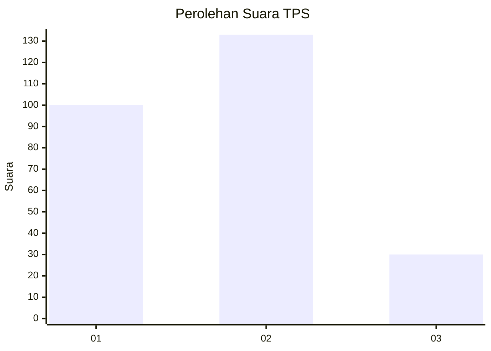
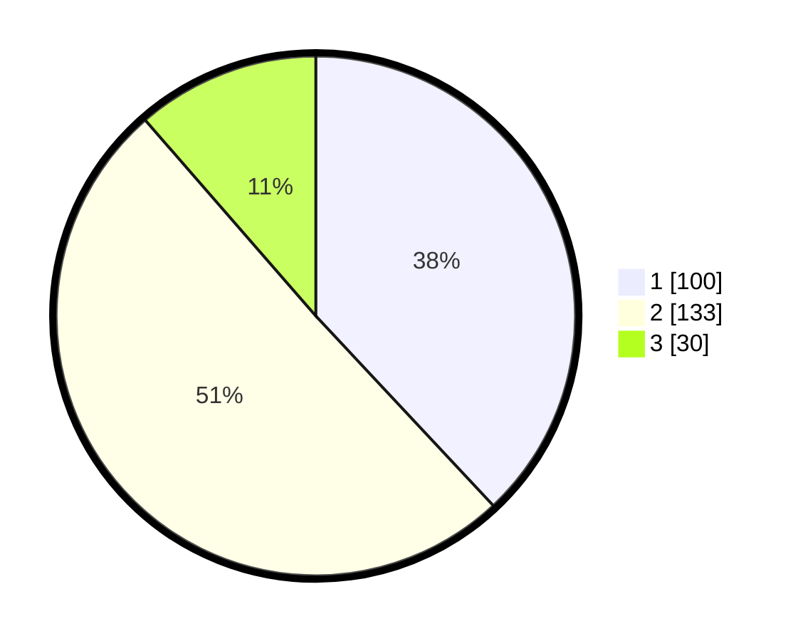

# Hasil

## Grafik

## Tabel

| No. | Nama Paslon    | Suara | Suara (raw) | Persentase |
|:--- |:-------------- | -----:| -----------:| ----------:|
| 1   | ANIES MUHAIMIN | 100   | [100][p-1]  | 38,02      |
| 2   | PRABOWO GIBRAN | 133   | [133][p-2]  | 50,57      |
| 3   | GANJAR MAHFUD  | 30    | [30][p-3]   | 11,41      |

[p-1]: https://github.com/gigit-pemilu/pemilu-2024-51-bali/blob/main/pilpres/hitung-suara/sub/51-bali/sub/05-klungkung/sub/04-dawan/sub/2007-kampung-kusamba/sub/002-tps/sub/paslon-1.txt
[p-2]: https://github.com/gigit-pemilu/pemilu-2024-51-bali/blob/main/pilpres/hitung-suara/sub/51-bali/sub/05-klungkung/sub/04-dawan/sub/2007-kampung-kusamba/sub/002-tps/sub/paslon-2.txt
[p-3]: https://github.com/gigit-pemilu/pemilu-2024-51-bali/blob/main/pilpres/hitung-suara/sub/51-bali/sub/05-klungkung/sub/04-dawan/sub/2007-kampung-kusamba/sub/002-tps/sub/paslon-3.txt

## Foto C Plano

https://sirekap-obj-formc.kpu.go.id/5ce0/pemilu/ppwp/51/05/04/20/07/5105042007002-20240216-143602--5e482e1b-cc21-4e1d-8951-8ad9d0991eae.jpg

https://sirekap-obj-formc.kpu.go.id/5ce0/pemilu/ppwp/51/05/04/20/07/5105042007002-20240216-143604--9c88ff17-538f-42f8-83f0-1609ed2e3769.jpg

https://sirekap-obj-formc.kpu.go.id/5ce0/pemilu/ppwp/51/05/04/20/07/5105042007002-20240216-143603--92b8b2c1-f759-4add-aa7e-86d4f3b93f43.jpg

## Metadata

| Key        | Value               |
| ---------- | ------------------- |
| Time Stamp | 2024-02-16 22:01:00 |

## DATA PEMILIH TETAP

Jumlah pemilih dalam DPT: **279**.
 * L: **134**.
 * P: **145**.

## DATA PENGGUNA HAK PILIH

Jumlah pengguna hak pilih dalam DPT: **252**.
 * L: **121**.
 * P: **131**.

Jumlah pengguna hak pilih dalam DPTb: **12**.
 * L: **6**.
 * P: **6**.

Jumlah pengguna hak pilih dalam DPK: **1**.
 * L: **0**.
 * P: **1**.

Jumlah pengguna hak pilih: **265**.
 * L: **127**.
 * P: **138**.

## JUMLAH SUARA SAH DAN TIDAK SAH

JUMLAH SELURUH SUARA SAH: **263**.

JUMLAH SUARA TIDAK SAH: **2**.

JUMLAH SELURUH SUARA SAH DAN SUARA TIDAK SAH: **265**.

