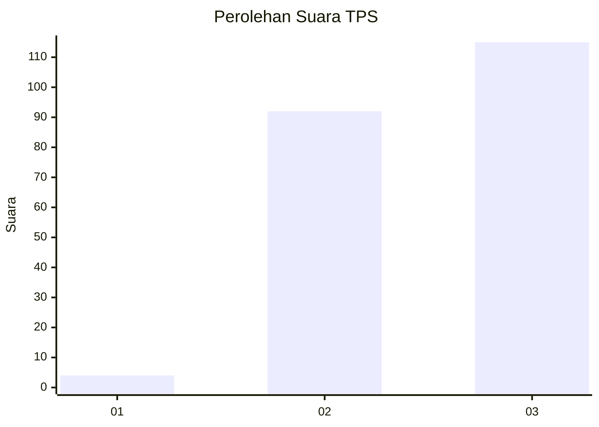
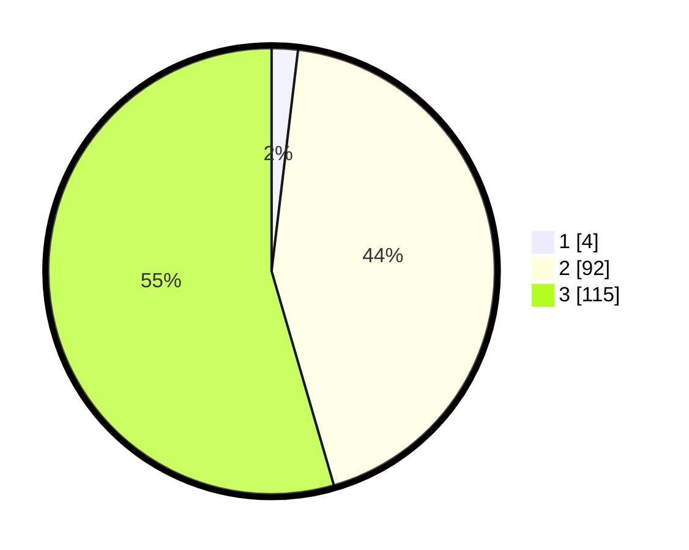

# Hasil

## Grafik

## Tabel

| No. | Nama Paslon    | Suara | Suara (raw) | Persentase |
|:--- |:-------------- | -----:| -----------:| ----------:|
| 1   | ANIES MUHAIMIN | 4     | [4][p-1]    | 1,90       |
| 2   | PRABOWO GIBRAN | 92    | [92][p-2]   | 43,60      |
| 3   | GANJAR MAHFUD  | 115   | [115][p-3]  | 54,50      |

[p-1]: https://github.com/gigit-pemilu/pemilu-2024-51-bali/blob/main/pilpres/hitung-suara/sub/51-bali/sub/05-klungkung/sub/04-dawan/sub/2008-pesinggahan/sub/001-tps/sub/paslon-1.txt
[p-2]: https://github.com/gigit-pemilu/pemilu-2024-51-bali/blob/main/pilpres/hitung-suara/sub/51-bali/sub/05-klungkung/sub/04-dawan/sub/2008-pesinggahan/sub/001-tps/sub/paslon-2.txt
[p-3]: https://github.com/gigit-pemilu/pemilu-2024-51-bali/blob/main/pilpres/hitung-suara/sub/51-bali/sub/05-klungkung/sub/04-dawan/sub/2008-pesinggahan/sub/001-tps/sub/paslon-3.txt

## Foto C Plano

https://sirekap-obj-formc.kpu.go.id/222f/pemilu/ppwp/51/05/04/20/08/5105042008001-20240215-001742--4431cfab-3f7b-4792-93d7-e7d91622aeb8.jpg

https://sirekap-obj-formc.kpu.go.id/222f/pemilu/ppwp/51/05/04/20/08/5105042008001-20240215-002018--036fd7be-c3dd-4398-85a9-534e8a4e9de0.jpg

https://sirekap-obj-formc.kpu.go.id/222f/pemilu/ppwp/51/05/04/20/08/5105042008001-20240215-002124--ac6683aa-13b8-442a-a080-c43bf6e57b1c.jpg

## Metadata

| Key        | Value               |
| ---------- | ------------------- |
| Time Stamp | 2024-02-15 12:00:28 |

