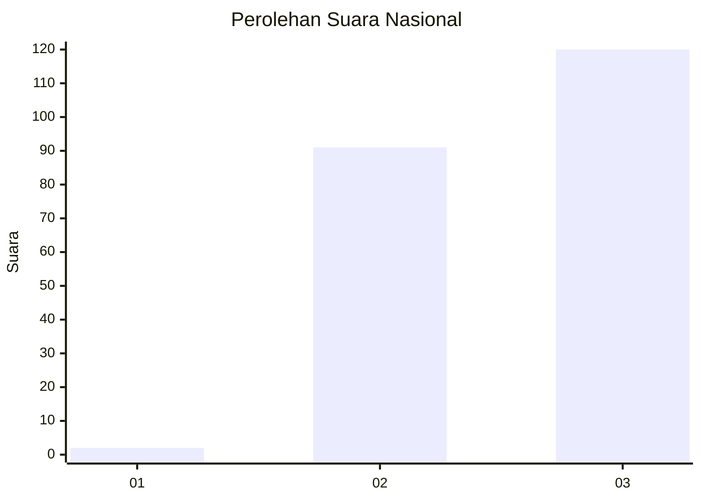
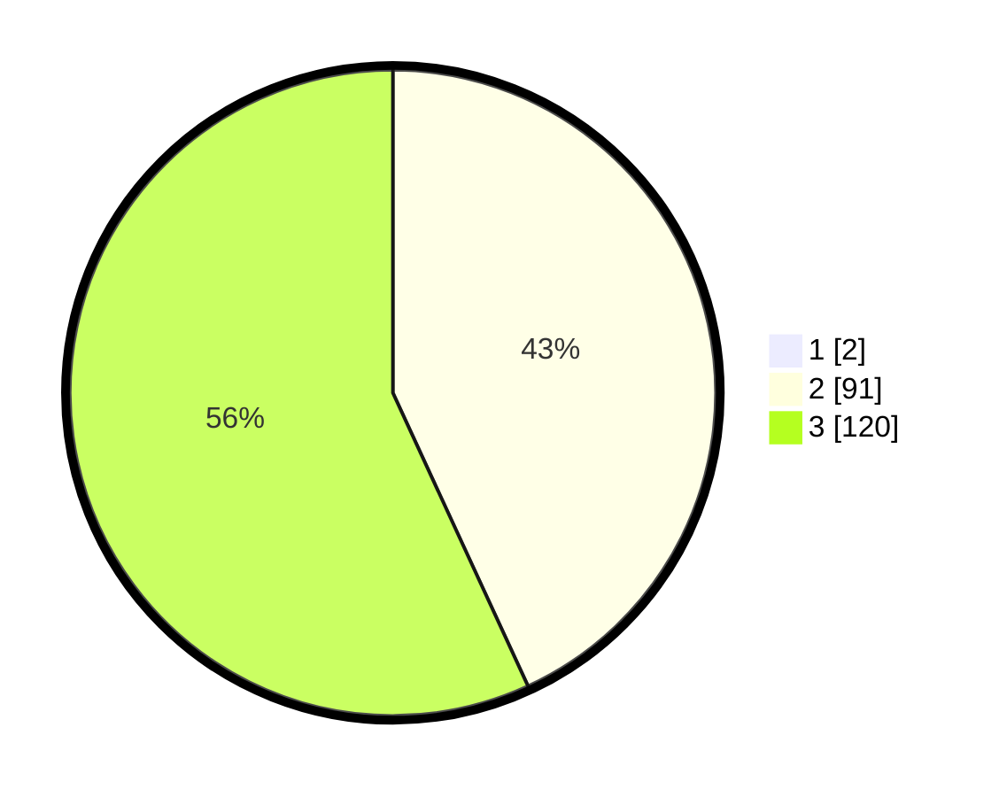

# Hasil

## Grafik

## Tabel

| No. | Nama Paslon    | Suara | Suara (raw) | Persentase |
|:--- |:-------------- | -----:| -----------:| ----------:|
| 1   | ANIES MUHAIMIN | 2     | [2][p-1]    | 0,94       |
| 2   | PRABOWO GIBRAN | 91    | [91][p-2]   | 42,72      |
| 3   | GANJAR MAHFUD  | 120   | [120][p-3]  | 56,34      |

[p-1]: https://github.com/gigit-pemilu/pemilu-2024/blob/main/pilpres/hitung-suara/sub/51-bali/sub/05-klungkung/sub/04-dawan/sub/2008-pesinggahan/sub/003-tps/sub/paslon-1.txt
[p-2]: https://github.com/gigit-pemilu/pemilu-2024/blob/main/pilpres/hitung-suara/sub/51-bali/sub/05-klungkung/sub/04-dawan/sub/2008-pesinggahan/sub/003-tps/sub/paslon-2.txt
[p-3]: https://github.com/gigit-pemilu/pemilu-2024/blob/main/pilpres/hitung-suara/sub/51-bali/sub/05-klungkung/sub/04-dawan/sub/2008-pesinggahan/sub/003-tps/sub/paslon-3.txt

## Foto C Plano

https://sirekap-obj-formc.kpu.go.id/eef3/pemilu/ppwp/51/05/04/20/08/5105042008003-20240214-222217--179bd357-add5-45cc-8da0-3585a7515852.jpg

https://sirekap-obj-formc.kpu.go.id/eef3/pemilu/ppwp/51/05/04/20/08/5105042008003-20240214-222432--dd13798a-0247-460a-91f5-445a6a5e6b35.jpg

https://sirekap-obj-formc.kpu.go.id/eef3/pemilu/ppwp/51/05/04/20/08/5105042008003-20240214-222505--bd1acf9a-1e95-4cbf-b318-7c606bd50d61.jpg

## Metadata

| Key        | Value               |
| ---------- | ------------------- |
| Time Stamp | 2024-02-15 09:00:24 |

