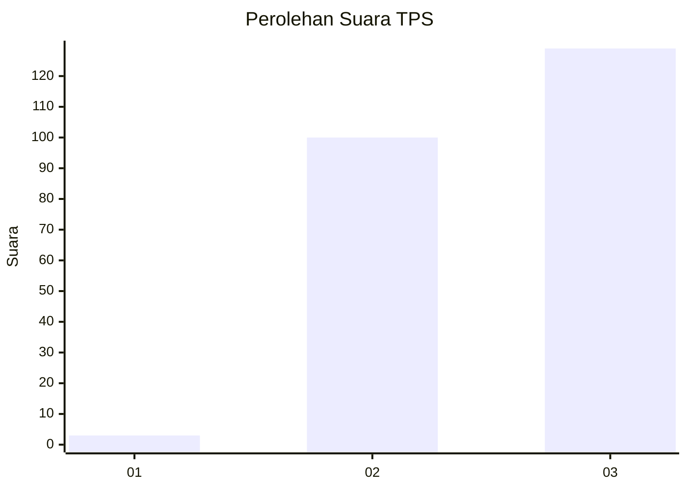
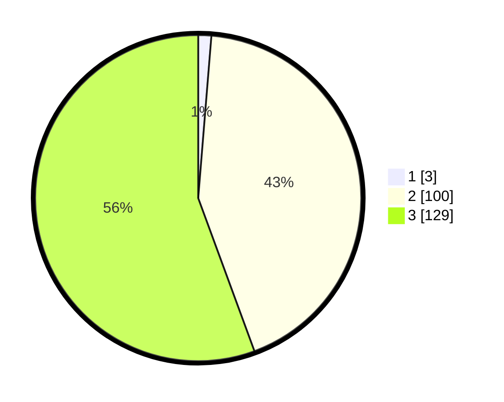

# Hasil

## Grafik

## Tabel

| No. | Nama Paslon    | Suara | Suara (raw) | Persentase |
|:--- |:-------------- | -----:| -----------:| ----------:|
| 1   | ANIES MUHAIMIN | 3     | [3][p-1]    | 1,29       |
| 2   | PRABOWO GIBRAN | 100   | [100][p-2]  | 43,10      |
| 3   | GANJAR MAHFUD  | 129   | [129][p-3]  | 55,60      |

[p-1]: https://github.com/gigit-pemilu/pemilu-2024-51-bali/blob/main/pilpres/hitung-suara/sub/51-bali/sub/05-klungkung/sub/04-dawan/sub/2008-pesinggahan/sub/004-tps/sub/paslon-1.txt
[p-2]: https://github.com/gigit-pemilu/pemilu-2024-51-bali/blob/main/pilpres/hitung-suara/sub/51-bali/sub/05-klungkung/sub/04-dawan/sub/2008-pesinggahan/sub/004-tps/sub/paslon-2.txt
[p-3]: https://github.com/gigit-pemilu/pemilu-2024-51-bali/blob/main/pilpres/hitung-suara/sub/51-bali/sub/05-klungkung/sub/04-dawan/sub/2008-pesinggahan/sub/004-tps/sub/paslon-3.txt

## Foto C Plano

https://sirekap-obj-formc.kpu.go.id/9bb4/pemilu/ppwp/51/05/04/20/08/5105042008004-20240214-220331--d3a4a01c-491c-4ee3-b2bd-2497a9b9b21a.jpg

https://sirekap-obj-formc.kpu.go.id/9bb4/pemilu/ppwp/51/05/04/20/08/5105042008004-20240214-220520--3682b527-ac99-4ef9-bdbf-2639372edfe1.jpg

https://sirekap-obj-formc.kpu.go.id/9bb4/pemilu/ppwp/51/05/04/20/08/5105042008004-20240214-220616--b1a23e5b-37a9-48c9-a895-d62630e22c37.jpg

## Metadata

| Key        | Value               |
| ---------- | ------------------- |
| Time Stamp | 2024-02-15 09:00:24 |

