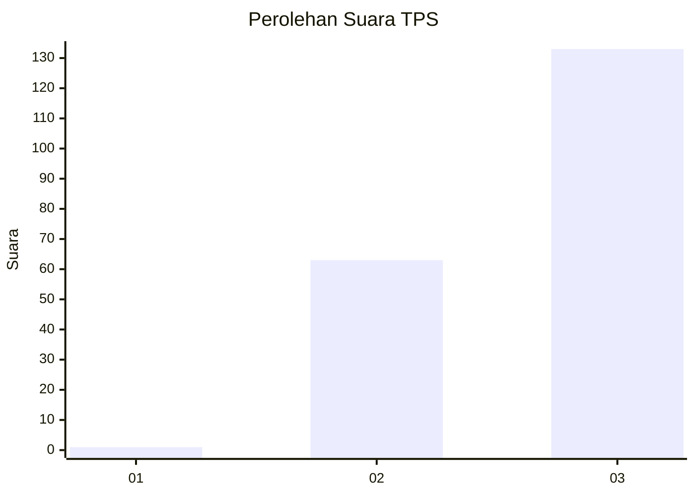
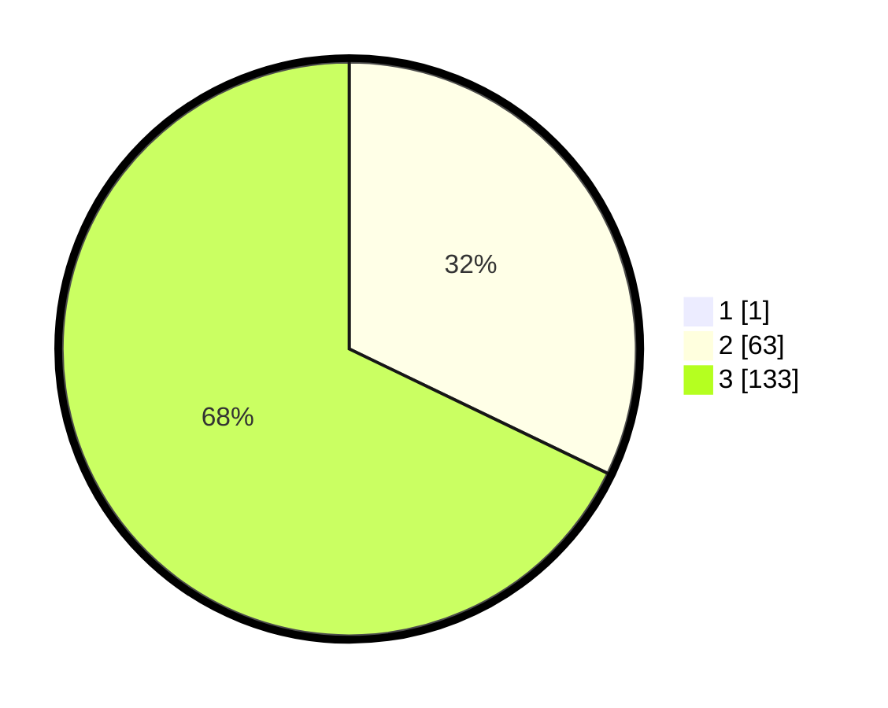

# Hasil

## Grafik

## Tabel

| No. | Nama Paslon    | Suara | Suara (raw) | Persentase |
|:--- |:-------------- | -----:| -----------:| ----------:|
| 1   | ANIES MUHAIMIN | 1     | [1][p-1]    | 0,51       |
| 2   | PRABOWO GIBRAN | 63    | [63][p-2]   | 31,98      |
| 3   | GANJAR MAHFUD  | 133   | [133][p-3]  | 67,51      |

[p-1]: https://github.com/gigit-pemilu/pemilu-2024-51-bali/blob/main/pilpres/hitung-suara/sub/51-bali/sub/05-klungkung/sub/04-dawan/sub/2008-pesinggahan/sub/009-tps/sub/paslon-1.txt
[p-2]: https://github.com/gigit-pemilu/pemilu-2024-51-bali/blob/main/pilpres/hitung-suara/sub/51-bali/sub/05-klungkung/sub/04-dawan/sub/2008-pesinggahan/sub/009-tps/sub/paslon-2.txt
[p-3]: https://github.com/gigit-pemilu/pemilu-2024-51-bali/blob/main/pilpres/hitung-suara/sub/51-bali/sub/05-klungkung/sub/04-dawan/sub/2008-pesinggahan/sub/009-tps/sub/paslon-3.txt

## Foto C Plano

https://sirekap-obj-formc.kpu.go.id/9a38/pemilu/ppwp/51/05/04/20/08/5105042008009-20240214-205023--fc27851f-c707-4271-9225-02d17c35184f.jpg

https://sirekap-obj-formc.kpu.go.id/9a38/pemilu/ppwp/51/05/04/20/08/5105042008009-20240214-205122--68c23d00-8d33-4a09-9e36-855a378de87c.jpg

https://sirekap-obj-formc.kpu.go.id/9a38/pemilu/ppwp/51/05/04/20/08/5105042008009-20240214-205205--fb3b0273-b585-4026-8ded-b2d3d9d5a3a2.jpg

## Metadata

| Key        | Value               |
| ---------- | ------------------- |
| Time Stamp | 2024-02-16 22:01:00 |

