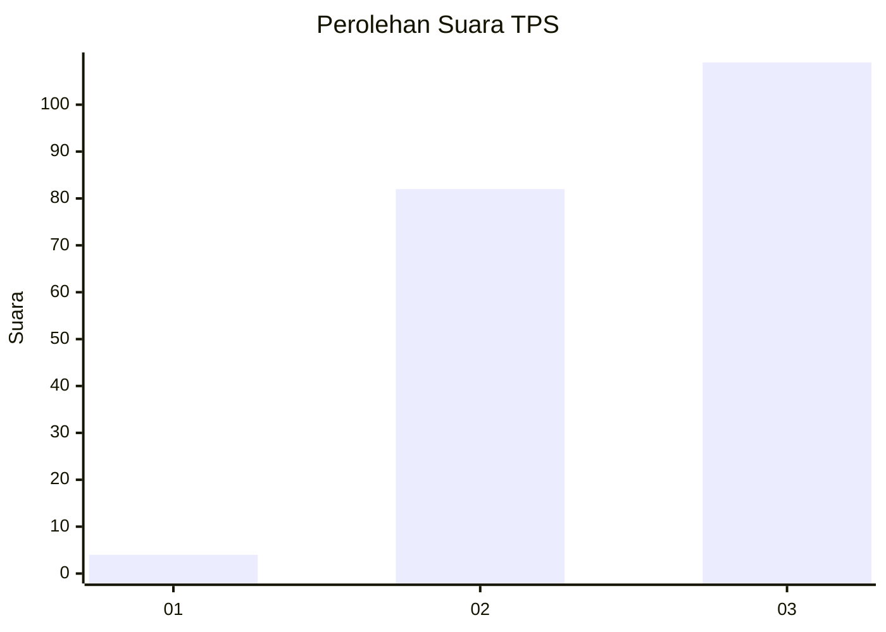
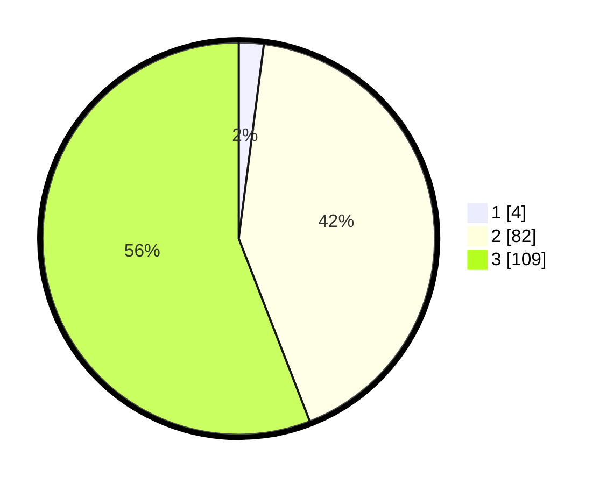

# Hasil

## Grafik

## Tabel

| No. | Nama Paslon    | Suara | Suara (raw) | Persentase |
|:--- |:-------------- | -----:| -----------:| ----------:|
| 1   | ANIES MUHAIMIN | 4     | [4][p-1]    | 2,05       |
| 2   | PRABOWO GIBRAN | 82    | [82][p-2]   | 42,05      |
| 3   | GANJAR MAHFUD  | 109   | [109][p-3]  | 55,90      |

[p-1]: https://github.com/gigit-pemilu/pemilu-2024-51-bali/blob/main/pilpres/hitung-suara/sub/51-bali/sub/05-klungkung/sub/04-dawan/sub/2008-pesinggahan/sub/014-tps/sub/paslon-1.txt
[p-2]: https://github.com/gigit-pemilu/pemilu-2024-51-bali/blob/main/pilpres/hitung-suara/sub/51-bali/sub/05-klungkung/sub/04-dawan/sub/2008-pesinggahan/sub/014-tps/sub/paslon-2.txt
[p-3]: https://github.com/gigit-pemilu/pemilu-2024-51-bali/blob/main/pilpres/hitung-suara/sub/51-bali/sub/05-klungkung/sub/04-dawan/sub/2008-pesinggahan/sub/014-tps/sub/paslon-3.txt

## Foto C Plano

https://sirekap-obj-formc.kpu.go.id/b236/pemilu/ppwp/51/05/04/20/08/5105042008014-20240214-191128--8667d01f-e180-482b-baa2-3d0d370485da.jpg

https://sirekap-obj-formc.kpu.go.id/b236/pemilu/ppwp/51/05/04/20/08/5105042008014-20240214-191302--0b0eb259-d7ba-40d2-8c95-f9516c032d7a.jpg

https://sirekap-obj-formc.kpu.go.id/b236/pemilu/ppwp/51/05/04/20/08/5105042008014-20240214-192144--7a6eb22d-82ae-49a7-a510-c8be135dc673.jpg

## Metadata

| Key        | Value               |
| ---------- | ------------------- |
| Time Stamp | 2024-02-19 06:16:00 |

