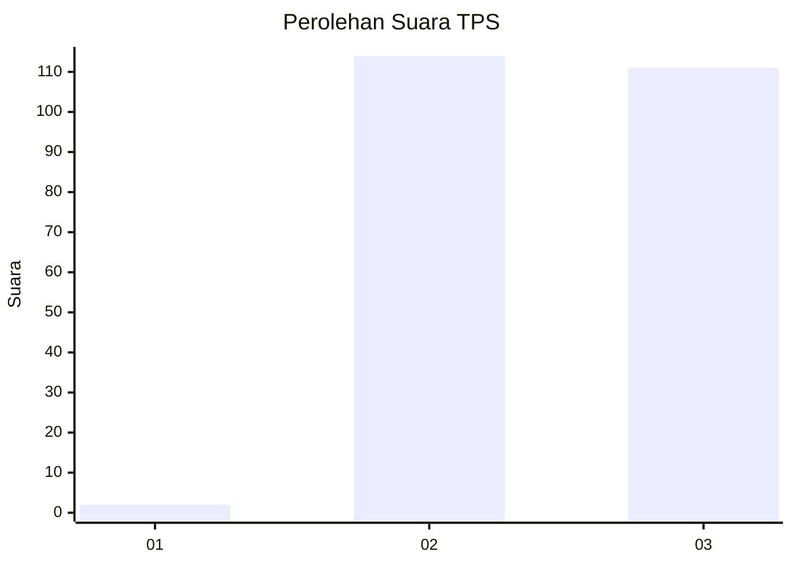
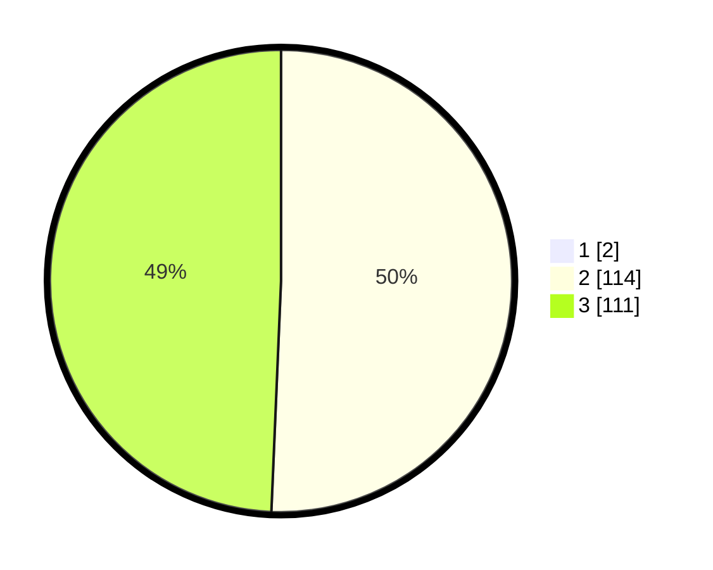

# Hasil

## Grafik

## Tabel

| No. | Nama Paslon    | Suara | Suara (raw) | Persentase |
|:--- |:-------------- | -----:| -----------:| ----------:|
| 1   | ANIES MUHAIMIN | 2     | [2][p-1]    | 0,88       |
| 2   | PRABOWO GIBRAN | 114   | [114][p-2]  | 50,22      |
| 3   | GANJAR MAHFUD  | 111   | [111][p-3]  | 48,90      |

[p-1]: https://github.com/gigit-pemilu/pemilu-2024-51-bali/blob/main/pilpres/hitung-suara/sub/51-bali/sub/05-klungkung/sub/04-dawan/sub/2009-dawan-klod/sub/003-tps/sub/paslon-1.txt
[p-2]: https://github.com/gigit-pemilu/pemilu-2024-51-bali/blob/main/pilpres/hitung-suara/sub/51-bali/sub/05-klungkung/sub/04-dawan/sub/2009-dawan-klod/sub/003-tps/sub/paslon-2.txt
[p-3]: https://github.com/gigit-pemilu/pemilu-2024-51-bali/blob/main/pilpres/hitung-suara/sub/51-bali/sub/05-klungkung/sub/04-dawan/sub/2009-dawan-klod/sub/003-tps/sub/paslon-3.txt

## Foto C Plano

https://sirekap-obj-formc.kpu.go.id/4757/pemilu/ppwp/51/05/04/20/09/5105042009003-20240214-203021--1903cb6e-789c-4051-98b3-4c03d81cfd64.jpg

https://sirekap-obj-formc.kpu.go.id/4757/pemilu/ppwp/51/05/04/20/09/5105042009003-20240214-203303--9b0fe73a-abab-45af-939f-4b9a23d0ad64.jpg

https://sirekap-obj-formc.kpu.go.id/4757/pemilu/ppwp/51/05/04/20/09/5105042009003-20240214-203547--51b722db-1f43-4ce0-8c5a-48217c329fa1.jpg

## Metadata

| Key        | Value               |
| ---------- | ------------------- |
| Time Stamp | 2024-02-15 15:00:29 |

