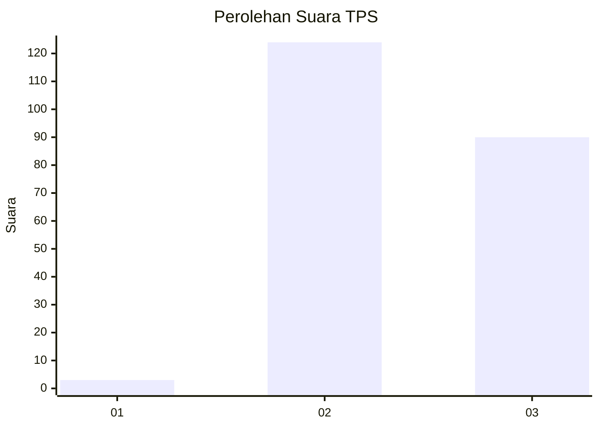
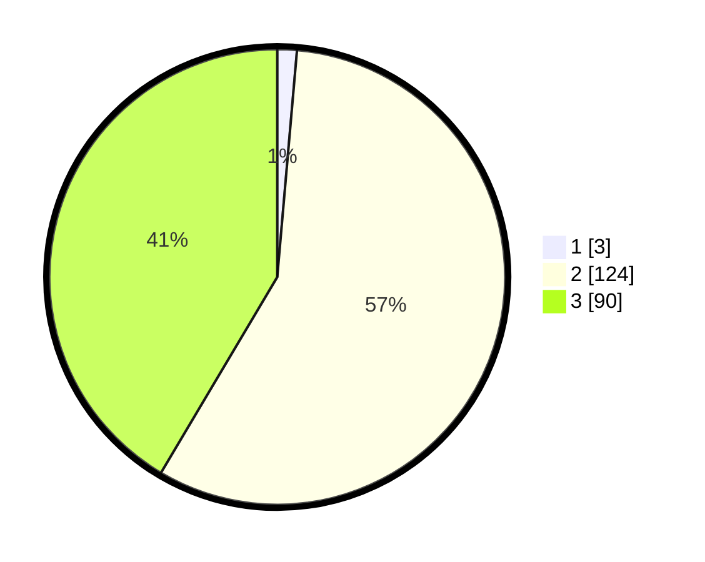

# Hasil

## Grafik

## Tabel

| No. | Nama Paslon    | Suara | Suara (raw) | Persentase |
|:--- |:-------------- | -----:| -----------:| ----------:|
| 1   | ANIES MUHAIMIN | 3     | [3][p-1]    | 1,38       |
| 2   | PRABOWO GIBRAN | 124   | [124][p-2]  | 57,14      |
| 3   | GANJAR MAHFUD  | 90    | [90][p-3]   | 41,47      |

[p-1]: https://github.com/gigit-pemilu/pemilu-2024-51-bali/blob/main/pilpres/hitung-suara/sub/51-bali/sub/05-klungkung/sub/04-dawan/sub/2009-dawan-klod/sub/004-tps/sub/paslon-1.txt
[p-2]: https://github.com/gigit-pemilu/pemilu-2024-51-bali/blob/main/pilpres/hitung-suara/sub/51-bali/sub/05-klungkung/sub/04-dawan/sub/2009-dawan-klod/sub/004-tps/sub/paslon-2.txt
[p-3]: https://github.com/gigit-pemilu/pemilu-2024-51-bali/blob/main/pilpres/hitung-suara/sub/51-bali/sub/05-klungkung/sub/04-dawan/sub/2009-dawan-klod/sub/004-tps/sub/paslon-3.txt

## Foto C Plano

https://sirekap-obj-formc.kpu.go.id/e32f/pemilu/ppwp/51/05/04/20/09/5105042009004-20240214-201107--b9cb953e-5483-4b1a-939c-0aa26597e144.jpg

https://sirekap-obj-formc.kpu.go.id/e32f/pemilu/ppwp/51/05/04/20/09/5105042009004-20240214-201114--99872776-59fa-454a-95c5-ba0da12ccc79.jpg

https://sirekap-obj-formc.kpu.go.id/e32f/pemilu/ppwp/51/05/04/20/09/5105042009004-20240214-201126--9f766596-d83a-4bbe-8f4d-e84f2937585a.jpg

## Metadata

| Key        | Value               |
| ---------- | ------------------- |
| Time Stamp | 2024-02-15 12:00:28 |

