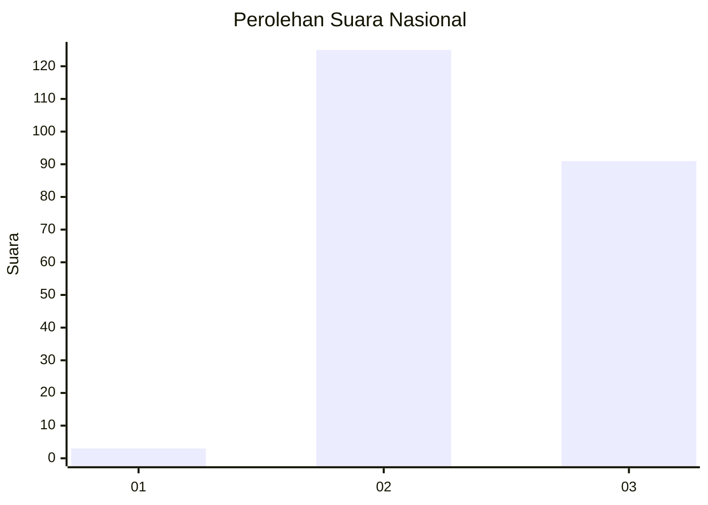
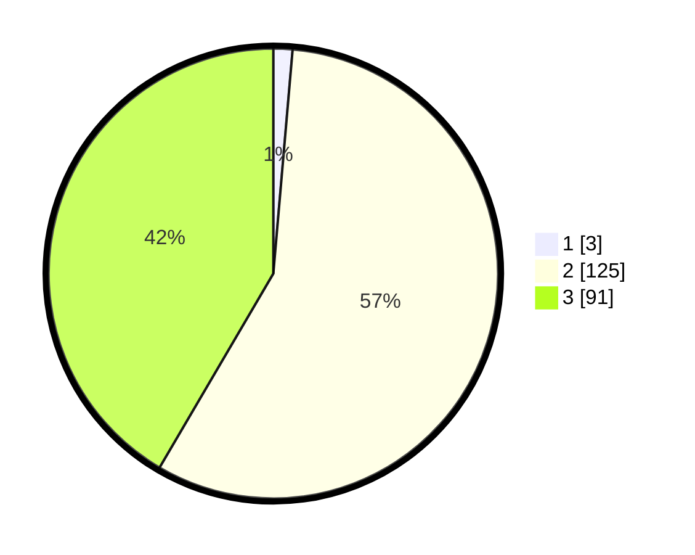

# Hasil

## Grafik

## Tabel

| No. | Nama Paslon    | Suara | Suara (raw) | Persentase |
|:--- |:-------------- | -----:| -----------:| ----------:|
| 1   | ANIES MUHAIMIN | 3     | [3][p-1]    | 1,37       |
| 2   | PRABOWO GIBRAN | 125   | [125][p-2]  | 57,08      |
| 3   | GANJAR MAHFUD  | 91    | [91][p-3]   | 41,55      |

[p-1]: https://github.com/gigit-pemilu/pemilu-2024/blob/main/pilpres/hitung-suara/sub/51-bali/sub/05-klungkung/sub/04-dawan/sub/2009-dawan-klod/sub/005-tps/sub/paslon-1.txt
[p-2]: https://github.com/gigit-pemilu/pemilu-2024/blob/main/pilpres/hitung-suara/sub/51-bali/sub/05-klungkung/sub/04-dawan/sub/2009-dawan-klod/sub/005-tps/sub/paslon-2.txt
[p-3]: https://github.com/gigit-pemilu/pemilu-2024/blob/main/pilpres/hitung-suara/sub/51-bali/sub/05-klungkung/sub/04-dawan/sub/2009-dawan-klod/sub/005-tps/sub/paslon-3.txt

## Foto C Plano

https://sirekap-obj-formc.kpu.go.id/7adb/pemilu/ppwp/51/05/04/20/09/5105042009005-20240216-044958--c44bb48d-78b0-4779-b93c-be722967b29a.jpg

https://sirekap-obj-formc.kpu.go.id/7adb/pemilu/ppwp/51/05/04/20/09/5105042009005-20240214-141055--5e7bc2ed-4af2-407d-aee6-b46226726b97.jpg

https://sirekap-obj-formc.kpu.go.id/7adb/pemilu/ppwp/51/05/04/20/09/5105042009005-20240216-044959--15953962-94dc-4258-8e82-e21271619733.jpg

## Metadata

| Key        | Value               |
| ---------- | ------------------- |
| Time Stamp | 2024-02-16 05:00:26 |

## DATA PEMILIH TETAP

Jumlah pemilih dalam DPT: **265**.
 * L: **131**.
 * P: **134**.

## DATA PENGGUNA HAK PILIH

Jumlah pengguna hak pilih dalam DPT: **226**.
 * L: **109**.
 * P: **117**.

Jumlah pengguna hak pilih dalam DPTb: **0**.
 * L: **0**.
 * P: **0**.

Jumlah pengguna hak pilih dalam DPK: **0**.
 * L: **0**.
 * P: **0**.

Jumlah pengguna hak pilih: **226**.
 * L: **109**.
 * P: **117**.

## JUMLAH SUARA SAH DAN TIDAK SAH

JUMLAH SELURUH SUARA SAH: **219**.

JUMLAH SUARA TIDAK SAH: **7**.

JUMLAH SELURUH SUARA SAH DAN SUARA TIDAK SAH: **226**.

