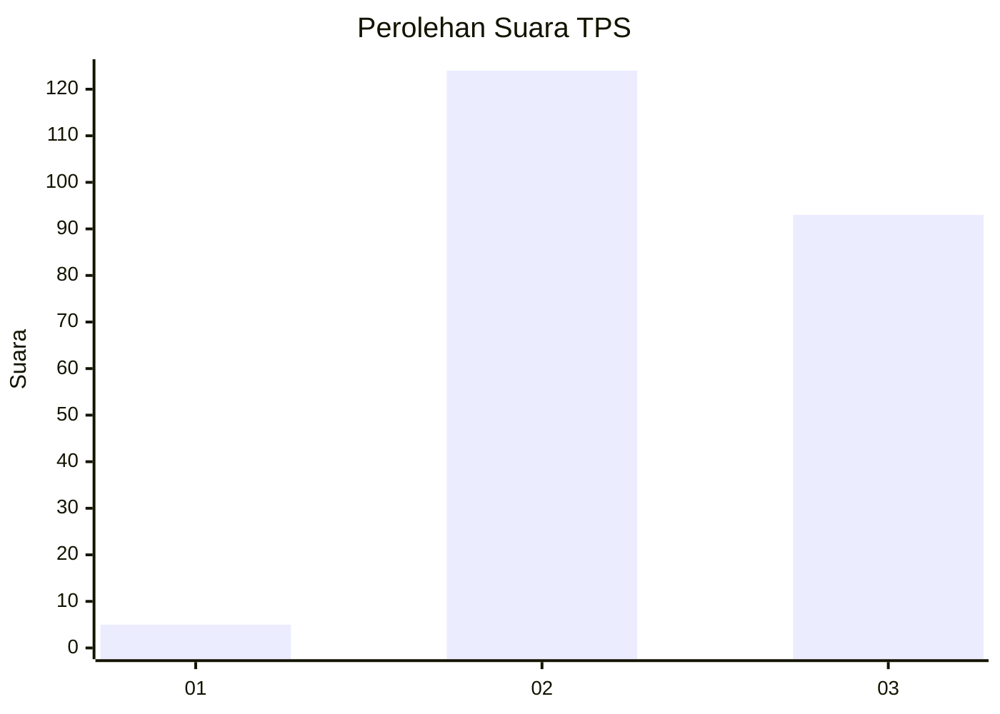
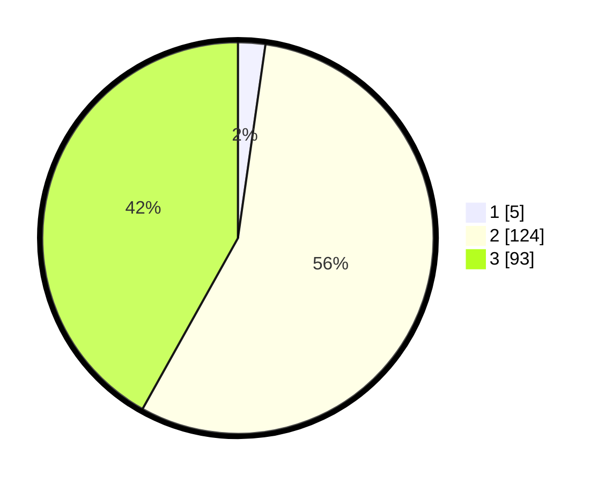

# Hasil

## Grafik

## Tabel

| No. | Nama Paslon    | Suara | Suara (raw) | Persentase |
|:--- |:-------------- | -----:| -----------:| ----------:|
| 1   | ANIES MUHAIMIN | 5     | [5][p-1]    | 2,25       |
| 2   | PRABOWO GIBRAN | 124   | [124][p-2]  | 55,86      |
| 3   | GANJAR MAHFUD  | 93    | [93][p-3]   | 41,89      |

[p-1]: https://github.com/gigit-pemilu/pemilu-2024-51-bali/blob/main/pilpres/hitung-suara/sub/51-bali/sub/05-klungkung/sub/04-dawan/sub/2010-pikat/sub/001-tps/sub/paslon-1.txt
[p-2]: https://github.com/gigit-pemilu/pemilu-2024-51-bali/blob/main/pilpres/hitung-suara/sub/51-bali/sub/05-klungkung/sub/04-dawan/sub/2010-pikat/sub/001-tps/sub/paslon-2.txt
[p-3]: https://github.com/gigit-pemilu/pemilu-2024-51-bali/blob/main/pilpres/hitung-suara/sub/51-bali/sub/05-klungkung/sub/04-dawan/sub/2010-pikat/sub/001-tps/sub/paslon-3.txt

## Foto C Plano

https://sirekap-obj-formc.kpu.go.id/6c7f/pemilu/ppwp/51/05/04/20/10/5105042010001-20240215-021143--d3a6f046-a800-455e-ab7b-8326fa4af0f3.jpg

https://sirekap-obj-formc.kpu.go.id/6c7f/pemilu/ppwp/51/05/04/20/10/5105042010001-20240215-000235--b5a48469-d202-45c8-b500-97f416eb0cf9.jpg

https://sirekap-obj-formc.kpu.go.id/6c7f/pemilu/ppwp/51/05/04/20/10/5105042010001-20240215-000358--38f2e322-1401-48cc-a1fe-8e6e9834a106.jpg

## Metadata

| Key        | Value               |
| ---------- | ------------------- |
| Time Stamp | 2024-02-15 15:00:29 |

