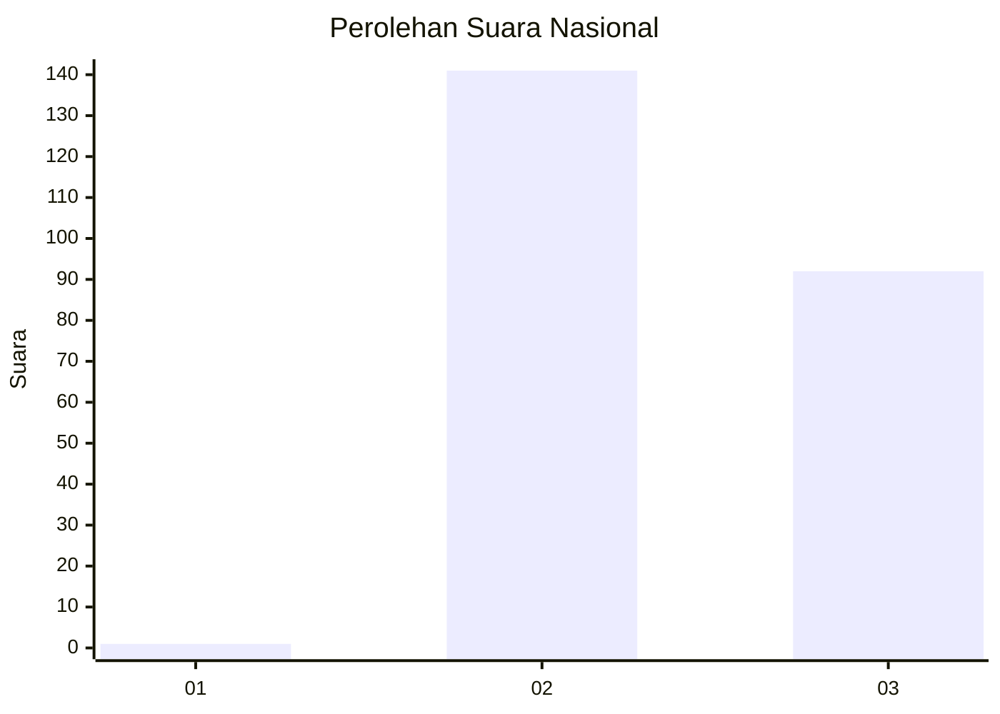
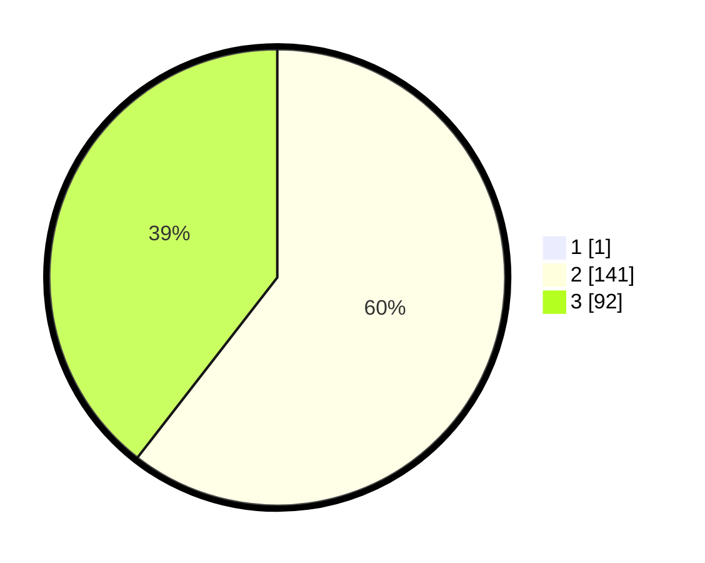

# Hasil

## Grafik

## Tabel

| No. | Nama Paslon    | Suara | Suara (raw) | Persentase |
|:--- |:-------------- | -----:| -----------:| ----------:|
| 1   | ANIES MUHAIMIN | 1     | [1][p-1]    | 0,43       |
| 2   | PRABOWO GIBRAN | 141   | [141][p-2]  | 60,26      |
| 3   | GANJAR MAHFUD  | 92    | [92][p-3]   | 39,32      |

[p-1]: https://github.com/gigit-pemilu/pemilu-2024/blob/main/pilpres/hitung-suara/sub/51-bali/sub/05-klungkung/sub/04-dawan/sub/2010-pikat/sub/003-tps/sub/paslon-1.txt
[p-2]: https://github.com/gigit-pemilu/pemilu-2024/blob/main/pilpres/hitung-suara/sub/51-bali/sub/05-klungkung/sub/04-dawan/sub/2010-pikat/sub/003-tps/sub/paslon-2.txt
[p-3]: https://github.com/gigit-pemilu/pemilu-2024/blob/main/pilpres/hitung-suara/sub/51-bali/sub/05-klungkung/sub/04-dawan/sub/2010-pikat/sub/003-tps/sub/paslon-3.txt

## Foto C Plano

https://sirekap-obj-formc.kpu.go.id/f420/pemilu/ppwp/51/05/04/20/10/5105042010003-20240215-023427--f72aa4eb-5f60-48e4-a073-c885d3f4b19b.jpg

https://sirekap-obj-formc.kpu.go.id/f420/pemilu/ppwp/51/05/04/20/10/5105042010003-20240215-023321--b129a3e4-a379-4e2e-b09e-53ec0b40ddbf.jpg

https://sirekap-obj-formc.kpu.go.id/f420/pemilu/ppwp/51/05/04/20/10/5105042010003-20240215-023203--1ae57ba0-8b23-49d6-9a40-eac832de0ce9.jpg

## Metadata

| Key        | Value               |
| ---------- | ------------------- |
| Time Stamp | 2024-02-15 15:00:29 |

