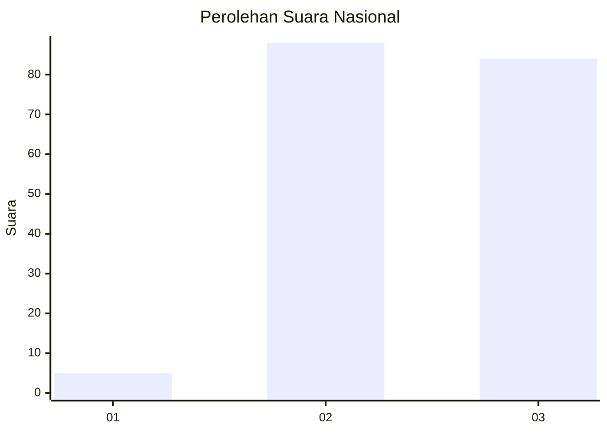
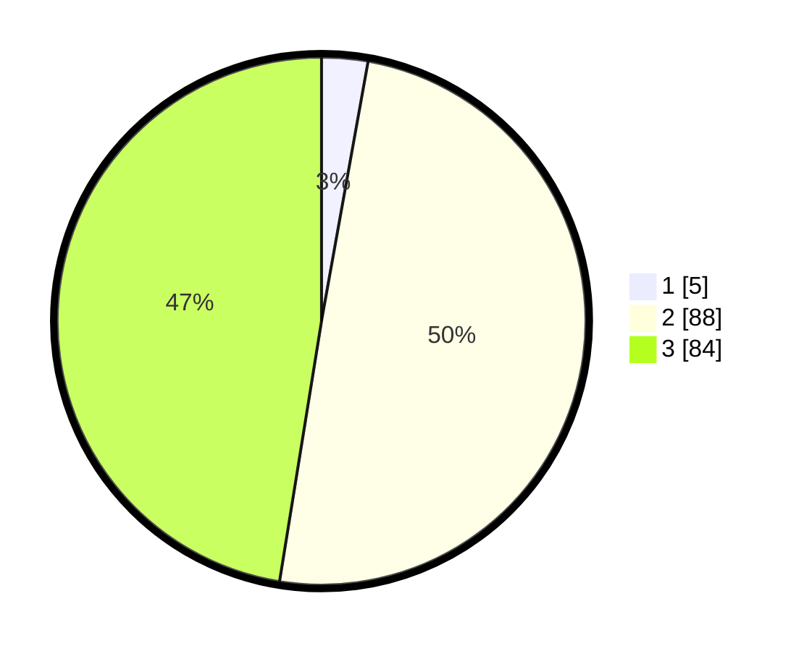

# Hasil

## Grafik

## Tabel

| No. | Nama Paslon    | Suara | Suara (raw) | Persentase |
|:--- |:-------------- | -----:| -----------:| ----------:|
| 1   | ANIES MUHAIMIN | 5     | [5][p-1]    | 2,82       |
| 2   | PRABOWO GIBRAN | 88    | [88][p-2]   | 49,72      |
| 3   | GANJAR MAHFUD  | 84    | [84][p-3]   | 47,46      |

[p-1]: https://github.com/gigit-pemilu/pemilu-2024/blob/main/pilpres/hitung-suara/sub/51-bali/sub/05-klungkung/sub/04-dawan/sub/2010-pikat/sub/005-tps/sub/paslon-1.txt
[p-2]: https://github.com/gigit-pemilu/pemilu-2024/blob/main/pilpres/hitung-suara/sub/51-bali/sub/05-klungkung/sub/04-dawan/sub/2010-pikat/sub/005-tps/sub/paslon-2.txt
[p-3]: https://github.com/gigit-pemilu/pemilu-2024/blob/main/pilpres/hitung-suara/sub/51-bali/sub/05-klungkung/sub/04-dawan/sub/2010-pikat/sub/005-tps/sub/paslon-3.txt

## Foto C Plano

https://sirekap-obj-formc.kpu.go.id/013e/pemilu/ppwp/51/05/04/20/10/5105042010005-20240215-020629--1461e797-0d51-491c-a415-59abf44de05f.jpg

https://sirekap-obj-formc.kpu.go.id/013e/pemilu/ppwp/51/05/04/20/10/5105042010005-20240215-020620--7b5ecc50-710a-441f-a98e-56e16b950784.jpg

https://sirekap-obj-formc.kpu.go.id/013e/pemilu/ppwp/51/05/04/20/10/5105042010005-20240215-020636--aacfc00a-4abb-49d3-b6b9-46c5d2a2897a.jpg

## Metadata

| Key        | Value               |
| ---------- | ------------------- |
| Time Stamp | 2024-02-15 09:00:24 |

