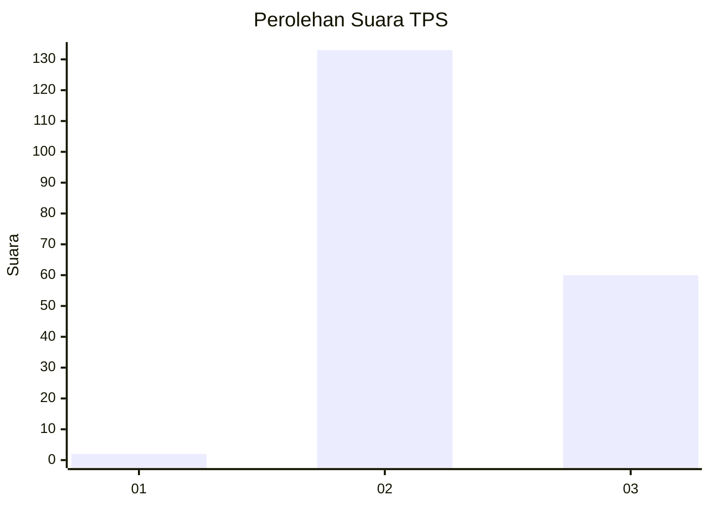
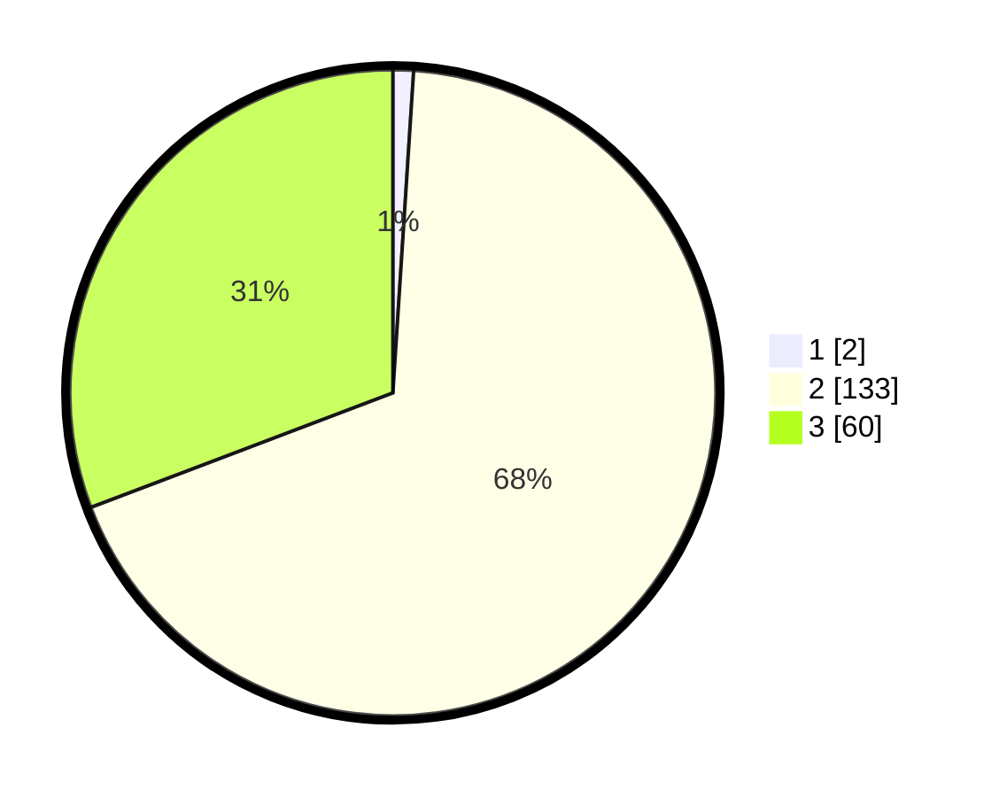

# Hasil

## Grafik

## Tabel

| No. | Nama Paslon    | Suara | Suara (raw) | Persentase |
|:--- |:-------------- | -----:| -----------:| ----------:|
| 1   | ANIES MUHAIMIN | 2     | [2][p-1]    | 1,03       |
| 2   | PRABOWO GIBRAN | 133   | [133][p-2]  | 68,21      |
| 3   | GANJAR MAHFUD  | 60    | [60][p-3]   | 30,77      |

[p-1]: https://github.com/gigit-pemilu/pemilu-2024-51-bali/blob/main/pilpres/hitung-suara/sub/51-bali/sub/05-klungkung/sub/04-dawan/sub/2010-pikat/sub/008-tps/sub/paslon-1.txt
[p-2]: https://github.com/gigit-pemilu/pemilu-2024-51-bali/blob/main/pilpres/hitung-suara/sub/51-bali/sub/05-klungkung/sub/04-dawan/sub/2010-pikat/sub/008-tps/sub/paslon-2.txt
[p-3]: https://github.com/gigit-pemilu/pemilu-2024-51-bali/blob/main/pilpres/hitung-suara/sub/51-bali/sub/05-klungkung/sub/04-dawan/sub/2010-pikat/sub/008-tps/sub/paslon-3.txt

## Foto C Plano

https://sirekap-obj-formc.kpu.go.id/b391/pemilu/ppwp/51/05/04/20/10/5105042010008-20240214-212347--f9c00b7f-ccab-4e5b-b47b-086dbd5587ef.jpg

https://sirekap-obj-formc.kpu.go.id/b391/pemilu/ppwp/51/05/04/20/10/5105042010008-20240214-212553--354eec44-ff6d-4820-809f-2208c4ecc0c1.jpg

https://sirekap-obj-formc.kpu.go.id/b391/pemilu/ppwp/51/05/04/20/10/5105042010008-20240214-212637--c14d5f0d-1236-4b0f-b549-cd696afaf98c.jpg

## Metadata

| Key        | Value               |
| ---------- | ------------------- |
| Time Stamp | 2024-02-15 09:00:24 |

