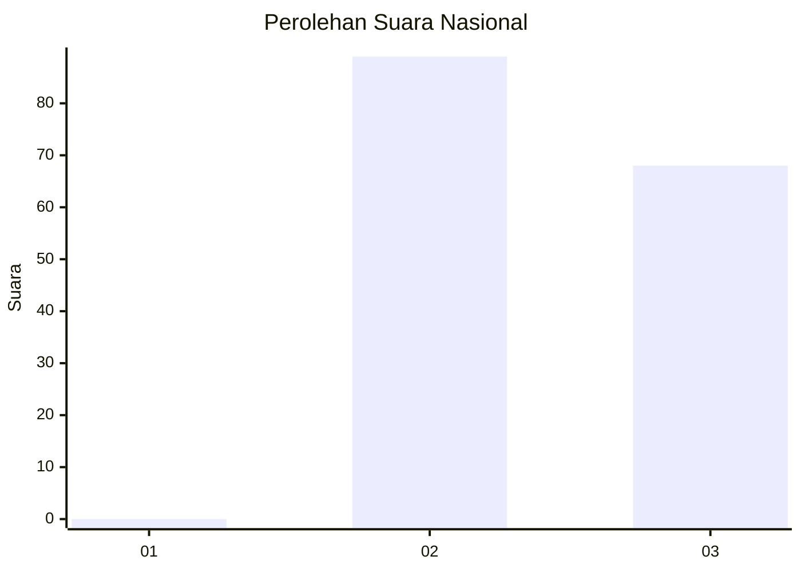
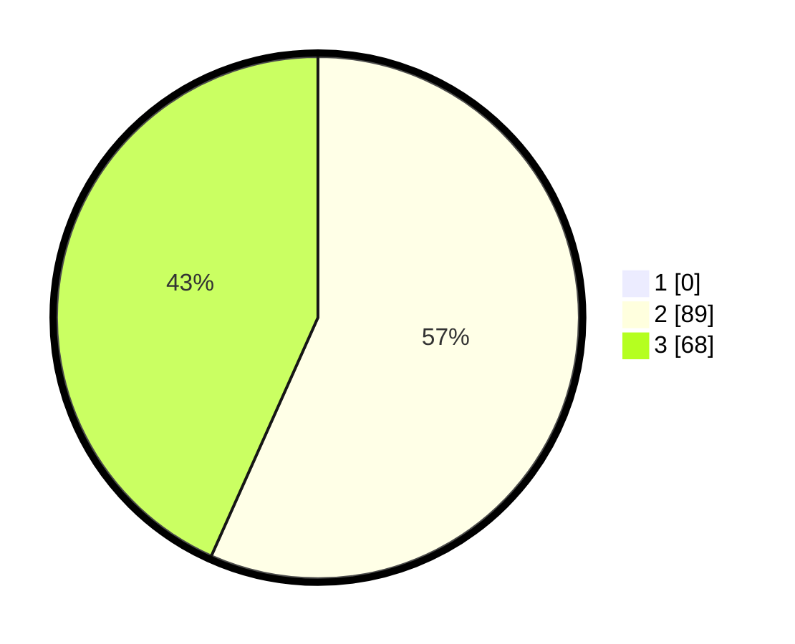

# Hasil

## Grafik

## Tabel

| No. | Nama Paslon    | Suara | Suara (raw) | Persentase |
|:--- |:-------------- | -----:| -----------:| ----------:|
| 1   | ANIES MUHAIMIN | 0     | [0][p-1]    | 0,00       |
| 2   | PRABOWO GIBRAN | 89    | [89][p-2]   | 56,69      |
| 3   | GANJAR MAHFUD  | 68    | [68][p-3]   | 43,31      |

[p-1]: https://github.com/gigit-pemilu/pemilu-2024/blob/main/pilpres/hitung-suara/sub/51-bali/sub/05-klungkung/sub/04-dawan/sub/2010-pikat/sub/009-tps/sub/paslon-1.txt
[p-2]: https://github.com/gigit-pemilu/pemilu-2024/blob/main/pilpres/hitung-suara/sub/51-bali/sub/05-klungkung/sub/04-dawan/sub/2010-pikat/sub/009-tps/sub/paslon-2.txt
[p-3]: https://github.com/gigit-pemilu/pemilu-2024/blob/main/pilpres/hitung-suara/sub/51-bali/sub/05-klungkung/sub/04-dawan/sub/2010-pikat/sub/009-tps/sub/paslon-3.txt

## Foto C Plano

https://sirekap-obj-formc.kpu.go.id/3f69/pemilu/ppwp/51/05/04/20/10/5105042010009-20240214-231403--54218963-fdb4-4eef-a76e-8bfabfdef33d.jpg

https://sirekap-obj-formc.kpu.go.id/3f69/pemilu/ppwp/51/05/04/20/10/5105042010009-20240214-231551--aec45b79-f680-43c3-936c-55a34413fdf7.jpg

https://sirekap-obj-formc.kpu.go.id/3f69/pemilu/ppwp/51/05/04/20/10/5105042010009-20240214-231710--9b87708a-92a6-4fd7-a645-90e21ee50b88.jpg

## Metadata

| Key        | Value               |
| ---------- | ------------------- |
| Time Stamp | 2024-02-15 15:00:29 |

