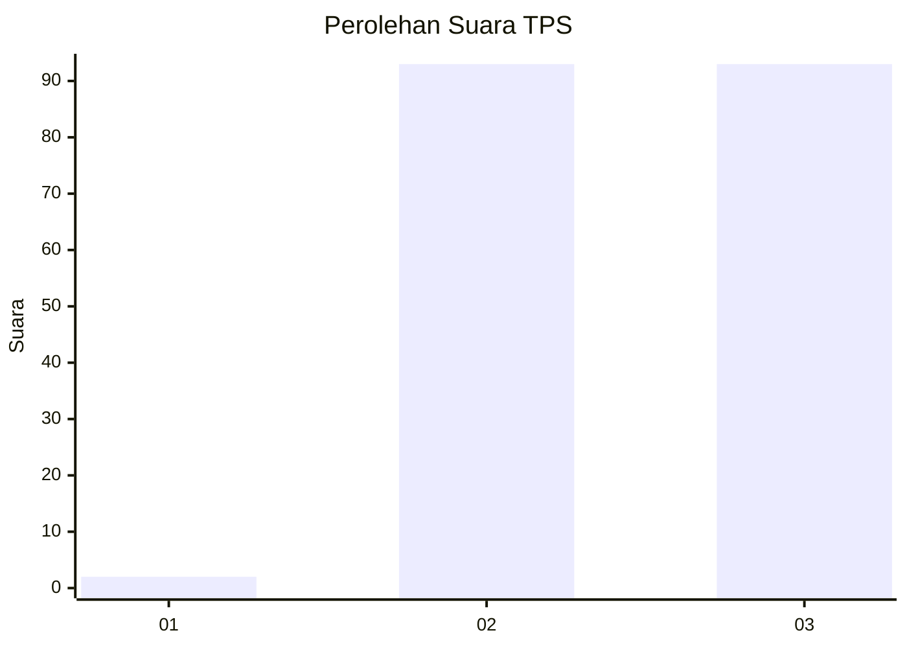
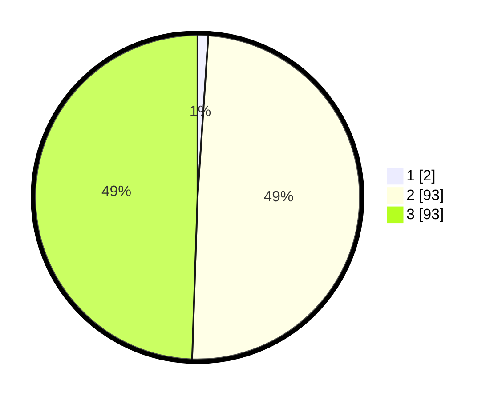

# Hasil

## Grafik

## Tabel

| No. | Nama Paslon    | Suara | Suara (raw) | Persentase |
|:--- |:-------------- | -----:| -----------:| ----------:|
| 1   | ANIES MUHAIMIN | 2     | [2][p-1]    | 1,06       |
| 2   | PRABOWO GIBRAN | 93    | [93][p-2]   | 49,47      |
| 3   | GANJAR MAHFUD  | 93    | [93][p-3]   | 49,47      |

[p-1]: https://github.com/gigit-pemilu/pemilu-2024-51-bali/blob/main/pilpres/hitung-suara/sub/51-bali/sub/05-klungkung/sub/04-dawan/sub/2010-pikat/sub/011-tps/sub/paslon-1.txt
[p-2]: https://github.com/gigit-pemilu/pemilu-2024-51-bali/blob/main/pilpres/hitung-suara/sub/51-bali/sub/05-klungkung/sub/04-dawan/sub/2010-pikat/sub/011-tps/sub/paslon-2.txt
[p-3]: https://github.com/gigit-pemilu/pemilu-2024-51-bali/blob/main/pilpres/hitung-suara/sub/51-bali/sub/05-klungkung/sub/04-dawan/sub/2010-pikat/sub/011-tps/sub/paslon-3.txt

## Foto C Plano

https://sirekap-obj-formc.kpu.go.id/ccc4/pemilu/ppwp/51/05/04/20/10/5105042010011-20240215-003108--d0e493bc-55df-4323-985e-84e6b5c0bb38.jpg

https://sirekap-obj-formc.kpu.go.id/ccc4/pemilu/ppwp/51/05/04/20/10/5105042010011-20240215-003342--63ab1754-e4e0-4d01-ac83-ec27e83bb3ab.jpg

https://sirekap-obj-formc.kpu.go.id/ccc4/pemilu/ppwp/51/05/04/20/10/5105042010011-20240215-003512--de0942c1-2899-4eac-bfb9-1deadbc601a3.jpg

## Metadata

| Key        | Value               |
| ---------- | ------------------- |
| Time Stamp | 2024-02-15 15:00:29 |

