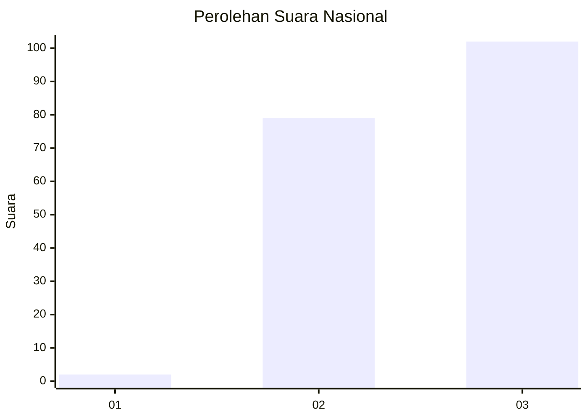
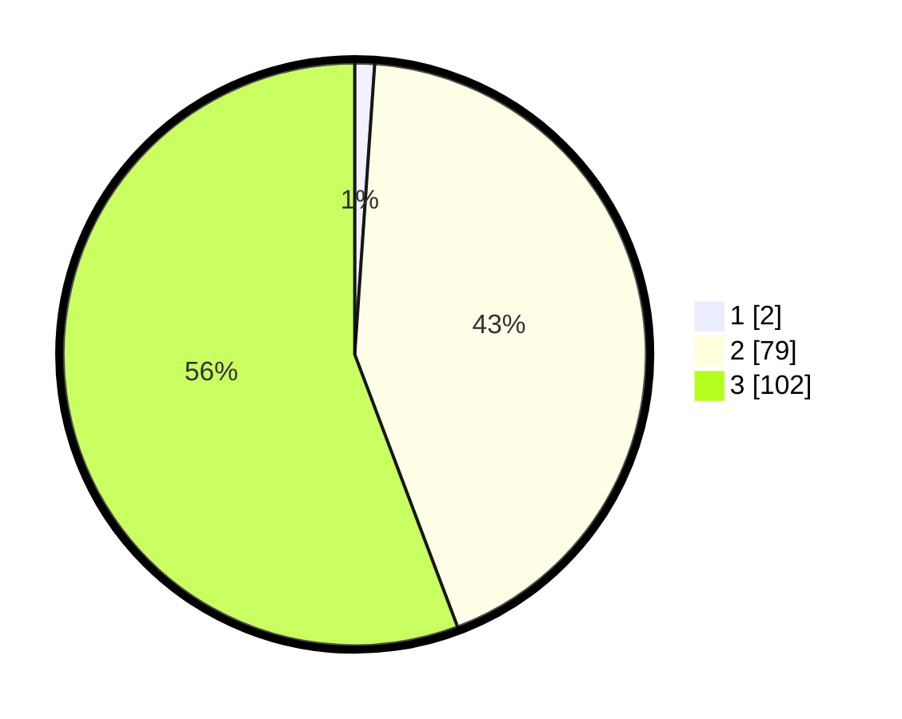

# Hasil

## Grafik

## Tabel

| No. | Nama Paslon    | Suara | Suara (raw) | Persentase |
|:--- |:-------------- | -----:| -----------:| ----------:|
| 1   | ANIES MUHAIMIN | 2     | [2][p-1]    | 1,09       |
| 2   | PRABOWO GIBRAN | 79    | [79][p-2]   | 43,17      |
| 3   | GANJAR MAHFUD  | 102   | [102][p-3]  | 55,74      |

[p-1]: https://github.com/gigit-pemilu/pemilu-2024/blob/main/pilpres/hitung-suara/sub/51-bali/sub/05-klungkung/sub/04-dawan/sub/2010-pikat/sub/012-tps/sub/paslon-1.txt
[p-2]: https://github.com/gigit-pemilu/pemilu-2024/blob/main/pilpres/hitung-suara/sub/51-bali/sub/05-klungkung/sub/04-dawan/sub/2010-pikat/sub/012-tps/sub/paslon-2.txt
[p-3]: https://github.com/gigit-pemilu/pemilu-2024/blob/main/pilpres/hitung-suara/sub/51-bali/sub/05-klungkung/sub/04-dawan/sub/2010-pikat/sub/012-tps/sub/paslon-3.txt

## Foto C Plano

https://sirekap-obj-formc.kpu.go.id/a970/pemilu/ppwp/51/05/04/20/10/5105042010012-20240215-002621--10990cce-4564-49c3-a4d4-ef024e98fb41.jpg

https://sirekap-obj-formc.kpu.go.id/a970/pemilu/ppwp/51/05/04/20/10/5105042010012-20240215-002849--aa895d67-d603-41a6-9a9a-11961516a358.jpg

https://sirekap-obj-formc.kpu.go.id/a970/pemilu/ppwp/51/05/04/20/10/5105042010012-20240215-003130--0b18f0f0-c5d7-4051-a743-cbca2c5244c3.jpg

## Metadata

| Key        | Value               |
| ---------- | ------------------- |
| Time Stamp | 2024-02-15 15:00:29 |

