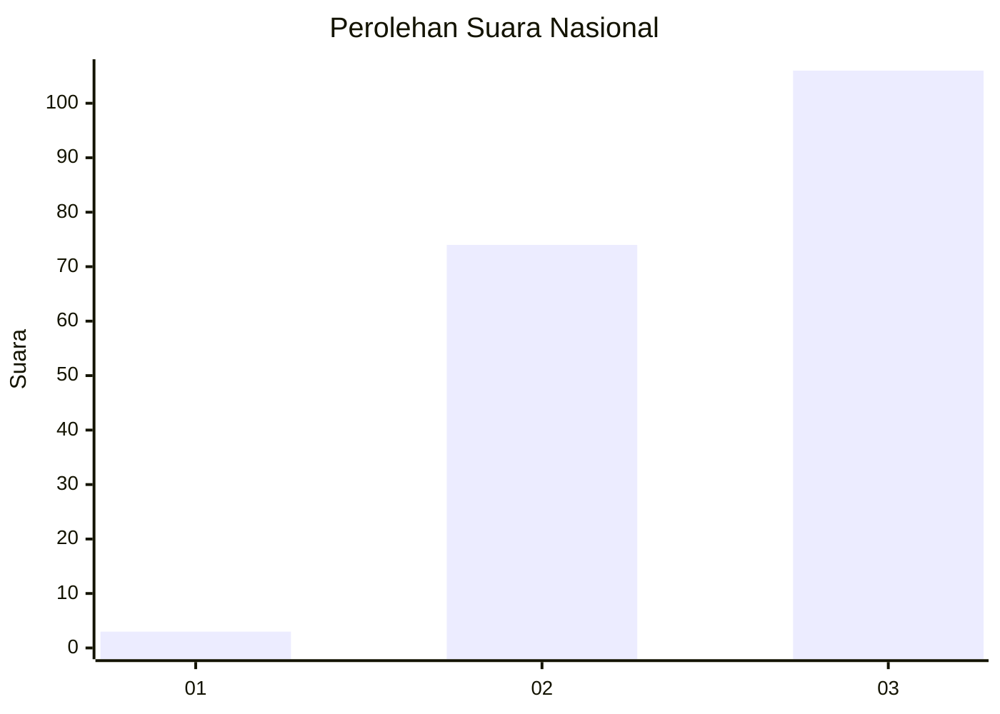
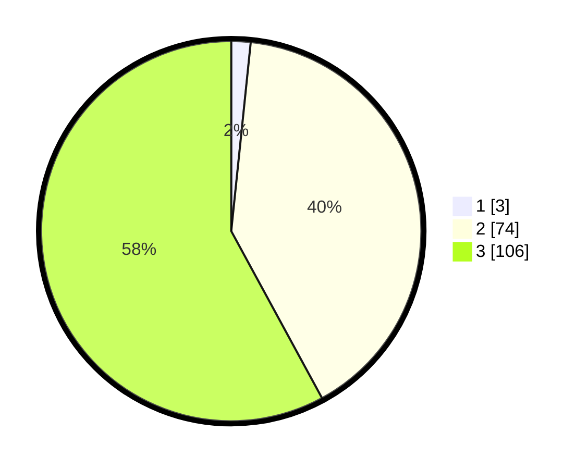

# Hasil

## Grafik

## Tabel

| No. | Nama Paslon    | Suara | Suara (raw) | Persentase |
|:--- |:-------------- | -----:| -----------:| ----------:|
| 1   | ANIES MUHAIMIN | 3     | [3][p-1]    | 1,64       |
| 2   | PRABOWO GIBRAN | 74    | [74][p-2]   | 40,44      |
| 3   | GANJAR MAHFUD  | 106   | [106][p-3]  | 57,92      |

[p-1]: https://github.com/gigit-pemilu/pemilu-2024/blob/main/pilpres/hitung-suara/sub/51-bali/sub/05-klungkung/sub/04-dawan/sub/2010-pikat/sub/013-tps/sub/paslon-1.txt
[p-2]: https://github.com/gigit-pemilu/pemilu-2024/blob/main/pilpres/hitung-suara/sub/51-bali/sub/05-klungkung/sub/04-dawan/sub/2010-pikat/sub/013-tps/sub/paslon-2.txt
[p-3]: https://github.com/gigit-pemilu/pemilu-2024/blob/main/pilpres/hitung-suara/sub/51-bali/sub/05-klungkung/sub/04-dawan/sub/2010-pikat/sub/013-tps/sub/paslon-3.txt

## Foto C Plano

https://sirekap-obj-formc.kpu.go.id/4db7/pemilu/ppwp/51/05/04/20/10/5105042010013-20240215-002811--1411757d-ff35-4b11-a3a2-0c5d488ace13.jpg

https://sirekap-obj-formc.kpu.go.id/4db7/pemilu/ppwp/51/05/04/20/10/5105042010013-20240215-004941--b5db4afe-8401-49bd-acc5-7318b850b4a5.jpg

https://sirekap-obj-formc.kpu.go.id/4db7/pemilu/ppwp/51/05/04/20/10/5105042010013-20240215-005228--2267d2e0-7050-4031-a923-ae81e8db8392.jpg

## Metadata

| Key        | Value               |
| ---------- | ------------------- |
| Time Stamp | 2024-02-15 15:00:29 |

