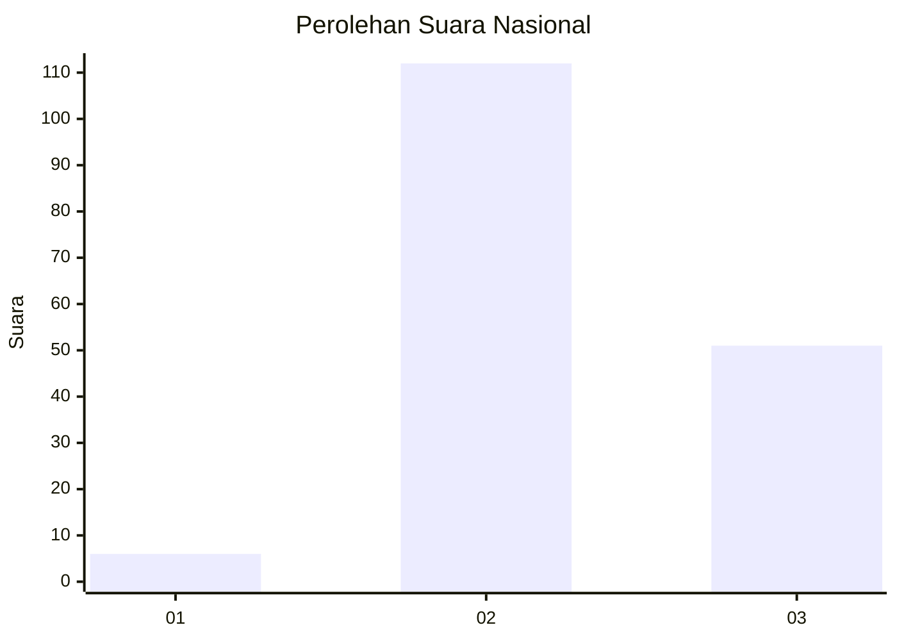

# Hasil

## Grafik

## Tabel

| No. | Nama Paslon    | Suara | Suara (raw) | Persentase |
|:--- |:-------------- | -----:| -----------:| ----------:|
| 1   | ANIES MUHAIMIN | 6     | [6][p-1]    | 3,55       |
| 2   | PRABOWO GIBRAN | 112   | [112][p-2]  | 66,27      |
| 3   | GANJAR MAHFUD  | 51    | [51][p-3]   | 30,18      |

[p-1]: https://github.com/gigit-pemilu/pemilu-2024/blob/main/pilpres/hitung-suara/sub/51-bali/sub/05-klungkung/sub/04-dawan/sub/2011-dawan-kaler/sub/006-tps/sub/paslon-1.txt
[p-2]: https://github.com/gigit-pemilu/pemilu-2024/blob/main/pilpres/hitung-suara/sub/51-bali/sub/05-klungkung/sub/04-dawan/sub/2011-dawan-kaler/sub/006-tps/sub/paslon-2.txt
[p-3]: https://github.com/gigit-pemilu/pemilu-2024/blob/main/pilpres/hitung-suara/sub/51-bali/sub/05-klungkung/sub/04-dawan/sub/2011-dawan-kaler/sub/006-tps/sub/paslon-3.txt

## Foto C Plano

https://sirekap-obj-formc.kpu.go.id/f3da/pemilu/ppwp/51/05/04/20/11/5105042011006-20240216-024323--b516b2a1-10d7-4b48-bd59-25b2a5891d87.jpg

https://sirekap-obj-formc.kpu.go.id/f3da/pemilu/ppwp/51/05/04/20/11/5105042011006-20240216-024335--04e83841-6e43-4ec1-ad76-db6b116e96c0.jpg

https://sirekap-obj-formc.kpu.go.id/f3da/pemilu/ppwp/51/05/04/20/11/5105042011006-20240216-024333--42f0885e-baff-47b0-a4cb-cc409a332864.jpg

## Metadata

| Key        | Value               |
| ---------- | ------------------- |
| Time Stamp | 2024-02-16 22:01:00 |

## DATA PEMILIH TETAP

Jumlah pemilih dalam DPT: **205**.
 * L: **101**.
 * P: **104**.

## DATA PENGGUNA HAK PILIH

Jumlah pengguna hak pilih dalam DPT: **177**.
 * L: **89**.
 * P: **88**.

Jumlah pengguna hak pilih dalam DPTb: **0**.
 * L: **0**.
 * P: **0**.

Jumlah pengguna hak pilih dalam DPK: **1**.
 * L: **0**.
 * P: **1**.

Jumlah pengguna hak pilih: **178**.
 * L: **89**.
 * P: **89**.

## JUMLAH SUARA SAH DAN TIDAK SAH

JUMLAH SELURUH SUARA SAH: **169**.

JUMLAH SUARA TIDAK SAH: **9**.

JUMLAH SELURUH SUARA SAH DAN SUARA TIDAK SAH: **178**.

