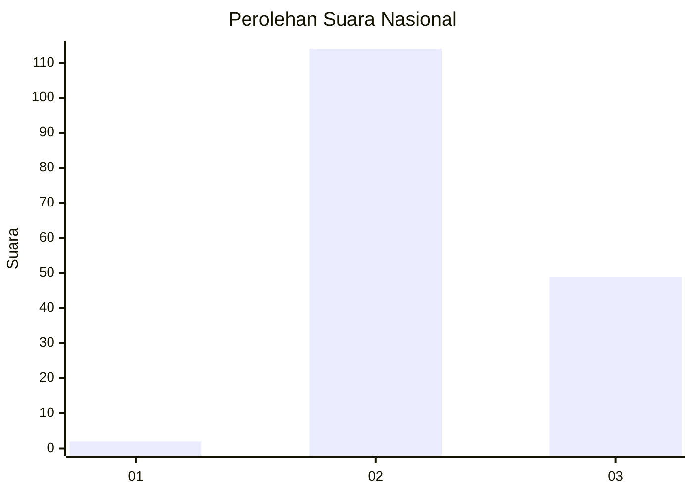

# Hasil

## Grafik

## Tabel

| No. | Nama Paslon    | Suara | Suara (raw) | Persentase |
|:--- |:-------------- | -----:| -----------:| ----------:|
| 1   | ANIES MUHAIMIN | 2     | [2][p-1]    | 1,21       |
| 2   | PRABOWO GIBRAN | 114   | [114][p-2]  | 69,09      |
| 3   | GANJAR MAHFUD  | 49    | [49][p-3]   | 29,70      |

[p-1]: https://github.com/gigit-pemilu/pemilu-2024/blob/main/pilpres/hitung-suara/sub/51-bali/sub/05-klungkung/sub/04-dawan/sub/2011-dawan-kaler/sub/007-tps/sub/paslon-1.txt
[p-2]: https://github.com/gigit-pemilu/pemilu-2024/blob/main/pilpres/hitung-suara/sub/51-bali/sub/05-klungkung/sub/04-dawan/sub/2011-dawan-kaler/sub/007-tps/sub/paslon-2.txt
[p-3]: https://github.com/gigit-pemilu/pemilu-2024/blob/main/pilpres/hitung-suara/sub/51-bali/sub/05-klungkung/sub/04-dawan/sub/2011-dawan-kaler/sub/007-tps/sub/paslon-3.txt

## Foto C Plano

https://sirekap-obj-formc.kpu.go.id/bc2b/pemilu/ppwp/51/05/04/20/11/5105042011007-20240216-033723--ad2feca2-396f-41f3-b425-fe992b7e7d79.jpg

https://sirekap-obj-formc.kpu.go.id/bc2b/pemilu/ppwp/51/05/04/20/11/5105042011007-20240216-033727--b121480d-0a41-4782-a361-fb1df4872433.jpg

https://sirekap-obj-formc.kpu.go.id/bc2b/pemilu/ppwp/51/05/04/20/11/5105042011007-20240216-033724--b14e74f5-6bd7-476a-8de7-7b2ec9b7fe90.jpg

## Metadata

| Key        | Value               |
| ---------- | ------------------- |
| Time Stamp | 2024-02-16 22:01:00 |

## DATA PEMILIH TETAP

Jumlah pemilih dalam DPT: **221**.
 * L: **111**.
 * P: **110**.

## DATA PENGGUNA HAK PILIH

Jumlah pengguna hak pilih dalam DPT: **187**.
 * L: **97**.
 * P: **90**.

Jumlah pengguna hak pilih dalam DPTb: **0**.
 * L: **0**.
 * P: **0**.

Jumlah pengguna hak pilih dalam DPK: **0**.
 * L: **0**.
 * P: **0**.

Jumlah pengguna hak pilih: **187**.
 * L: **97**.
 * P: **90**.

## JUMLAH SUARA SAH DAN TIDAK SAH

JUMLAH SELURUH SUARA SAH: **165**.

JUMLAH SUARA TIDAK SAH: **22**.

JUMLAH SELURUH SUARA SAH DAN SUARA TIDAK SAH: **187**.

