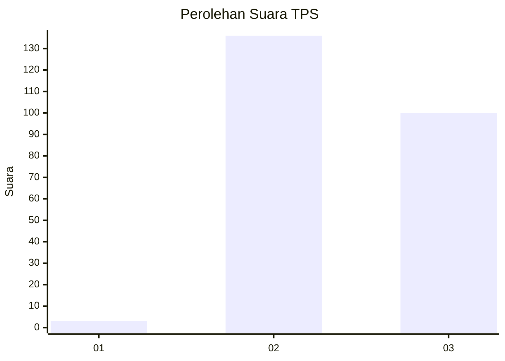
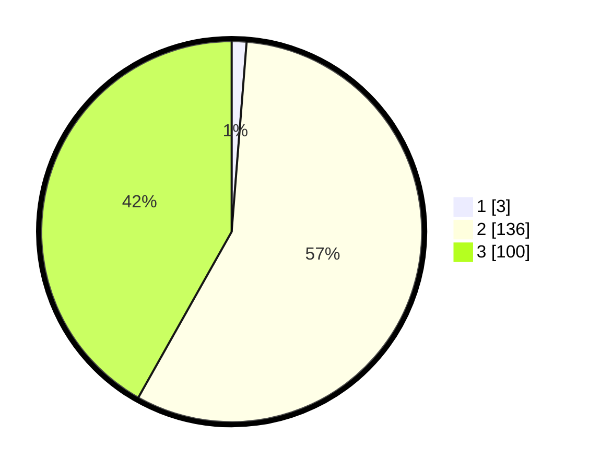

# Hasil

## Grafik

## Tabel

| No. | Nama Paslon    | Suara | Suara (raw) | Persentase |
|:--- |:-------------- | -----:| -----------:| ----------:|
| 1   | ANIES MUHAIMIN | 3     | [3][p-1]    | 1,26       |
| 2   | PRABOWO GIBRAN | 136   | [136][p-2]  | 56,90      |
| 3   | GANJAR MAHFUD  | 100   | [100][p-3]  | 41,84      |

[p-1]: https://github.com/gigit-pemilu/pemilu-2024-51-bali/blob/main/pilpres/hitung-suara/sub/51-bali/sub/06-bangli/sub/01-susut/sub/2001-apuan/sub/001-tps/sub/paslon-1.txt
[p-2]: https://github.com/gigit-pemilu/pemilu-2024-51-bali/blob/main/pilpres/hitung-suara/sub/51-bali/sub/06-bangli/sub/01-susut/sub/2001-apuan/sub/001-tps/sub/paslon-2.txt
[p-3]: https://github.com/gigit-pemilu/pemilu-2024-51-bali/blob/main/pilpres/hitung-suara/sub/51-bali/sub/06-bangli/sub/01-susut/sub/2001-apuan/sub/001-tps/sub/paslon-3.txt

## Foto C Plano

https://sirekap-obj-formc.kpu.go.id/2642/pemilu/ppwp/51/06/01/20/01/5106012001001-20240218-065951--2fc7af3b-1f43-4aab-a4aa-f28e3b802309.jpg

https://sirekap-obj-formc.kpu.go.id/2642/pemilu/ppwp/51/06/01/20/01/5106012001001-20240218-065953--cb6f877c-3eff-46e8-9b64-be0996442a85.jpg

https://sirekap-obj-formc.kpu.go.id/2642/pemilu/ppwp/51/06/01/20/01/5106012001001-20240218-065952--b55fdc4e-9879-4363-bf9f-08d6d62ee7c9.jpg

## Metadata

| Key        | Value               |
| ---------- | ------------------- |
| Time Stamp | 2024-02-21 15:00:00 |

## DATA PEMILIH TETAP

Jumlah pemilih dalam DPT: **249**.
 * L: **121**.
 * P: **128**.

## DATA PENGGUNA HAK PILIH

Jumlah pengguna hak pilih dalam DPT: **0**.
 * L: **0**.
 * P: **0**.

Jumlah pengguna hak pilih dalam DPTb: **0**.
 * L: **0**.
 * P: **0**.

Jumlah pengguna hak pilih dalam DPK: **0**.
 * L: **0**.
 * P: **0**.

Jumlah pengguna hak pilih: **0**.
 * L: **0**.
 * P: **0**.

## JUMLAH SUARA SAH DAN TIDAK SAH

JUMLAH SELURUH SUARA SAH: **239**.

JUMLAH SUARA TIDAK SAH: **10**.

JUMLAH SELURUH SUARA SAH DAN SUARA TIDAK SAH: **249**.

