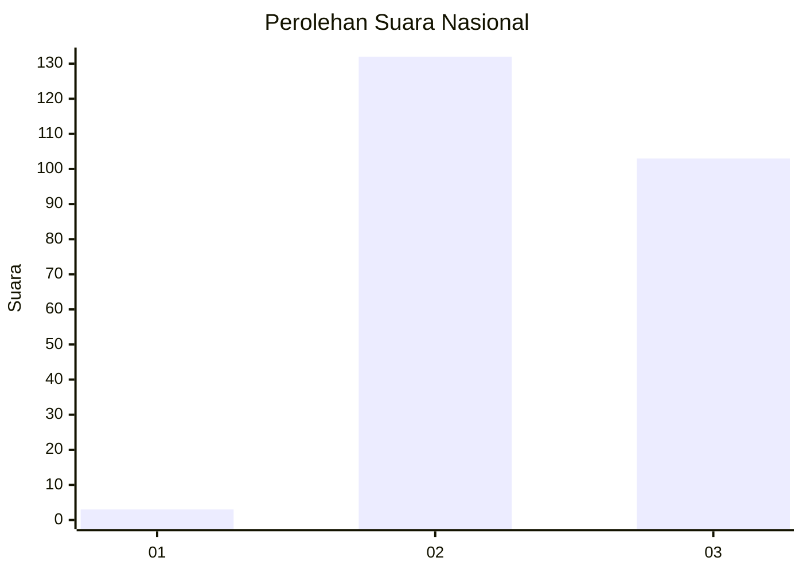
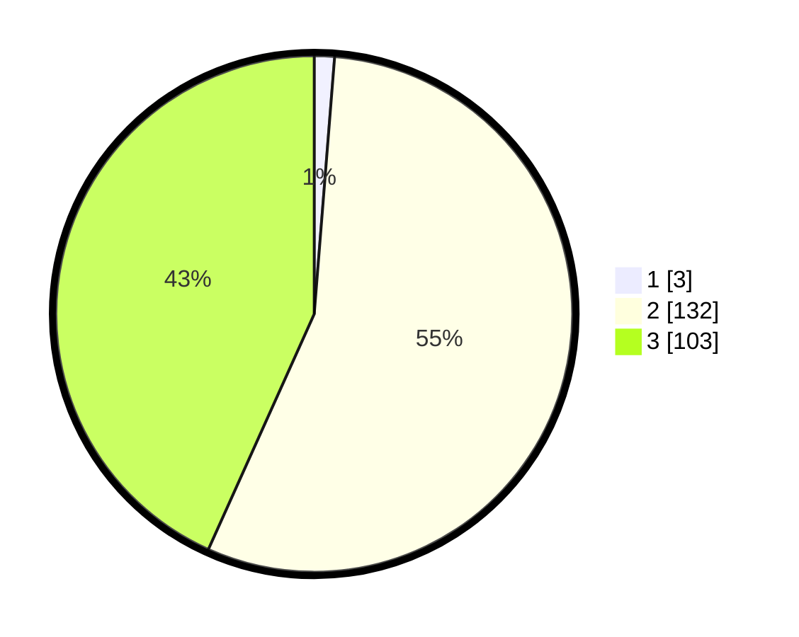

# Hasil

## Grafik

## Tabel

| No. | Nama Paslon    | Suara | Suara (raw) | Persentase |
|:--- |:-------------- | -----:| -----------:| ----------:|
| 1   | ANIES MUHAIMIN | 3     | [3][p-1]    | 1,26       |
| 2   | PRABOWO GIBRAN | 132   | [132][p-2]  | 55,46      |
| 3   | GANJAR MAHFUD  | 103   | [103][p-3]  | 43,28      |

[p-1]: https://github.com/gigit-pemilu/pemilu-2024/blob/main/pilpres/hitung-suara/sub/51-bali/sub/06-bangli/sub/01-susut/sub/2001-apuan/sub/002-tps/sub/paslon-1.txt
[p-2]: https://github.com/gigit-pemilu/pemilu-2024/blob/main/pilpres/hitung-suara/sub/51-bali/sub/06-bangli/sub/01-susut/sub/2001-apuan/sub/002-tps/sub/paslon-2.txt
[p-3]: https://github.com/gigit-pemilu/pemilu-2024/blob/main/pilpres/hitung-suara/sub/51-bali/sub/06-bangli/sub/01-susut/sub/2001-apuan/sub/002-tps/sub/paslon-3.txt

## Foto C Plano

https://sirekap-obj-formc.kpu.go.id/cc9a/pemilu/ppwp/51/06/01/20/01/5106012001002-20240214-221806--9b0f0c55-58ff-4162-937b-bfd0689daeaf.jpg

https://sirekap-obj-formc.kpu.go.id/cc9a/pemilu/ppwp/51/06/01/20/01/5106012001002-20240214-221842--e029e093-ea9a-48de-846a-3013dbf2f16a.jpg

https://sirekap-obj-formc.kpu.go.id/cc9a/pemilu/ppwp/51/06/01/20/01/5106012001002-20240214-221850--9909d864-4bba-4796-94a5-bd84ee75e835.jpg

## Metadata

| Key        | Value               |
| ---------- | ------------------- |
| Time Stamp | 2024-02-15 16:00:26 |

## DATA PEMILIH TETAP

Jumlah pemilih dalam DPT: **292**.
 * L: **161**.
 * P: **131**.

## DATA PENGGUNA HAK PILIH

Jumlah pengguna hak pilih dalam DPT: **247**.
 * L: **131**.
 * P: **116**.

Jumlah pengguna hak pilih dalam DPTb: **0**.
 * L: **0**.
 * P: **0**.

Jumlah pengguna hak pilih dalam DPK: **0**.
 * L: **0**.
 * P: **0**.

Jumlah pengguna hak pilih: **247**.
 * L: **131**.
 * P: **116**.

## JUMLAH SUARA SAH DAN TIDAK SAH

JUMLAH SELURUH SUARA SAH: **238**.

JUMLAH SUARA TIDAK SAH: **9**.

JUMLAH SELURUH SUARA SAH DAN SUARA TIDAK SAH: **247**.

