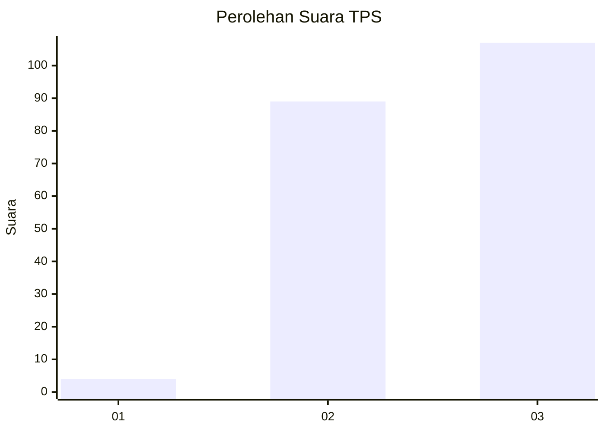
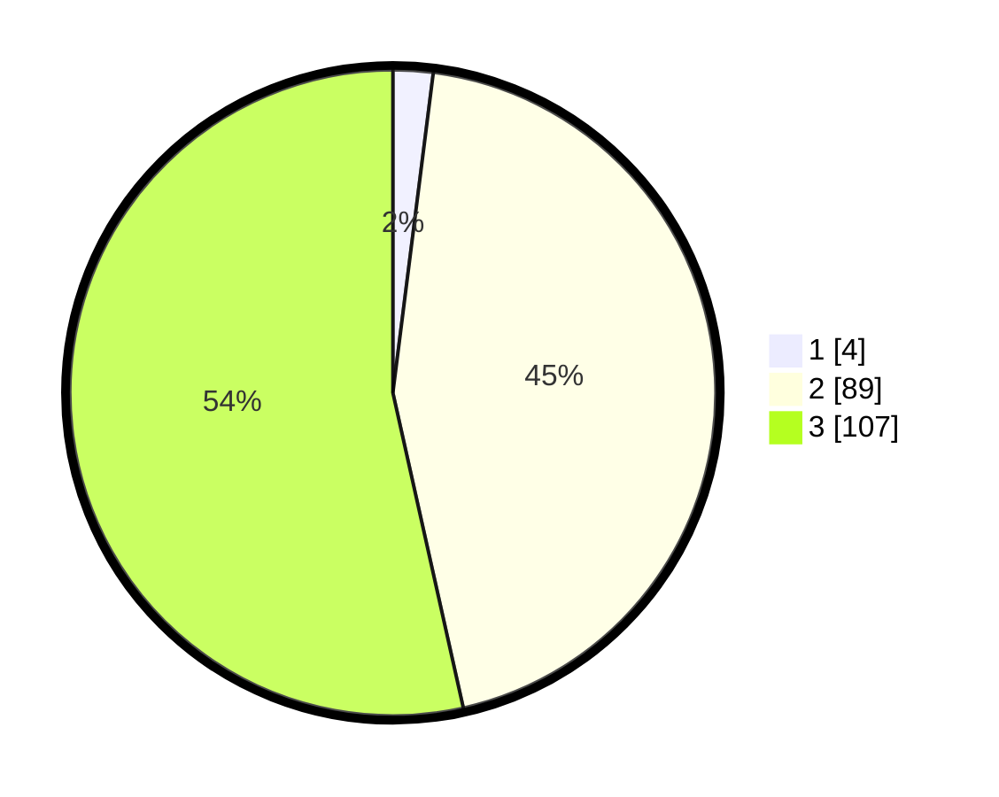

# Hasil

## Grafik

## Tabel

| No. | Nama Paslon    | Suara | Suara (raw) | Persentase |
|:--- |:-------------- | -----:| -----------:| ----------:|
| 1   | ANIES MUHAIMIN | 4     | [4][p-1]    | 2,00       |
| 2   | PRABOWO GIBRAN | 89    | [89][p-2]   | 44,50      |
| 3   | GANJAR MAHFUD  | 107   | [107][p-3]  | 53,50      |

[p-1]: https://github.com/gigit-pemilu/pemilu-2024-51-bali/blob/main/pilpres/hitung-suara/sub/51-bali/sub/06-bangli/sub/01-susut/sub/2001-apuan/sub/006-tps/sub/paslon-1.txt
[p-2]: https://github.com/gigit-pemilu/pemilu-2024-51-bali/blob/main/pilpres/hitung-suara/sub/51-bali/sub/06-bangli/sub/01-susut/sub/2001-apuan/sub/006-tps/sub/paslon-2.txt
[p-3]: https://github.com/gigit-pemilu/pemilu-2024-51-bali/blob/main/pilpres/hitung-suara/sub/51-bali/sub/06-bangli/sub/01-susut/sub/2001-apuan/sub/006-tps/sub/paslon-3.txt

## Foto C Plano

https://sirekap-obj-formc.kpu.go.id/660c/pemilu/ppwp/51/06/01/20/01/5106012001006-20240214-155027--8c3ee596-6219-4362-b634-5abb6912fef1.jpg

https://sirekap-obj-formc.kpu.go.id/660c/pemilu/ppwp/51/06/01/20/01/5106012001006-20240214-155030--a895c4c7-d59f-4e8e-833e-fae389a8523f.jpg

https://sirekap-obj-formc.kpu.go.id/660c/pemilu/ppwp/51/06/01/20/01/5106012001006-20240214-155034--38ce1128-67a9-41c8-811a-ffe9d44662c5.jpg

## Metadata

| Key        | Value               |
| ---------- | ------------------- |
| Time Stamp | 2024-02-14 21:46:01 |

## DATA PEMILIH TETAP

Jumlah pemilih dalam DPT: **254**.
 * L: **129**.
 * P: **125**.

## DATA PENGGUNA HAK PILIH

Jumlah pengguna hak pilih dalam DPT: **209**.
 * L: **109**.
 * P: **100**.

Jumlah pengguna hak pilih dalam DPTb: **0**.
 * L: **0**.
 * P: **0**.

Jumlah pengguna hak pilih dalam DPK: **0**.
 * L: **0**.
 * P: **0**.

Jumlah pengguna hak pilih: **209**.
 * L: **109**.
 * P: **100**.

## JUMLAH SUARA SAH DAN TIDAK SAH

JUMLAH SELURUH SUARA SAH: **200**.

JUMLAH SUARA TIDAK SAH: **9**.

JUMLAH SELURUH SUARA SAH DAN SUARA TIDAK SAH: **209**.

