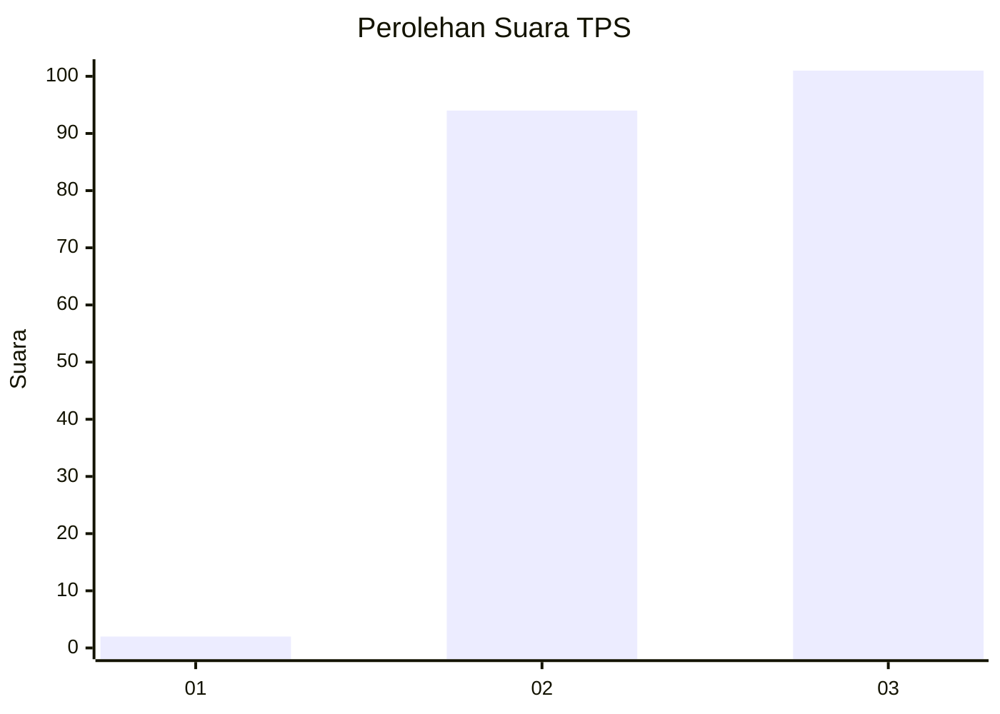
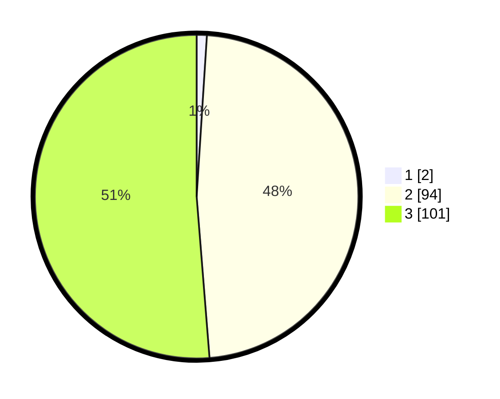

# Hasil

## Grafik

## Tabel

| No. | Nama Paslon    | Suara | Suara (raw) | Persentase |
|:--- |:-------------- | -----:| -----------:| ----------:|
| 1   | ANIES MUHAIMIN | 2     | [2][p-1]    | 1,02       |
| 2   | PRABOWO GIBRAN | 94    | [94][p-2]   | 47,72      |
| 3   | GANJAR MAHFUD  | 101   | [101][p-3]  | 51,27      |

[p-1]: https://github.com/gigit-pemilu/pemilu-2024-51-bali/blob/main/pilpres/hitung-suara/sub/51-bali/sub/06-bangli/sub/01-susut/sub/2001-apuan/sub/007-tps/sub/paslon-1.txt
[p-2]: https://github.com/gigit-pemilu/pemilu-2024-51-bali/blob/main/pilpres/hitung-suara/sub/51-bali/sub/06-bangli/sub/01-susut/sub/2001-apuan/sub/007-tps/sub/paslon-2.txt
[p-3]: https://github.com/gigit-pemilu/pemilu-2024-51-bali/blob/main/pilpres/hitung-suara/sub/51-bali/sub/06-bangli/sub/01-susut/sub/2001-apuan/sub/007-tps/sub/paslon-3.txt

## Foto C Plano

https://sirekap-obj-formc.kpu.go.id/143e/pemilu/ppwp/51/06/01/20/01/5106012001007-20240216-155141--3942bb13-7f7c-45f1-a539-8f1c14aea32b.jpg

https://sirekap-obj-formc.kpu.go.id/143e/pemilu/ppwp/51/06/01/20/01/5106012001007-20240216-155143--ea241385-8dfc-4d4a-8626-0e48419913c1.jpg

https://sirekap-obj-formc.kpu.go.id/143e/pemilu/ppwp/51/06/01/20/01/5106012001007-20240216-155142--a21510c6-7f68-4acb-96c9-26129150c093.jpg

## Metadata

| Key        | Value               |
| ---------- | ------------------- |
| Time Stamp | 2024-02-17 10:00:02 |

## DATA PEMILIH TETAP

Jumlah pemilih dalam DPT: **248**.
 * L: **118**.
 * P: **130**.

## DATA PENGGUNA HAK PILIH

Jumlah pengguna hak pilih dalam DPT: **208**.
 * L: **91**.
 * P: **117**.

Jumlah pengguna hak pilih dalam DPTb: **0**.
 * L: **0**.
 * P: **0**.

Jumlah pengguna hak pilih dalam DPK: **0**.
 * L: **0**.
 * P: **0**.

Jumlah pengguna hak pilih: **208**.
 * L: **91**.
 * P: **117**.

## JUMLAH SUARA SAH DAN TIDAK SAH

JUMLAH SELURUH SUARA SAH: **197**.

JUMLAH SUARA TIDAK SAH: **11**.

JUMLAH SELURUH SUARA SAH DAN SUARA TIDAK SAH: **208**.

