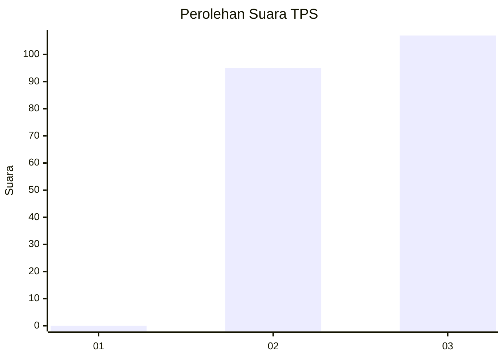
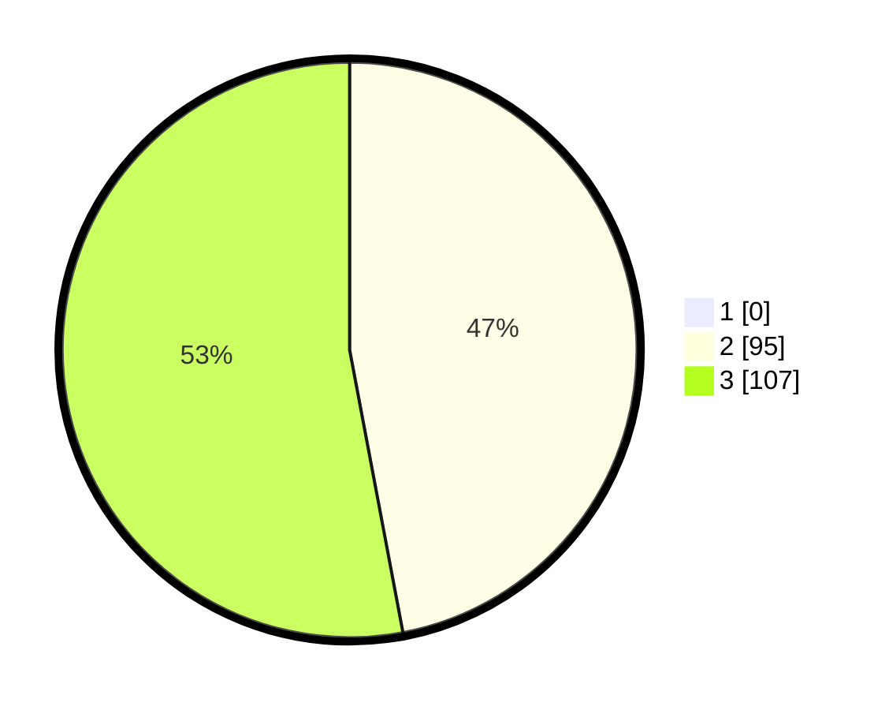

# Hasil

## Grafik

## Tabel

| No. | Nama Paslon    | Suara | Suara (raw) | Persentase |
|:--- |:-------------- | -----:| -----------:| ----------:|
| 1   | ANIES MUHAIMIN | 0     | [0][p-1]    | 0,00       |
| 2   | PRABOWO GIBRAN | 95    | [95][p-2]   | 47,03      |
| 3   | GANJAR MAHFUD  | 107   | [107][p-3]  | 52,97      |

[p-1]: https://github.com/gigit-pemilu/pemilu-2024-51-bali/blob/main/pilpres/hitung-suara/sub/51-bali/sub/06-bangli/sub/01-susut/sub/2001-apuan/sub/010-tps/sub/paslon-1.txt
[p-2]: https://github.com/gigit-pemilu/pemilu-2024-51-bali/blob/main/pilpres/hitung-suara/sub/51-bali/sub/06-bangli/sub/01-susut/sub/2001-apuan/sub/010-tps/sub/paslon-2.txt
[p-3]: https://github.com/gigit-pemilu/pemilu-2024-51-bali/blob/main/pilpres/hitung-suara/sub/51-bali/sub/06-bangli/sub/01-susut/sub/2001-apuan/sub/010-tps/sub/paslon-3.txt

## Foto C Plano

https://sirekap-obj-formc.kpu.go.id/41b6/pemilu/ppwp/51/06/01/20/01/5106012001010-20240216-061715--4e70a69b-5c36-4b00-96aa-7e57ad6dda6f.jpg

https://sirekap-obj-formc.kpu.go.id/41b6/pemilu/ppwp/51/06/01/20/01/5106012001010-20240216-061727--eb149827-c2a4-434e-b26a-2afb1dece790.jpg

https://sirekap-obj-formc.kpu.go.id/41b6/pemilu/ppwp/51/06/01/20/01/5106012001010-20240216-061718--c5c45ad2-a66e-4b01-8f81-ec14781e109a.jpg

## Metadata

| Key        | Value               |
| ---------- | ------------------- |
| Time Stamp | 2024-02-16 12:51:22 |

## DATA PEMILIH TETAP

Jumlah pemilih dalam DPT: **264**.
 * L: **126**.
 * P: **138**.

## DATA PENGGUNA HAK PILIH

Jumlah pengguna hak pilih dalam DPT: **218**.
 * L: **106**.
 * P: **112**.

Jumlah pengguna hak pilih dalam DPTb: **1**.
 * L: **1**.
 * P: **0**.

Jumlah pengguna hak pilih dalam DPK: **0**.
 * L: **0**.
 * P: **0**.

Jumlah pengguna hak pilih: **219**.
 * L: **107**.
 * P: **112**.

## JUMLAH SUARA SAH DAN TIDAK SAH

JUMLAH SELURUH SUARA SAH: **202**.

JUMLAH SUARA TIDAK SAH: **17**.

JUMLAH SELURUH SUARA SAH DAN SUARA TIDAK SAH: **219**.

