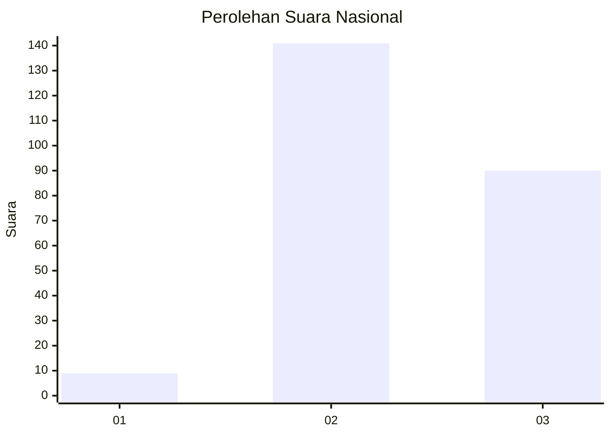
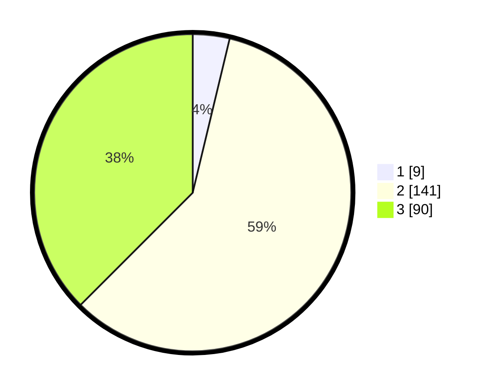

# Hasil

## Grafik

## Tabel

| No. | Nama Paslon    | Suara | Suara (raw) | Persentase |
|:--- |:-------------- | -----:| -----------:| ----------:|
| 1   | ANIES MUHAIMIN | 9     | [9][p-1]    | 3,75       |
| 2   | PRABOWO GIBRAN | 141   | [141][p-2]  | 58,75      |
| 3   | GANJAR MAHFUD  | 90    | [90][p-3]   | 37,50      |

[p-1]: https://github.com/gigit-pemilu/pemilu-2024/blob/main/pilpres/hitung-suara/sub/51-bali/sub/06-bangli/sub/01-susut/sub/2001-apuan/sub/013-tps/sub/paslon-1.txt
[p-2]: https://github.com/gigit-pemilu/pemilu-2024/blob/main/pilpres/hitung-suara/sub/51-bali/sub/06-bangli/sub/01-susut/sub/2001-apuan/sub/013-tps/sub/paslon-2.txt
[p-3]: https://github.com/gigit-pemilu/pemilu-2024/blob/main/pilpres/hitung-suara/sub/51-bali/sub/06-bangli/sub/01-susut/sub/2001-apuan/sub/013-tps/sub/paslon-3.txt

## Foto C Plano

https://sirekap-obj-formc.kpu.go.id/4290/pemilu/ppwp/51/06/01/20/01/5106012001013-20240214-214732--1e90bfc2-50ac-4931-9108-8c785a898667.jpg

https://sirekap-obj-formc.kpu.go.id/4290/pemilu/ppwp/51/06/01/20/01/5106012001013-20240214-231717--6863f95d-2ca3-47b4-aeeb-fd88357b73e5.jpg

https://sirekap-obj-formc.kpu.go.id/4290/pemilu/ppwp/51/06/01/20/01/5106012001013-20240214-231736--ec93fdd8-e50d-49b3-becf-6eb3c0713d7f.jpg

## Metadata

| Key        | Value               |
| ---------- | ------------------- |
| Time Stamp | 2024-02-24 22:31:28 |

