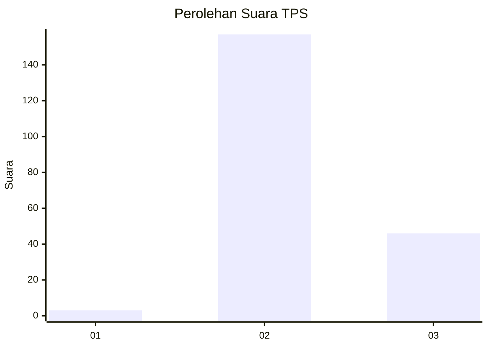
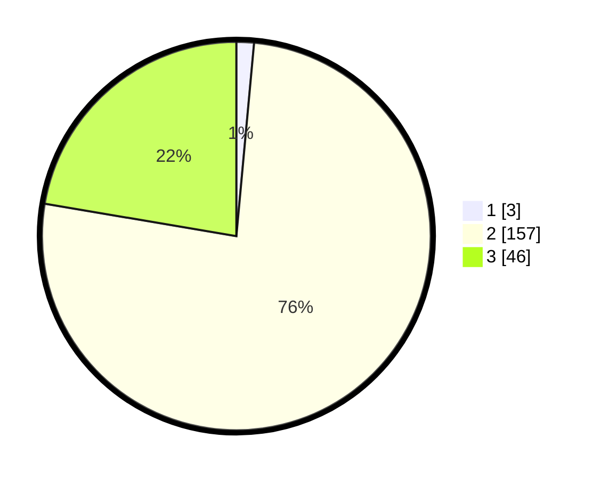

# Hasil

## Grafik

## Tabel

| No. | Nama Paslon    | Suara | Suara (raw) | Persentase |
|:--- |:-------------- | -----:| -----------:| ----------:|
| 1   | ANIES MUHAIMIN | 3     | [3][p-1]    | 1,46       |
| 2   | PRABOWO GIBRAN | 157   | [157][p-2]  | 76,21      |
| 3   | GANJAR MAHFUD  | 46    | [46][p-3]   | 22,33      |

[p-1]: https://github.com/gigit-pemilu/pemilu-2024-51-bali/blob/main/pilpres/hitung-suara/sub/51-bali/sub/06-bangli/sub/01-susut/sub/2002-demulih/sub/003-tps/sub/paslon-1.txt
[p-2]: https://github.com/gigit-pemilu/pemilu-2024-51-bali/blob/main/pilpres/hitung-suara/sub/51-bali/sub/06-bangli/sub/01-susut/sub/2002-demulih/sub/003-tps/sub/paslon-2.txt
[p-3]: https://github.com/gigit-pemilu/pemilu-2024-51-bali/blob/main/pilpres/hitung-suara/sub/51-bali/sub/06-bangli/sub/01-susut/sub/2002-demulih/sub/003-tps/sub/paslon-3.txt

## Foto C Plano

https://sirekap-obj-formc.kpu.go.id/ea58/pemilu/ppwp/51/06/01/20/02/5106012002003-20240216-013607--76bdf889-79ad-44f9-be98-cba4f71daa2f.jpg

https://sirekap-obj-formc.kpu.go.id/ea58/pemilu/ppwp/51/06/01/20/02/5106012002003-20240216-013609--b9aeef1a-0d23-497c-b630-5c29b2b30f75.jpg

https://sirekap-obj-formc.kpu.go.id/ea58/pemilu/ppwp/51/06/01/20/02/5106012002003-20240216-013608--138cbd15-4aeb-4da9-a4ca-af4698413c12.jpg

## Metadata

| Key        | Value               |
| ---------- | ------------------- |
| Time Stamp | 2024-02-16 12:51:22 |

## DATA PEMILIH TETAP

Jumlah pemilih dalam DPT: **261**.
 * L: **124**.
 * P: **137**.

## DATA PENGGUNA HAK PILIH

Jumlah pengguna hak pilih dalam DPT: **227**.
 * L: **107**.
 * P: **120**.

Jumlah pengguna hak pilih dalam DPTb: **0**.
 * L: **0**.
 * P: **0**.

Jumlah pengguna hak pilih dalam DPK: **0**.
 * L: **0**.
 * P: **0**.

Jumlah pengguna hak pilih: **227**.
 * L: **107**.
 * P: **120**.

## JUMLAH SUARA SAH DAN TIDAK SAH

JUMLAH SELURUH SUARA SAH: **206**.

JUMLAH SUARA TIDAK SAH: **21**.

JUMLAH SELURUH SUARA SAH DAN SUARA TIDAK SAH: **227**.

