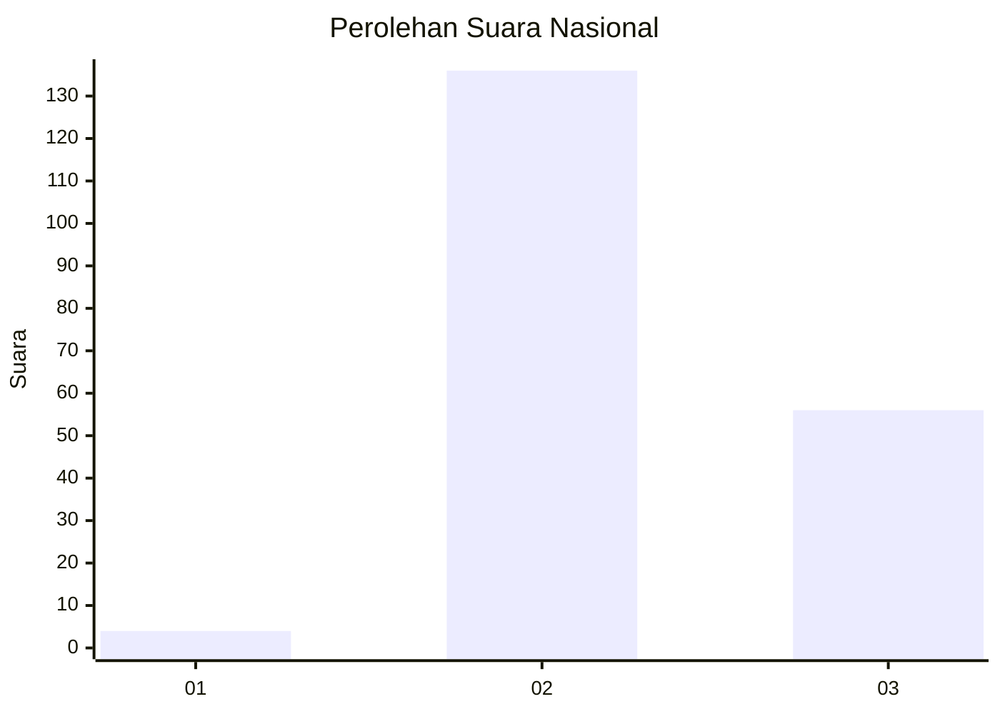

# Hasil

## Grafik

## Tabel

| No. | Nama Paslon    | Suara | Suara (raw) | Persentase |
|:--- |:-------------- | -----:| -----------:| ----------:|
| 1   | ANIES MUHAIMIN | 4     | [4][p-1]    | 2,04       |
| 2   | PRABOWO GIBRAN | 136   | [136][p-2]  | 69,39      |
| 3   | GANJAR MAHFUD  | 56    | [56][p-3]   | 28,57      |

[p-1]: https://github.com/gigit-pemilu/pemilu-2024/blob/main/pilpres/hitung-suara/sub/51-bali/sub/06-bangli/sub/01-susut/sub/2002-demulih/sub/004-tps/sub/paslon-1.txt
[p-2]: https://github.com/gigit-pemilu/pemilu-2024/blob/main/pilpres/hitung-suara/sub/51-bali/sub/06-bangli/sub/01-susut/sub/2002-demulih/sub/004-tps/sub/paslon-2.txt
[p-3]: https://github.com/gigit-pemilu/pemilu-2024/blob/main/pilpres/hitung-suara/sub/51-bali/sub/06-bangli/sub/01-susut/sub/2002-demulih/sub/004-tps/sub/paslon-3.txt

## Foto C Plano

https://sirekap-obj-formc.kpu.go.id/61f1/pemilu/ppwp/51/06/01/20/02/5106012002004-20240216-012252--94ea65c6-4353-4cb2-bf02-4d4aa4a0d5c3.jpg

https://sirekap-obj-formc.kpu.go.id/61f1/pemilu/ppwp/51/06/01/20/02/5106012002004-20240216-012257--82d0f1c5-1561-4daf-9018-ef94c7845c19.jpg

https://sirekap-obj-formc.kpu.go.id/61f1/pemilu/ppwp/51/06/01/20/02/5106012002004-20240216-012255--8e9910ca-9541-412b-a74e-9f61cf3553c4.jpg

## Metadata

| Key        | Value               |
| ---------- | ------------------- |
| Time Stamp | 2024-02-16 14:00:34 |

## DATA PEMILIH TETAP

Jumlah pemilih dalam DPT: **257**.
 * L: **120**.
 * P: **137**.

## DATA PENGGUNA HAK PILIH

Jumlah pengguna hak pilih dalam DPT: **219**.
 * L: **106**.
 * P: **113**.

Jumlah pengguna hak pilih dalam DPTb: **0**.
 * L: **0**.
 * P: **0**.

Jumlah pengguna hak pilih dalam DPK: **0**.
 * L: **0**.
 * P: **0**.

Jumlah pengguna hak pilih: **219**.
 * L: **106**.
 * P: **113**.

## JUMLAH SUARA SAH DAN TIDAK SAH

JUMLAH SELURUH SUARA SAH: **196**.

JUMLAH SUARA TIDAK SAH: **23**.

JUMLAH SELURUH SUARA SAH DAN SUARA TIDAK SAH: **219**.

