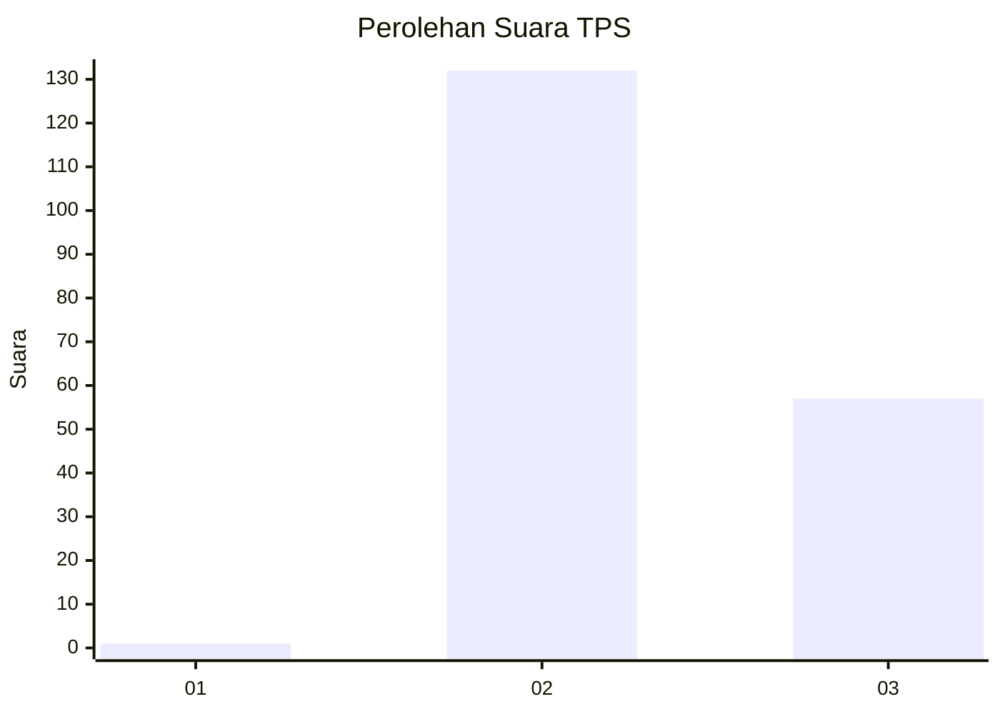
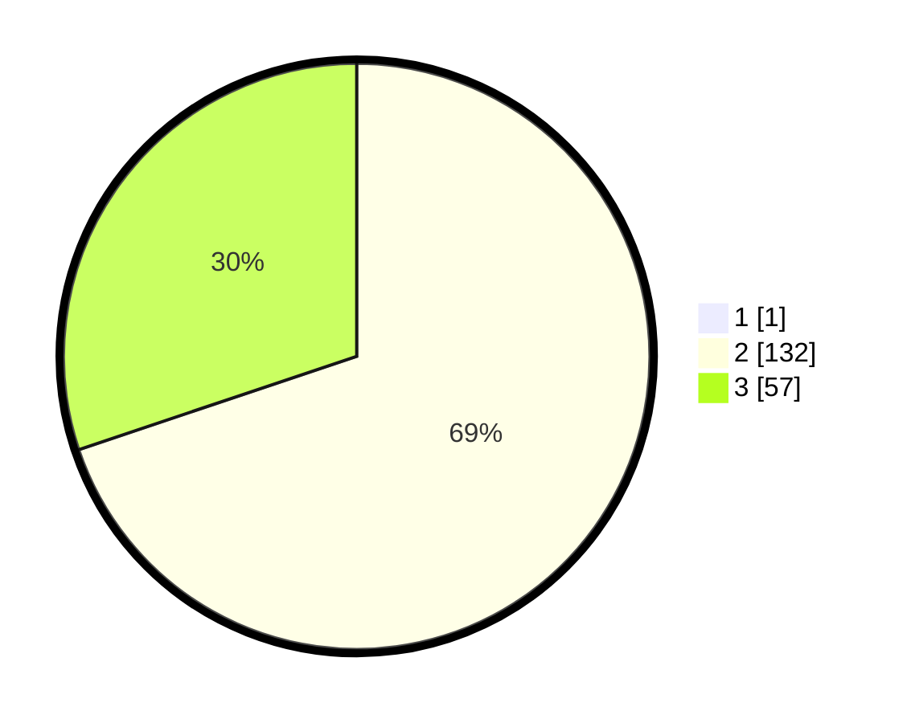

# Hasil

## Grafik

## Tabel

| No. | Nama Paslon    | Suara | Suara (raw) | Persentase |
|:--- |:-------------- | -----:| -----------:| ----------:|
| 1   | ANIES MUHAIMIN | 1     | [1][p-1]    | 0,53       |
| 2   | PRABOWO GIBRAN | 132   | [132][p-2]  | 69,47      |
| 3   | GANJAR MAHFUD  | 57    | [57][p-3]   | 30,00      |

[p-1]: https://github.com/gigit-pemilu/pemilu-2024-51-bali/blob/main/pilpres/hitung-suara/sub/51-bali/sub/06-bangli/sub/01-susut/sub/2002-demulih/sub/005-tps/sub/paslon-1.txt
[p-2]: https://github.com/gigit-pemilu/pemilu-2024-51-bali/blob/main/pilpres/hitung-suara/sub/51-bali/sub/06-bangli/sub/01-susut/sub/2002-demulih/sub/005-tps/sub/paslon-2.txt
[p-3]: https://github.com/gigit-pemilu/pemilu-2024-51-bali/blob/main/pilpres/hitung-suara/sub/51-bali/sub/06-bangli/sub/01-susut/sub/2002-demulih/sub/005-tps/sub/paslon-3.txt

## Foto C Plano

https://sirekap-obj-formc.kpu.go.id/c69e/pemilu/ppwp/51/06/01/20/02/5106012002005-20240215-211754--7c2bc72b-bb27-4ad0-80df-a9a0d8860b02.jpg

https://sirekap-obj-formc.kpu.go.id/c69e/pemilu/ppwp/51/06/01/20/02/5106012002005-20240215-211757--ddd48e0c-df62-48ad-8fc8-9fa30c0fe2b8.jpg

https://sirekap-obj-formc.kpu.go.id/c69e/pemilu/ppwp/51/06/01/20/02/5106012002005-20240215-211755--a23befe2-bb5d-4c28-a7e7-716419347239.jpg

## Metadata

| Key        | Value               |
| ---------- | ------------------- |
| Time Stamp | 2024-02-16 14:00:34 |

## DATA PEMILIH TETAP

Jumlah pemilih dalam DPT: **257**.
 * L: **124**.
 * P: **133**.

## DATA PENGGUNA HAK PILIH

Jumlah pengguna hak pilih dalam DPT: **215**.
 * L: **102**.
 * P: **113**.

Jumlah pengguna hak pilih dalam DPTb: **0**.
 * L: **0**.
 * P: **0**.

Jumlah pengguna hak pilih dalam DPK: **0**.
 * L: **0**.
 * P: **0**.

Jumlah pengguna hak pilih: **215**.
 * L: **102**.
 * P: **113**.

## JUMLAH SUARA SAH DAN TIDAK SAH

JUMLAH SELURUH SUARA SAH: **190**.

JUMLAH SUARA TIDAK SAH: **25**.

JUMLAH SELURUH SUARA SAH DAN SUARA TIDAK SAH: **215**.

