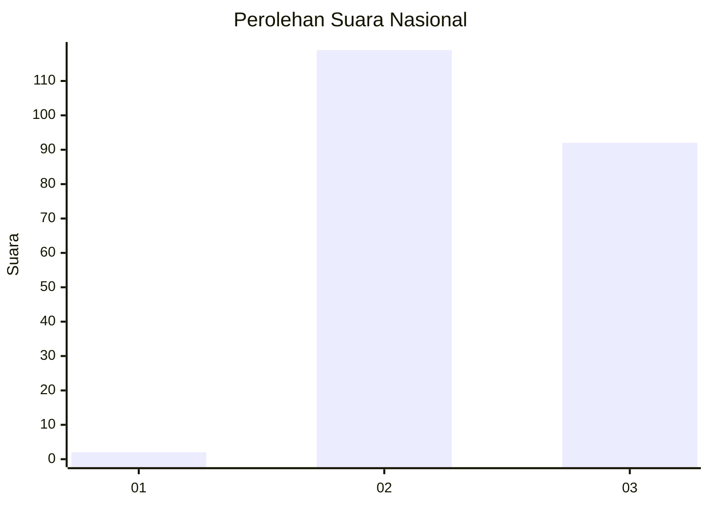
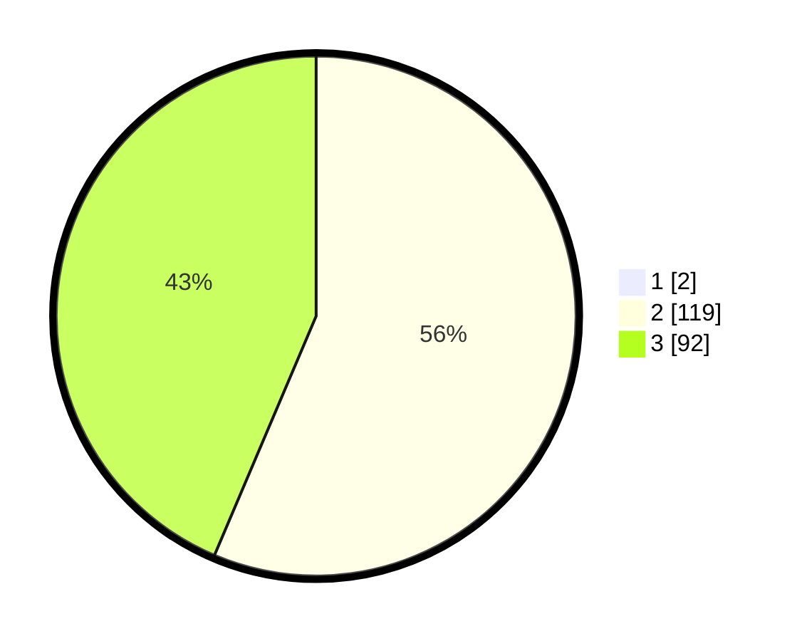

# Hasil

## Grafik

## Tabel

| No. | Nama Paslon    | Suara | Suara (raw) | Persentase |
|:--- |:-------------- | -----:| -----------:| ----------:|
| 1   | ANIES MUHAIMIN | 2     | [2][p-1]    | 0,94       |
| 2   | PRABOWO GIBRAN | 119   | [119][p-2]  | 55,87      |
| 3   | GANJAR MAHFUD  | 92    | [92][p-3]   | 43,19      |

[p-1]: https://github.com/gigit-pemilu/pemilu-2024/blob/main/pilpres/hitung-suara/sub/51-bali/sub/06-bangli/sub/01-susut/sub/2002-demulih/sub/006-tps/sub/paslon-1.txt
[p-2]: https://github.com/gigit-pemilu/pemilu-2024/blob/main/pilpres/hitung-suara/sub/51-bali/sub/06-bangli/sub/01-susut/sub/2002-demulih/sub/006-tps/sub/paslon-2.txt
[p-3]: https://github.com/gigit-pemilu/pemilu-2024/blob/main/pilpres/hitung-suara/sub/51-bali/sub/06-bangli/sub/01-susut/sub/2002-demulih/sub/006-tps/sub/paslon-3.txt

## Foto C Plano

https://sirekap-obj-formc.kpu.go.id/7a5b/pemilu/ppwp/51/06/01/20/02/5106012002006-20240214-223815--36509458-5403-4a19-97b8-4529ecefaa10.jpg

https://sirekap-obj-formc.kpu.go.id/7a5b/pemilu/ppwp/51/06/01/20/02/5106012002006-20240214-224039--dc7edace-64dc-43d0-abf0-cbcaf4e360d6.jpg

https://sirekap-obj-formc.kpu.go.id/7a5b/pemilu/ppwp/51/06/01/20/02/5106012002006-20240214-224145--4f839ed4-c8b1-407b-95a0-abf2723b22f9.jpg

## Metadata

| Key        | Value               |
| ---------- | ------------------- |
| Time Stamp | 2024-02-24 22:31:28 |

