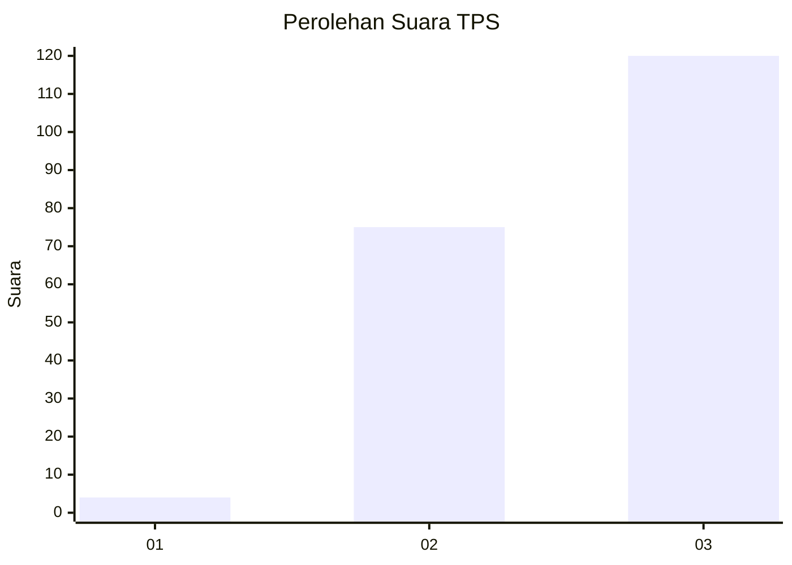
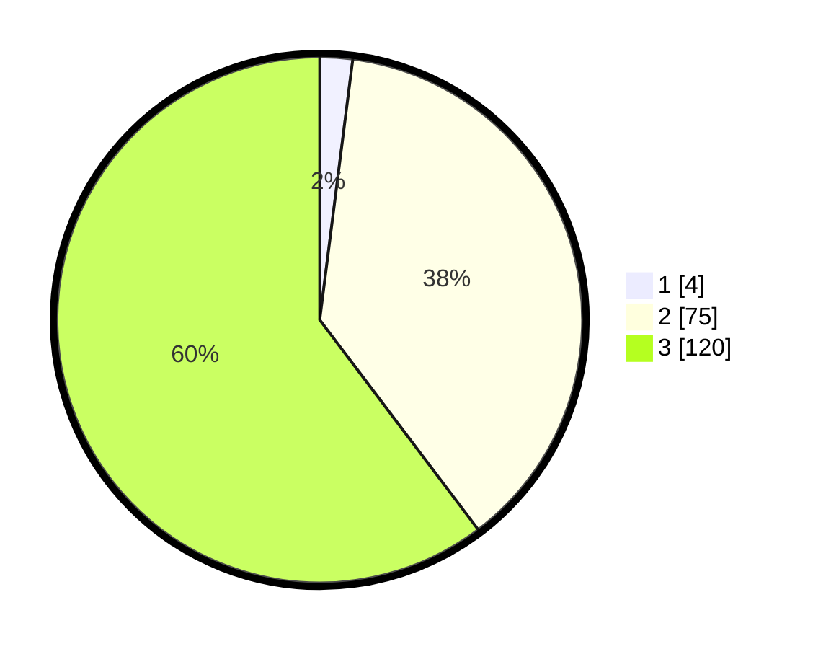

# Hasil

## Grafik

## Tabel

| No. | Nama Paslon    | Suara | Suara (raw) | Persentase |
|:--- |:-------------- | -----:| -----------:| ----------:|
| 1   | ANIES MUHAIMIN | 4     | [4][p-1]    | 2,01       |
| 2   | PRABOWO GIBRAN | 75    | [75][p-2]   | 37,69      |
| 3   | GANJAR MAHFUD  | 120   | [120][p-3]  | 60,30      |

[p-1]: https://github.com/gigit-pemilu/pemilu-2024-51-bali/blob/main/pilpres/hitung-suara/sub/51-bali/sub/06-bangli/sub/01-susut/sub/2002-demulih/sub/011-tps/sub/paslon-1.txt
[p-2]: https://github.com/gigit-pemilu/pemilu-2024-51-bali/blob/main/pilpres/hitung-suara/sub/51-bali/sub/06-bangli/sub/01-susut/sub/2002-demulih/sub/011-tps/sub/paslon-2.txt
[p-3]: https://github.com/gigit-pemilu/pemilu-2024-51-bali/blob/main/pilpres/hitung-suara/sub/51-bali/sub/06-bangli/sub/01-susut/sub/2002-demulih/sub/011-tps/sub/paslon-3.txt

## Foto C Plano

https://sirekap-obj-formc.kpu.go.id/7acf/pemilu/ppwp/51/06/01/20/02/5106012002011-20240215-032730--66e489a0-d436-42dc-b899-4b65ecf2f72e.jpg

https://sirekap-obj-formc.kpu.go.id/7acf/pemilu/ppwp/51/06/01/20/02/5106012002011-20240215-032734--176d82a6-61fb-4ff6-9411-02ccd045dc88.jpg

https://sirekap-obj-formc.kpu.go.id/7acf/pemilu/ppwp/51/06/01/20/02/5106012002011-20240215-032741--35ac8b34-fc05-4580-997d-9b3712893784.jpg

## Metadata

| Key        | Value               |
| ---------- | ------------------- |
| Time Stamp | 2024-02-24 22:31:28 |

