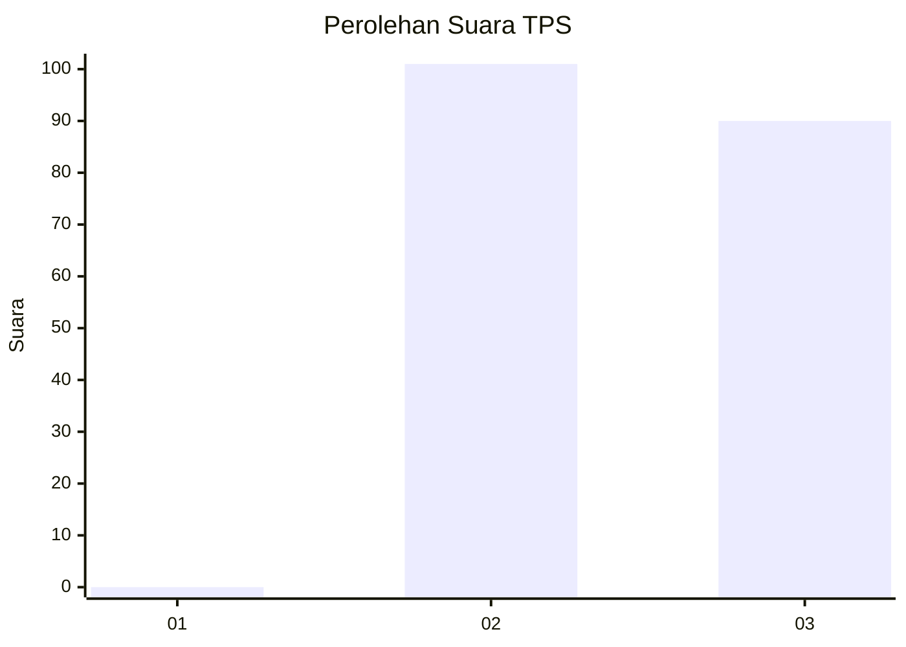
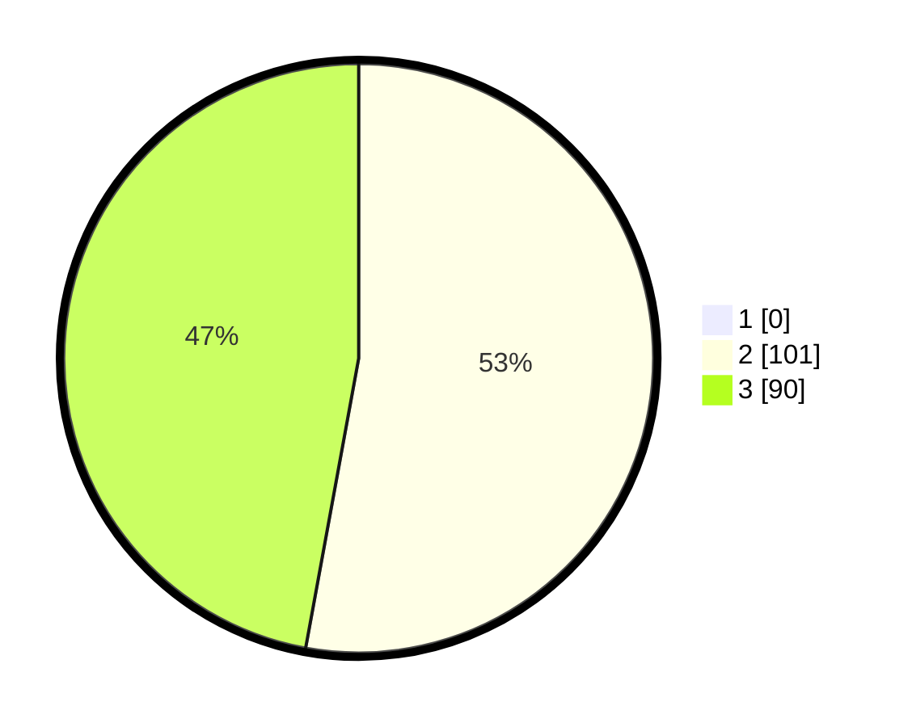

# Hasil

## Grafik

## Tabel

| No. | Nama Paslon    | Suara | Suara (raw) | Persentase |
|:--- |:-------------- | -----:| -----------:| ----------:|
| 1   | ANIES MUHAIMIN | 0     | [0][p-1]    | 0,00       |
| 2   | PRABOWO GIBRAN | 101   | [101][p-2]  | 52,88      |
| 3   | GANJAR MAHFUD  | 90    | [90][p-3]   | 47,12      |

[p-1]: https://github.com/gigit-pemilu/pemilu-2024-51-bali/blob/main/pilpres/hitung-suara/sub/51-bali/sub/06-bangli/sub/01-susut/sub/2002-demulih/sub/012-tps/sub/paslon-1.txt
[p-2]: https://github.com/gigit-pemilu/pemilu-2024-51-bali/blob/main/pilpres/hitung-suara/sub/51-bali/sub/06-bangli/sub/01-susut/sub/2002-demulih/sub/012-tps/sub/paslon-2.txt
[p-3]: https://github.com/gigit-pemilu/pemilu-2024-51-bali/blob/main/pilpres/hitung-suara/sub/51-bali/sub/06-bangli/sub/01-susut/sub/2002-demulih/sub/012-tps/sub/paslon-3.txt

## Foto C Plano

https://sirekap-obj-formc.kpu.go.id/f750/pemilu/ppwp/51/06/01/20/02/5106012002012-20240214-190222--2b9e1511-eedb-4135-9771-66c9e3c2458b.jpg

https://sirekap-obj-formc.kpu.go.id/f750/pemilu/ppwp/51/06/01/20/02/5106012002012-20240214-190338--04352df9-1036-41aa-a25d-862371571d7d.jpg

https://sirekap-obj-formc.kpu.go.id/f750/pemilu/ppwp/51/06/01/20/02/5106012002012-20240214-190504--e5c268a8-8360-4c3b-ac6d-f8d662a4f032.jpg

## Metadata

| Key        | Value               |
| ---------- | ------------------- |
| Time Stamp | 2024-02-24 22:31:28 |

