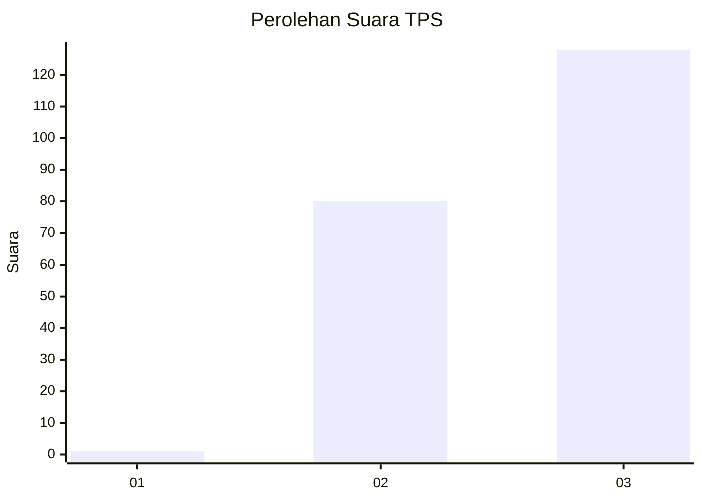
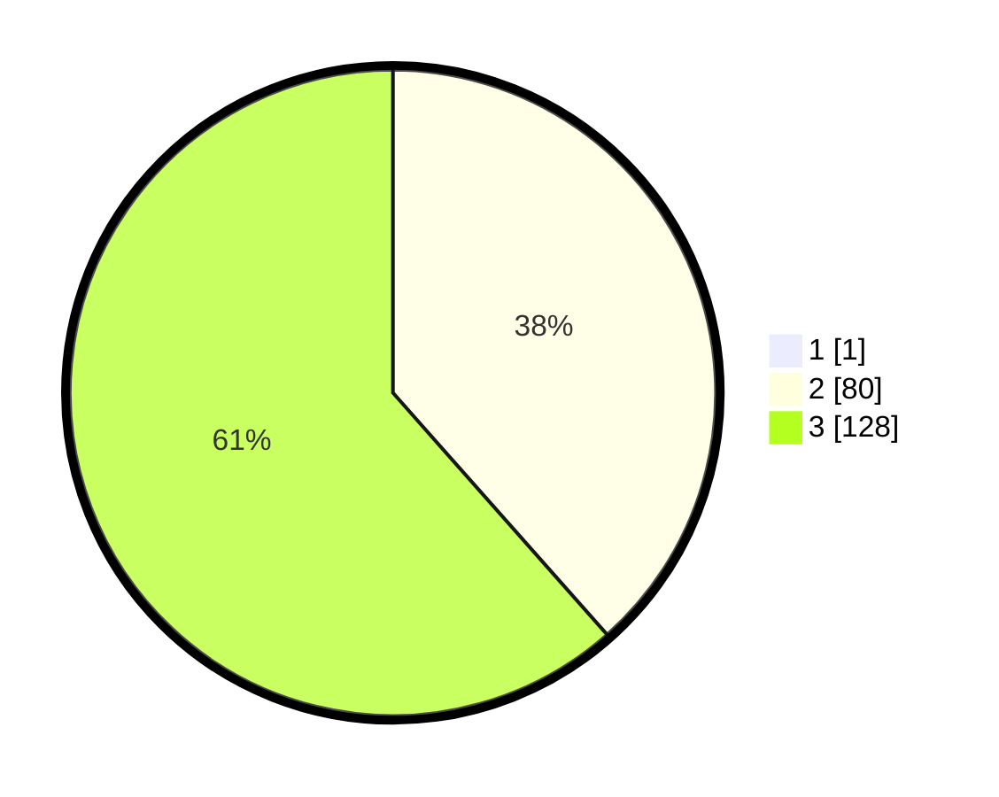

# Hasil

## Grafik

## Tabel

| No. | Nama Paslon    | Suara | Suara (raw) | Persentase |
|:--- |:-------------- | -----:| -----------:| ----------:|
| 1   | ANIES MUHAIMIN | 1     | [1][p-1]    | 0,48       |
| 2   | PRABOWO GIBRAN | 80    | [80][p-2]   | 38,28      |
| 3   | GANJAR MAHFUD  | 128   | [128][p-3]  | 61,24      |

[p-1]: https://github.com/gigit-pemilu/pemilu-2024-51-bali/blob/main/pilpres/hitung-suara/sub/51-bali/sub/06-bangli/sub/01-susut/sub/2002-demulih/sub/013-tps/sub/paslon-1.txt
[p-2]: https://github.com/gigit-pemilu/pemilu-2024-51-bali/blob/main/pilpres/hitung-suara/sub/51-bali/sub/06-bangli/sub/01-susut/sub/2002-demulih/sub/013-tps/sub/paslon-2.txt
[p-3]: https://github.com/gigit-pemilu/pemilu-2024-51-bali/blob/main/pilpres/hitung-suara/sub/51-bali/sub/06-bangli/sub/01-susut/sub/2002-demulih/sub/013-tps/sub/paslon-3.txt

## Foto C Plano

https://sirekap-obj-formc.kpu.go.id/efc8/pemilu/ppwp/51/06/01/20/02/5106012002013-20240317-194153--db9544b1-6358-44e7-bd1f-8ffbf1d4faf7.jpg

https://sirekap-obj-formc.kpu.go.id/efc8/pemilu/ppwp/51/06/01/20/02/5106012002013-20240214-210732--81f53dee-1cd4-43e2-837e-ff0ea822a883.jpg

https://sirekap-obj-formc.kpu.go.id/efc8/pemilu/ppwp/51/06/01/20/02/5106012002013-20240317-194248--96cfee77-dbf8-4d7a-8404-f6c10383b7d2.jpg

## Metadata

| Key        | Value               |
| ---------- | ------------------- |
| Time Stamp | 2024-03-17 20:00:00 |

