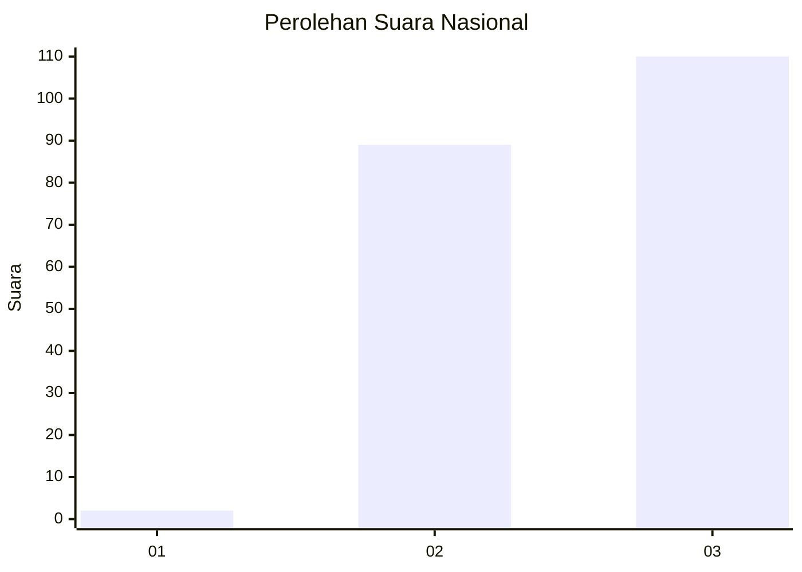
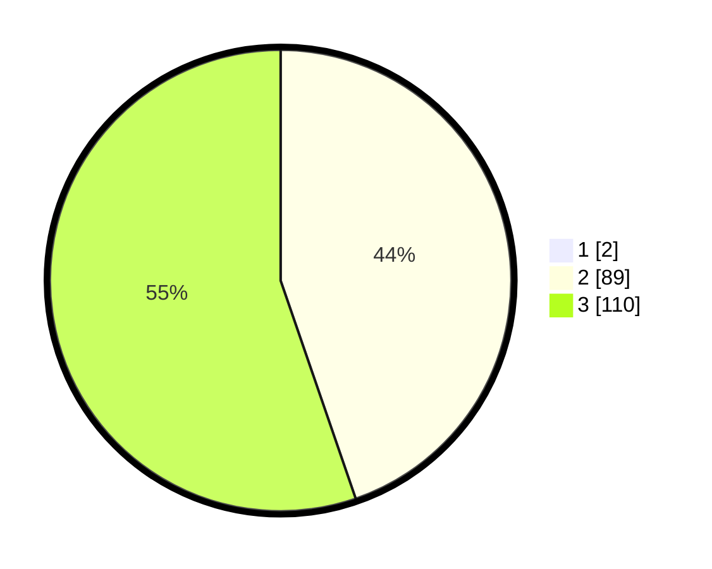

# Hasil

## Grafik

## Tabel

| No. | Nama Paslon    | Suara | Suara (raw) | Persentase |
|:--- |:-------------- | -----:| -----------:| ----------:|
| 1   | ANIES MUHAIMIN | 2     | [2][p-1]    | 1,00       |
| 2   | PRABOWO GIBRAN | 89    | [89][p-2]   | 44,28      |
| 3   | GANJAR MAHFUD  | 110   | [110][p-3]  | 54,73      |

[p-1]: https://github.com/gigit-pemilu/pemilu-2024/blob/main/pilpres/hitung-suara/sub/51-bali/sub/06-bangli/sub/01-susut/sub/2002-demulih/sub/014-tps/sub/paslon-1.txt
[p-2]: https://github.com/gigit-pemilu/pemilu-2024/blob/main/pilpres/hitung-suara/sub/51-bali/sub/06-bangli/sub/01-susut/sub/2002-demulih/sub/014-tps/sub/paslon-2.txt
[p-3]: https://github.com/gigit-pemilu/pemilu-2024/blob/main/pilpres/hitung-suara/sub/51-bali/sub/06-bangli/sub/01-susut/sub/2002-demulih/sub/014-tps/sub/paslon-3.txt

## Foto C Plano

https://sirekap-obj-formc.kpu.go.id/6a56/pemilu/ppwp/51/06/01/20/02/5106012002014-20240214-232743--23dcb7a5-8171-4450-98b7-54012a34a981.jpg

https://sirekap-obj-formc.kpu.go.id/6a56/pemilu/ppwp/51/06/01/20/02/5106012002014-20240214-232835--d0666955-0326-4513-a988-167d12a6ff4c.jpg

https://sirekap-obj-formc.kpu.go.id/6a56/pemilu/ppwp/51/06/01/20/02/5106012002014-20240214-232905--d9e04798-8a54-4faa-a436-a316293c9a71.jpg

## Metadata

| Key        | Value               |
| ---------- | ------------------- |
| Time Stamp | 2024-02-25 12:00:00 |

