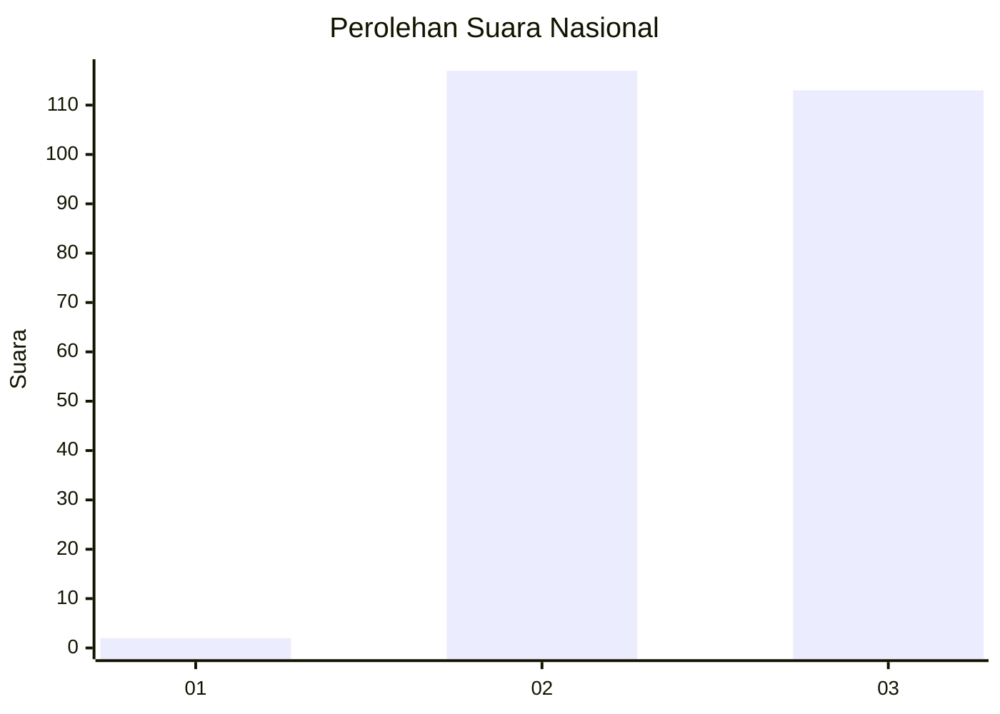
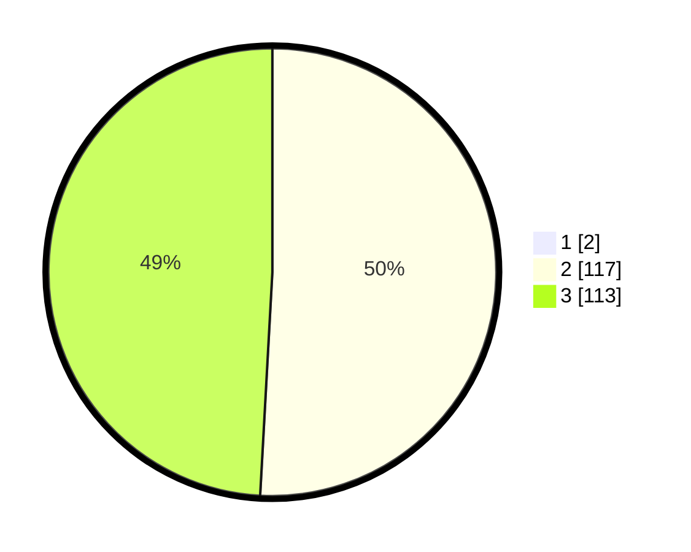

# Hasil

## Grafik

## Tabel

| No. | Nama Paslon    | Suara | Suara (raw) | Persentase |
|:--- |:-------------- | -----:| -----------:| ----------:|
| 1   | ANIES MUHAIMIN | 2     | [2][p-1]    | 0,86       |
| 2   | PRABOWO GIBRAN | 117   | [117][p-2]  | 50,43      |
| 3   | GANJAR MAHFUD  | 113   | [113][p-3]  | 48,71      |

[p-1]: https://github.com/gigit-pemilu/pemilu-2024/blob/main/pilpres/hitung-suara/sub/51-bali/sub/06-bangli/sub/01-susut/sub/2003-abuan/sub/001-tps/sub/paslon-1.txt
[p-2]: https://github.com/gigit-pemilu/pemilu-2024/blob/main/pilpres/hitung-suara/sub/51-bali/sub/06-bangli/sub/01-susut/sub/2003-abuan/sub/001-tps/sub/paslon-2.txt
[p-3]: https://github.com/gigit-pemilu/pemilu-2024/blob/main/pilpres/hitung-suara/sub/51-bali/sub/06-bangli/sub/01-susut/sub/2003-abuan/sub/001-tps/sub/paslon-3.txt

## Foto C Plano

https://sirekap-obj-formc.kpu.go.id/a3d1/pemilu/ppwp/51/06/01/20/03/5106012003001-20240214-232952--f1e4b2fa-1d54-4c06-9d40-0074a7342004.jpg

https://sirekap-obj-formc.kpu.go.id/a3d1/pemilu/ppwp/51/06/01/20/03/5106012003001-20240214-234014--180cd839-22ac-4e17-9746-663be3ded035.jpg

https://sirekap-obj-formc.kpu.go.id/a3d1/pemilu/ppwp/51/06/01/20/03/5106012003001-20240214-234117--b0640443-7f77-4b9c-8907-5812d4cb5941.jpg

## Metadata

| Key        | Value               |
| ---------- | ------------------- |
| Time Stamp | 2024-02-25 15:00:00 |

