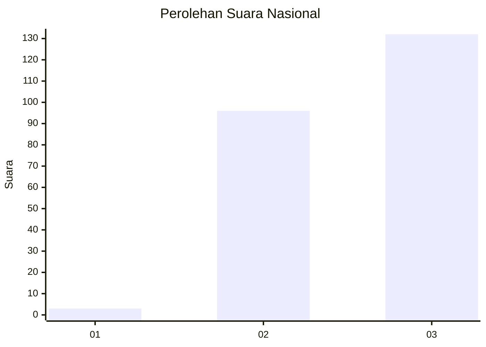
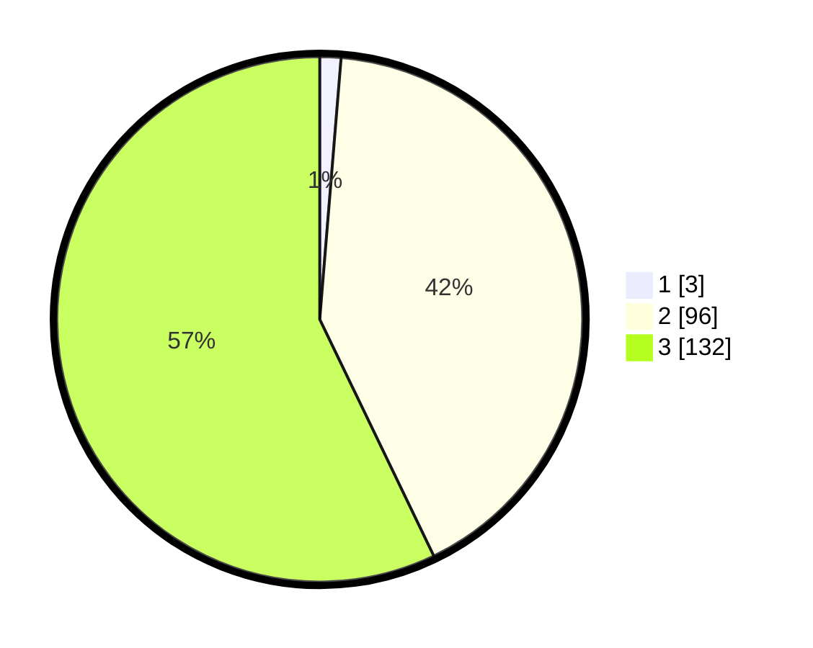

# Hasil

## Grafik

## Tabel

| No. | Nama Paslon    | Suara | Suara (raw) | Persentase |
|:--- |:-------------- | -----:| -----------:| ----------:|
| 1   | ANIES MUHAIMIN | 3     | [3][p-1]    | 1,30       |
| 2   | PRABOWO GIBRAN | 96    | [96][p-2]   | 41,56      |
| 3   | GANJAR MAHFUD  | 132   | [132][p-3]  | 57,14      |

[p-1]: https://github.com/gigit-pemilu/pemilu-2024/blob/main/pilpres/hitung-suara/sub/51-bali/sub/06-bangli/sub/01-susut/sub/2003-abuan/sub/002-tps/sub/paslon-1.txt
[p-2]: https://github.com/gigit-pemilu/pemilu-2024/blob/main/pilpres/hitung-suara/sub/51-bali/sub/06-bangli/sub/01-susut/sub/2003-abuan/sub/002-tps/sub/paslon-2.txt
[p-3]: https://github.com/gigit-pemilu/pemilu-2024/blob/main/pilpres/hitung-suara/sub/51-bali/sub/06-bangli/sub/01-susut/sub/2003-abuan/sub/002-tps/sub/paslon-3.txt

## Foto C Plano

https://sirekap-obj-formc.kpu.go.id/fef3/pemilu/ppwp/51/06/01/20/03/5106012003002-20240215-002905--7ccc24b4-84d1-4220-994c-3ed1fb77aa7a.jpg

https://sirekap-obj-formc.kpu.go.id/fef3/pemilu/ppwp/51/06/01/20/03/5106012003002-20240215-004227--cc940245-270b-4c8f-bf36-2b288cea22dc.jpg

https://sirekap-obj-formc.kpu.go.id/fef3/pemilu/ppwp/51/06/01/20/03/5106012003002-20240313-093116--f8522383-1fe8-4320-8727-e9069abab084.jpg

## Metadata

| Key        | Value               |
| ---------- | ------------------- |
| Time Stamp | 2024-03-13 10:00:00 |

