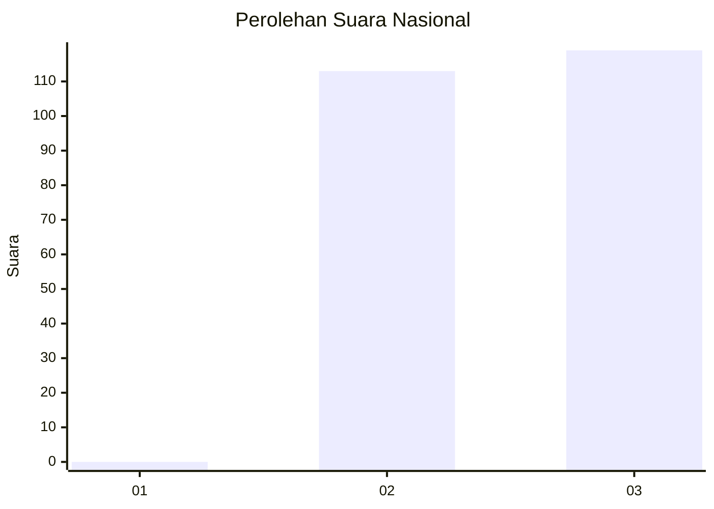
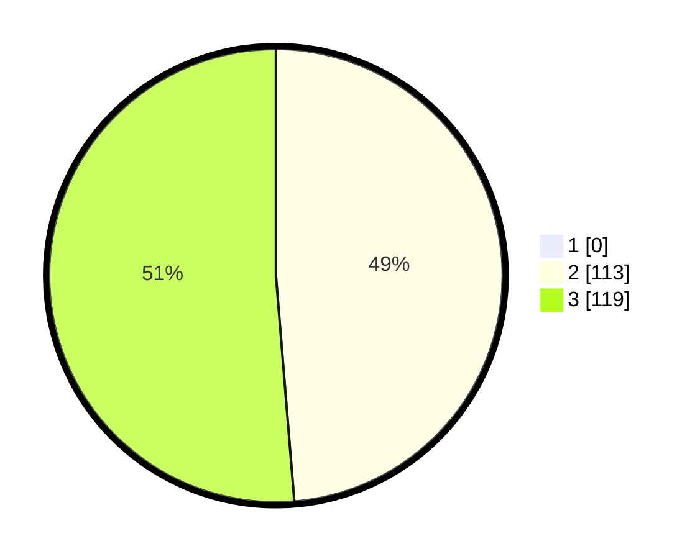

# Hasil

## Grafik

## Tabel

| No. | Nama Paslon    | Suara | Suara (raw) | Persentase |
|:--- |:-------------- | -----:| -----------:| ----------:|
| 1   | ANIES MUHAIMIN | 0     | [0][p-1]    | 0,00       |
| 2   | PRABOWO GIBRAN | 113   | [113][p-2]  | 48,71      |
| 3   | GANJAR MAHFUD  | 119   | [119][p-3]  | 51,29      |

[p-1]: https://github.com/gigit-pemilu/pemilu-2024/blob/main/pilpres/hitung-suara/sub/51-bali/sub/06-bangli/sub/01-susut/sub/2003-abuan/sub/003-tps/sub/paslon-1.txt
[p-2]: https://github.com/gigit-pemilu/pemilu-2024/blob/main/pilpres/hitung-suara/sub/51-bali/sub/06-bangli/sub/01-susut/sub/2003-abuan/sub/003-tps/sub/paslon-2.txt
[p-3]: https://github.com/gigit-pemilu/pemilu-2024/blob/main/pilpres/hitung-suara/sub/51-bali/sub/06-bangli/sub/01-susut/sub/2003-abuan/sub/003-tps/sub/paslon-3.txt

## Foto C Plano

https://sirekap-obj-formc.kpu.go.id/9e02/pemilu/ppwp/51/06/01/20/03/5106012003003-20240214-210931--95d1fb3f-b259-415f-aaf6-39a52f847b58.jpg

https://sirekap-obj-formc.kpu.go.id/9e02/pemilu/ppwp/51/06/01/20/03/5106012003003-20240214-211401--009d710c-ad1b-448a-926d-4915f39c1a89.jpg

https://sirekap-obj-formc.kpu.go.id/9e02/pemilu/ppwp/51/06/01/20/03/5106012003003-20240214-211541--07809f86-edca-467c-a4b6-f218f8c1462b.jpg

## Metadata

| Key        | Value               |
| ---------- | ------------------- |
| Time Stamp | 2024-02-24 22:31:28 |

