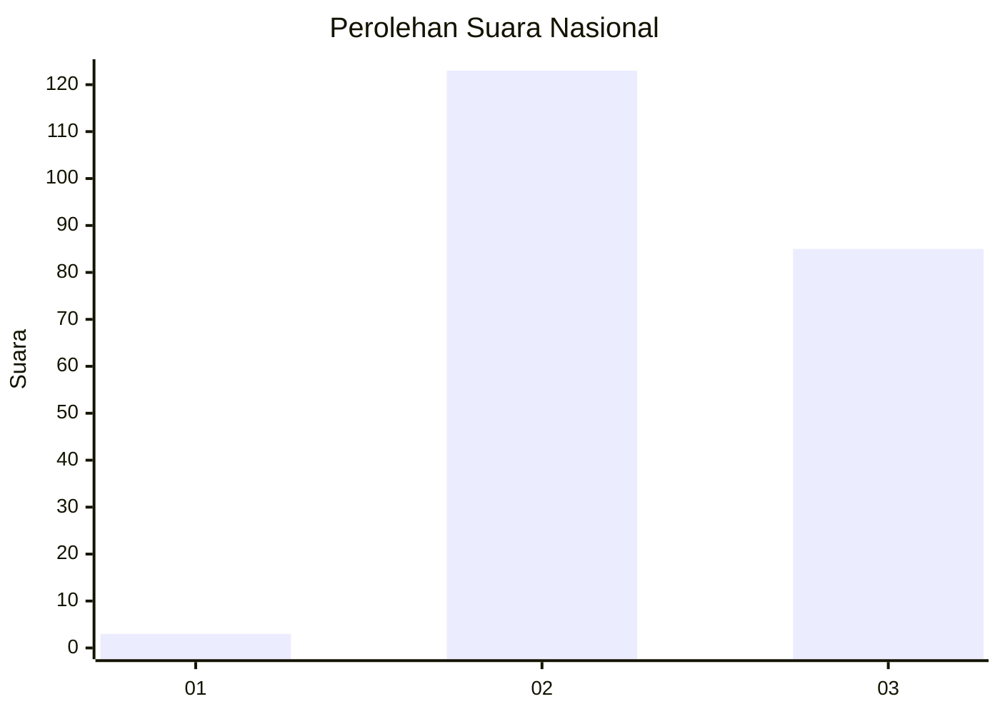
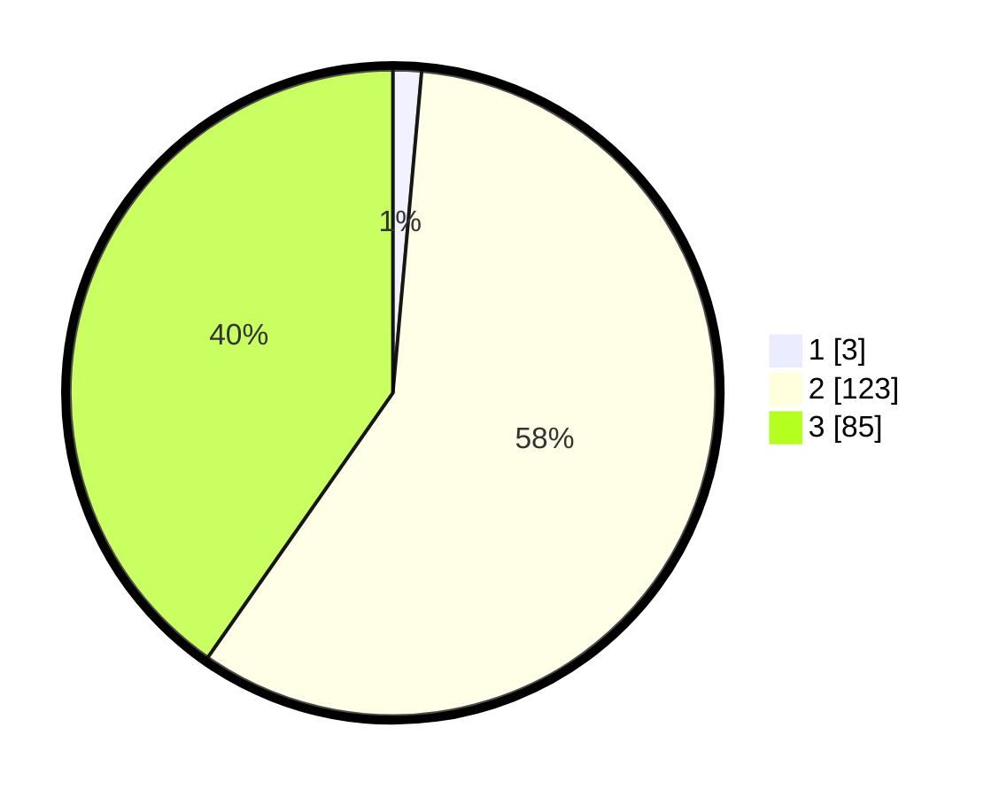

# Hasil

## Grafik

## Tabel

| No. | Nama Paslon    | Suara | Suara (raw) | Persentase |
|:--- |:-------------- | -----:| -----------:| ----------:|
| 1   | ANIES MUHAIMIN | 3     | [3][p-1]    | 1,42       |
| 2   | PRABOWO GIBRAN | 123   | [123][p-2]  | 58,29      |
| 3   | GANJAR MAHFUD  | 85    | [85][p-3]   | 40,28      |

[p-1]: https://github.com/gigit-pemilu/pemilu-2024/blob/main/pilpres/hitung-suara/sub/51-bali/sub/06-bangli/sub/01-susut/sub/2003-abuan/sub/013-tps/sub/paslon-1.txt
[p-2]: https://github.com/gigit-pemilu/pemilu-2024/blob/main/pilpres/hitung-suara/sub/51-bali/sub/06-bangli/sub/01-susut/sub/2003-abuan/sub/013-tps/sub/paslon-2.txt
[p-3]: https://github.com/gigit-pemilu/pemilu-2024/blob/main/pilpres/hitung-suara/sub/51-bali/sub/06-bangli/sub/01-susut/sub/2003-abuan/sub/013-tps/sub/paslon-3.txt

## Foto C Plano

https://sirekap-obj-formc.kpu.go.id/beab/pemilu/ppwp/51/06/01/20/03/5106012003013-20240216-145927--d6b87ab8-fd75-4bb5-878b-608a4ba895c5.jpg

https://sirekap-obj-formc.kpu.go.id/beab/pemilu/ppwp/51/06/01/20/03/5106012003013-20240216-145928--cd4d91a8-6910-43af-b8df-cdf2f74ed197.jpg

https://sirekap-obj-formc.kpu.go.id/beab/pemilu/ppwp/51/06/01/20/03/5106012003013-20240216-145927--cb5d3852-e09c-49f6-8e53-9ae37b2d76c2.jpg

## Metadata

| Key        | Value               |
| ---------- | ------------------- |
| Time Stamp | 2024-02-17 10:00:02 |

## DATA PEMILIH TETAP

Jumlah pemilih dalam DPT: **269**.
 * L: **136**.
 * P: **133**.

## DATA PENGGUNA HAK PILIH

Jumlah pengguna hak pilih dalam DPT: **221**.
 * L: **108**.
 * P: **113**.

Jumlah pengguna hak pilih dalam DPTb: **0**.
 * L: **0**.
 * P: **0**.

Jumlah pengguna hak pilih dalam DPK: **1**.
 * L: **0**.
 * P: **1**.

Jumlah pengguna hak pilih: **222**.
 * L: **108**.
 * P: **114**.

## JUMLAH SUARA SAH DAN TIDAK SAH

JUMLAH SELURUH SUARA SAH: **211**.

JUMLAH SUARA TIDAK SAH: **11**.

JUMLAH SELURUH SUARA SAH DAN SUARA TIDAK SAH: **222**.

