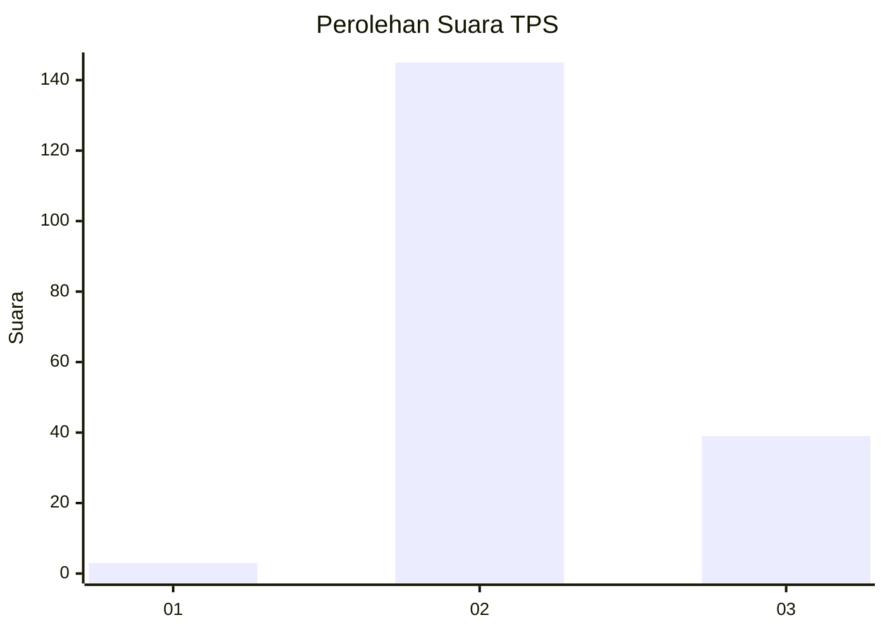

# Hasil

## Grafik

## Tabel

| No. | Nama Paslon    | Suara | Suara (raw) | Persentase |
|:--- |:-------------- | -----:| -----------:| ----------:|
| 1   | ANIES MUHAIMIN | 3     | [3][p-1]    | 1,60       |
| 2   | PRABOWO GIBRAN | 145   | [145][p-2]  | 77,54      |
| 3   | GANJAR MAHFUD  | 39    | [39][p-3]   | 20,86      |

[p-1]: https://github.com/gigit-pemilu/pemilu-2024-51-bali/blob/main/pilpres/hitung-suara/sub/51-bali/sub/06-bangli/sub/01-susut/sub/2003-abuan/sub/019-tps/sub/paslon-1.txt
[p-2]: https://github.com/gigit-pemilu/pemilu-2024-51-bali/blob/main/pilpres/hitung-suara/sub/51-bali/sub/06-bangli/sub/01-susut/sub/2003-abuan/sub/019-tps/sub/paslon-2.txt
[p-3]: https://github.com/gigit-pemilu/pemilu-2024-51-bali/blob/main/pilpres/hitung-suara/sub/51-bali/sub/06-bangli/sub/01-susut/sub/2003-abuan/sub/019-tps/sub/paslon-3.txt

## Foto C Plano

https://sirekap-obj-formc.kpu.go.id/d21c/pemilu/ppwp/51/06/01/20/03/5106012003019-20240215-002048--bdb8f2a2-1606-4bd5-93d6-0424c44022b0.jpg

https://sirekap-obj-formc.kpu.go.id/d21c/pemilu/ppwp/51/06/01/20/03/5106012003019-20240214-213901--e33a7ea8-9516-4213-a536-d764ea077ba0.jpg

https://sirekap-obj-formc.kpu.go.id/d21c/pemilu/ppwp/51/06/01/20/03/5106012003019-20240214-214059--d1b8433a-bc08-45da-a55e-b0e42da251d8.jpg

## Metadata

| Key        | Value               |
| ---------- | ------------------- |
| Time Stamp | 2024-02-15 16:00:26 |

