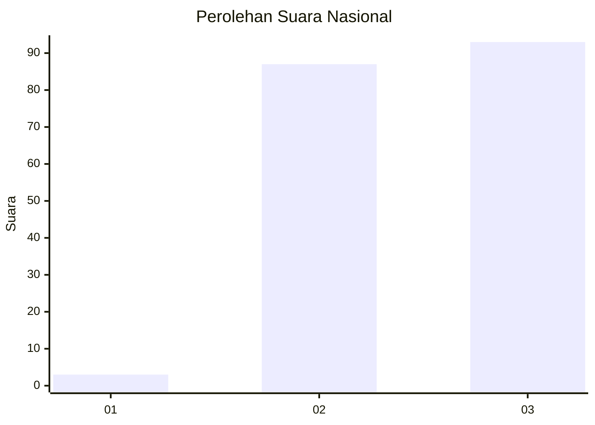
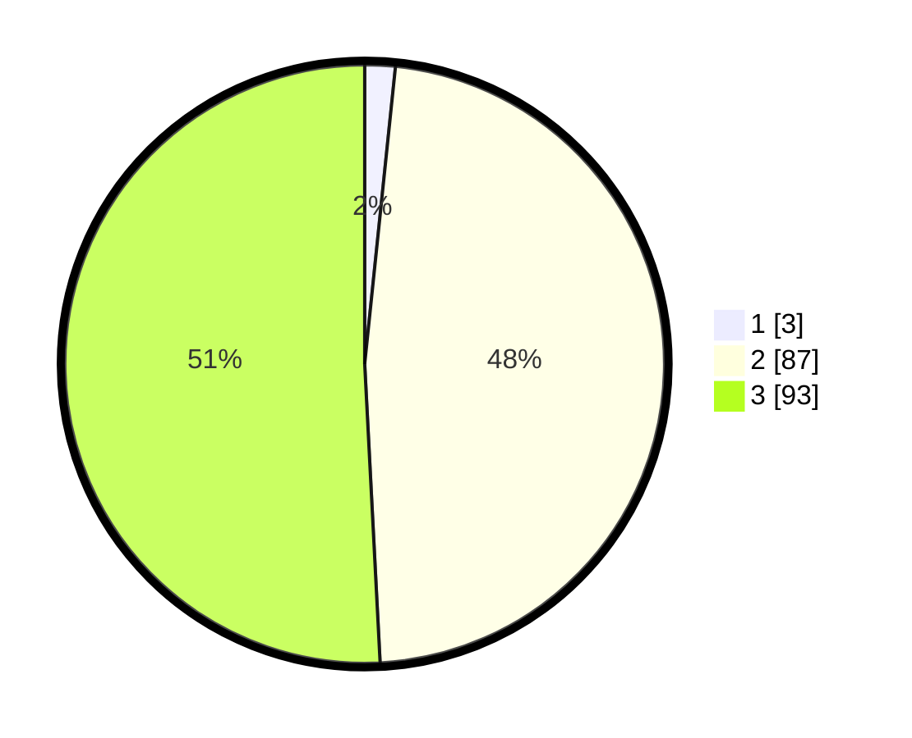

# Hasil

## Grafik

## Tabel

| No. | Nama Paslon    | Suara | Suara (raw) | Persentase |
|:--- |:-------------- | -----:| -----------:| ----------:|
| 1   | ANIES MUHAIMIN | 3     | [3][p-1]    | 1,64       |
| 2   | PRABOWO GIBRAN | 87    | [87][p-2]   | 47,54      |
| 3   | GANJAR MAHFUD  | 93    | [93][p-3]   | 50,82      |

[p-1]: https://github.com/gigit-pemilu/pemilu-2024/blob/main/pilpres/hitung-suara/sub/51-bali/sub/06-bangli/sub/01-susut/sub/2004-susut/sub/001-tps/sub/paslon-1.txt
[p-2]: https://github.com/gigit-pemilu/pemilu-2024/blob/main/pilpres/hitung-suara/sub/51-bali/sub/06-bangli/sub/01-susut/sub/2004-susut/sub/001-tps/sub/paslon-2.txt
[p-3]: https://github.com/gigit-pemilu/pemilu-2024/blob/main/pilpres/hitung-suara/sub/51-bali/sub/06-bangli/sub/01-susut/sub/2004-susut/sub/001-tps/sub/paslon-3.txt

## Foto C Plano

https://sirekap-obj-formc.kpu.go.id/ab9d/pemilu/ppwp/51/06/01/20/04/5106012004001-20240214-205623--54294c7d-8a92-441c-bb1a-ae2bfdab1563.jpg

https://sirekap-obj-formc.kpu.go.id/ab9d/pemilu/ppwp/51/06/01/20/04/5106012004001-20240215-012055--2f2c79f5-f5c4-4d75-aee9-dcd2acd46128.jpg

https://sirekap-obj-formc.kpu.go.id/ab9d/pemilu/ppwp/51/06/01/20/04/5106012004001-20240214-210008--ee439010-9c3a-4d2d-8962-81fa8b517506.jpg

## Metadata

| Key        | Value               |
| ---------- | ------------------- |
| Time Stamp | 2024-02-16 14:00:34 |

## DATA PEMILIH TETAP

Jumlah pemilih dalam DPT: **230**.
 * L: **113**.
 * P: **117**.

## DATA PENGGUNA HAK PILIH

Jumlah pengguna hak pilih dalam DPT: **196**.
 * L: **100**.
 * P: **96**.

Jumlah pengguna hak pilih dalam DPTb: **0**.
 * L: **0**.
 * P: **0**.

Jumlah pengguna hak pilih dalam DPK: **0**.
 * L: **0**.
 * P: **0**.

Jumlah pengguna hak pilih: **196**.
 * L: **100**.
 * P: **96**.

## JUMLAH SUARA SAH DAN TIDAK SAH

JUMLAH SELURUH SUARA SAH: **183**.

JUMLAH SUARA TIDAK SAH: **13**.

JUMLAH SELURUH SUARA SAH DAN SUARA TIDAK SAH: **196**.

