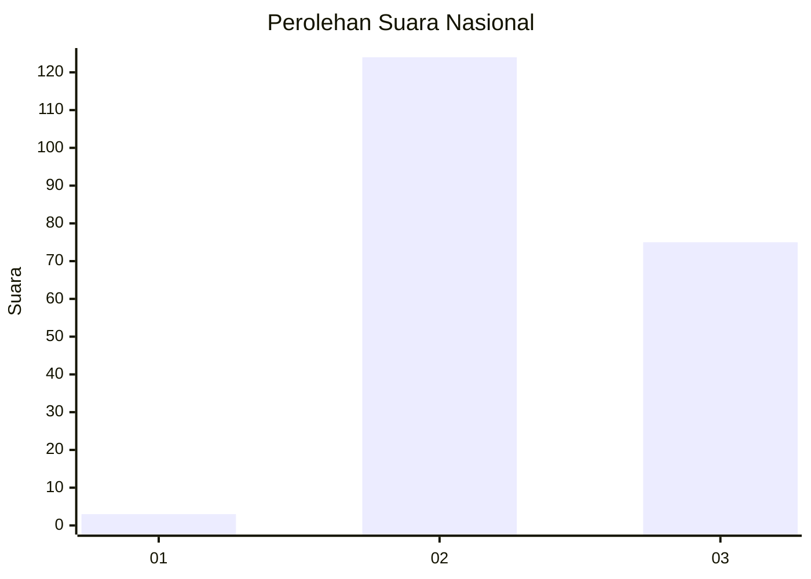
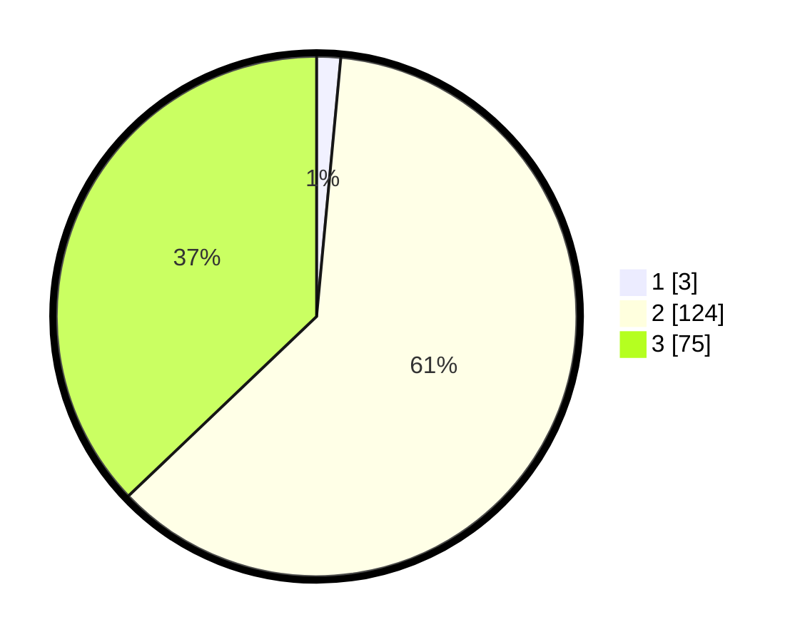

# Hasil

## Grafik

## Tabel

| No. | Nama Paslon    | Suara | Suara (raw) | Persentase |
|:--- |:-------------- | -----:| -----------:| ----------:|
| 1   | ANIES MUHAIMIN | 3     | [3][p-1]    | 1,49       |
| 2   | PRABOWO GIBRAN | 124   | [124][p-2]  | 61,39      |
| 3   | GANJAR MAHFUD  | 75    | [75][p-3]   | 37,13      |

[p-1]: https://github.com/gigit-pemilu/pemilu-2024/blob/main/pilpres/hitung-suara/sub/51-bali/sub/06-bangli/sub/01-susut/sub/2004-susut/sub/002-tps/sub/paslon-1.txt
[p-2]: https://github.com/gigit-pemilu/pemilu-2024/blob/main/pilpres/hitung-suara/sub/51-bali/sub/06-bangli/sub/01-susut/sub/2004-susut/sub/002-tps/sub/paslon-2.txt
[p-3]: https://github.com/gigit-pemilu/pemilu-2024/blob/main/pilpres/hitung-suara/sub/51-bali/sub/06-bangli/sub/01-susut/sub/2004-susut/sub/002-tps/sub/paslon-3.txt

## Foto C Plano

https://sirekap-obj-formc.kpu.go.id/d78d/pemilu/ppwp/51/06/01/20/04/5106012004002-20240214-221929--bf550659-56b3-4217-873a-6744f3c98984.jpg

https://sirekap-obj-formc.kpu.go.id/d78d/pemilu/ppwp/51/06/01/20/04/5106012004002-20240214-202135--78931654-52a7-43d8-8b49-6d0496e26563.jpg

https://sirekap-obj-formc.kpu.go.id/d78d/pemilu/ppwp/51/06/01/20/04/5106012004002-20240214-202259--0d9449fc-f70f-4eb0-bd34-f0e1654426f1.jpg

## Metadata

| Key        | Value               |
| ---------- | ------------------- |
| Time Stamp | 2024-02-15 02:10:27 |

## DATA PEMILIH TETAP

Jumlah pemilih dalam DPT: **229**.
 * L: **107**.
 * P: **122**.

## DATA PENGGUNA HAK PILIH

Jumlah pengguna hak pilih dalam DPT: **209**.
 * L: **97**.
 * P: **112**.

Jumlah pengguna hak pilih dalam DPTb: **8**.
 * L: **8**.
 * P: **0**.

Jumlah pengguna hak pilih dalam DPK: **0**.
 * L: **0**.
 * P: **0**.

Jumlah pengguna hak pilih: **209**.
 * L: **97**.
 * P: **112**.

## JUMLAH SUARA SAH DAN TIDAK SAH

JUMLAH SELURUH SUARA SAH: **202**.

JUMLAH SUARA TIDAK SAH: **7**.

JUMLAH SELURUH SUARA SAH DAN SUARA TIDAK SAH: **209**.

