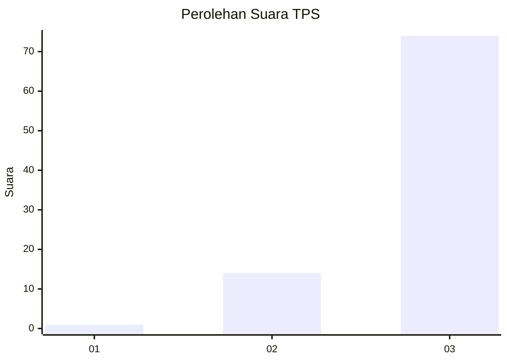
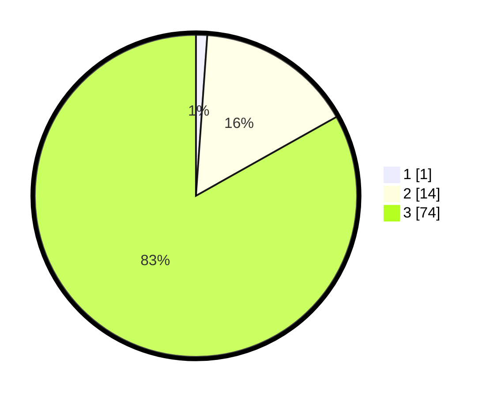

# Hasil

## Grafik

## Tabel

| No. | Nama Paslon    | Suara | Suara (raw) | Persentase |
|:--- |:-------------- | -----:| -----------:| ----------:|
| 1   | ANIES MUHAIMIN | 1     | [1][p-1]    | 1,12       |
| 2   | PRABOWO GIBRAN | 14    | [14][p-2]   | 15,73      |
| 3   | GANJAR MAHFUD  | 74    | [74][p-3]   | 83,15      |

[p-1]: https://github.com/gigit-pemilu/pemilu-2024-51-bali/blob/main/pilpres/hitung-suara/sub/51-bali/sub/06-bangli/sub/01-susut/sub/2004-susut/sub/008-tps/sub/paslon-1.txt
[p-2]: https://github.com/gigit-pemilu/pemilu-2024-51-bali/blob/main/pilpres/hitung-suara/sub/51-bali/sub/06-bangli/sub/01-susut/sub/2004-susut/sub/008-tps/sub/paslon-2.txt
[p-3]: https://github.com/gigit-pemilu/pemilu-2024-51-bali/blob/main/pilpres/hitung-suara/sub/51-bali/sub/06-bangli/sub/01-susut/sub/2004-susut/sub/008-tps/sub/paslon-3.txt

## Foto C Plano

https://sirekap-obj-formc.kpu.go.id/c995/pemilu/ppwp/51/06/01/20/04/5106012004008-20240215-005756--95da4806-ad25-463c-9779-1f669b9f29c3.jpg

https://sirekap-obj-formc.kpu.go.id/c995/pemilu/ppwp/51/06/01/20/04/5106012004008-20240215-005817--e2b4c7dd-3b5b-434c-8109-27c07217e20b.jpg

https://sirekap-obj-formc.kpu.go.id/c995/pemilu/ppwp/51/06/01/20/04/5106012004008-20240215-005806--a7f77aaa-82f5-4a98-8502-f9d87491396c.jpg

## Metadata

| Key        | Value               |
| ---------- | ------------------- |
| Time Stamp | 2024-02-15 01:47:43 |

## DATA PEMILIH TETAP

Jumlah pemilih dalam DPT: **97**.
 * L: **47**.
 * P: **50**.

## DATA PENGGUNA HAK PILIH

Jumlah pengguna hak pilih dalam DPT: **91**.
 * L: **45**.
 * P: **46**.

Jumlah pengguna hak pilih dalam DPTb: **0**.
 * L: **0**.
 * P: **0**.

Jumlah pengguna hak pilih dalam DPK: **0**.
 * L: **0**.
 * P: **0**.

Jumlah pengguna hak pilih: **91**.
 * L: **45**.
 * P: **46**.

## JUMLAH SUARA SAH DAN TIDAK SAH

JUMLAH SELURUH SUARA SAH: **89**.

JUMLAH SUARA TIDAK SAH: **2**.

JUMLAH SELURUH SUARA SAH DAN SUARA TIDAK SAH: **91**.

