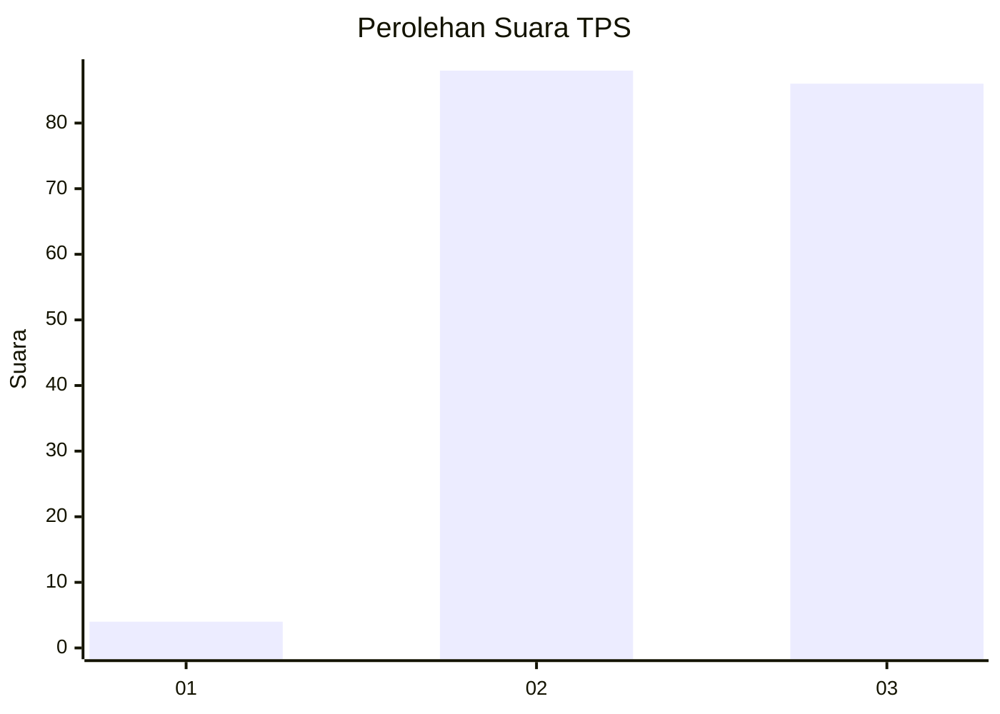
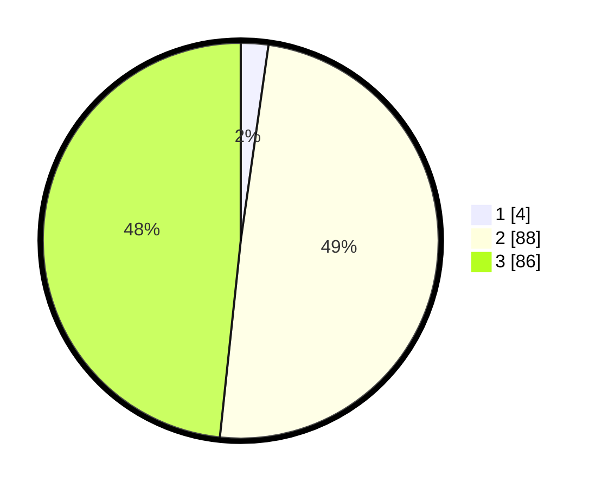

# Hasil

## Grafik

## Tabel

| No. | Nama Paslon    | Suara | Suara (raw) | Persentase |
|:--- |:-------------- | -----:| -----------:| ----------:|
| 1   | ANIES MUHAIMIN | 4     | [4][p-1]    | 2,25       |
| 2   | PRABOWO GIBRAN | 88    | [88][p-2]   | 49,44      |
| 3   | GANJAR MAHFUD  | 86    | [86][p-3]   | 48,31      |

[p-1]: https://github.com/gigit-pemilu/pemilu-2024-51-bali/blob/main/pilpres/hitung-suara/sub/51-bali/sub/06-bangli/sub/01-susut/sub/2004-susut/sub/014-tps/sub/paslon-1.txt
[p-2]: https://github.com/gigit-pemilu/pemilu-2024-51-bali/blob/main/pilpres/hitung-suara/sub/51-bali/sub/06-bangli/sub/01-susut/sub/2004-susut/sub/014-tps/sub/paslon-2.txt
[p-3]: https://github.com/gigit-pemilu/pemilu-2024-51-bali/blob/main/pilpres/hitung-suara/sub/51-bali/sub/06-bangli/sub/01-susut/sub/2004-susut/sub/014-tps/sub/paslon-3.txt

## Foto C Plano

https://sirekap-obj-formc.kpu.go.id/0786/pemilu/ppwp/51/06/01/20/04/5106012004014-20240215-064104--290ccdb9-d107-4eeb-ad20-ebfd29df4b9b.jpg

https://sirekap-obj-formc.kpu.go.id/0786/pemilu/ppwp/51/06/01/20/04/5106012004014-20240215-064125--21756c54-f68d-45d4-8c05-9750208884f9.jpg

https://sirekap-obj-formc.kpu.go.id/0786/pemilu/ppwp/51/06/01/20/04/5106012004014-20240215-064115--be452e82-342a-46f0-b6bb-ae4311307f2b.jpg

## Metadata

| Key        | Value               |
| ---------- | ------------------- |
| Time Stamp | 2024-02-15 15:00:29 |

## DATA PEMILIH TETAP

Jumlah pemilih dalam DPT: **221**.
 * L: **109**.
 * P: **112**.

## DATA PENGGUNA HAK PILIH

Jumlah pengguna hak pilih dalam DPT: **186**.
 * L: **90**.
 * P: **96**.

Jumlah pengguna hak pilih dalam DPTb: **0**.
 * L: **0**.
 * P: **0**.

Jumlah pengguna hak pilih dalam DPK: **0**.
 * L: **1**.
 * P: **0**.

Jumlah pengguna hak pilih: **187**.
 * L: **91**.
 * P: **96**.

## JUMLAH SUARA SAH DAN TIDAK SAH

JUMLAH SELURUH SUARA SAH: **178**.

JUMLAH SUARA TIDAK SAH: **9**.

JUMLAH SELURUH SUARA SAH DAN SUARA TIDAK SAH: **187**.

