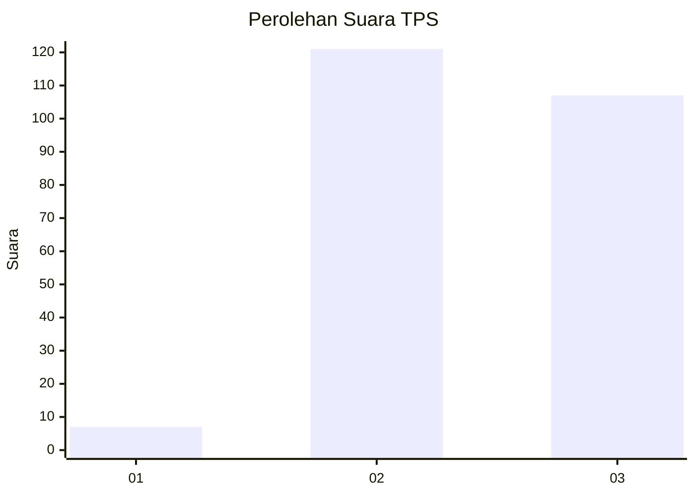
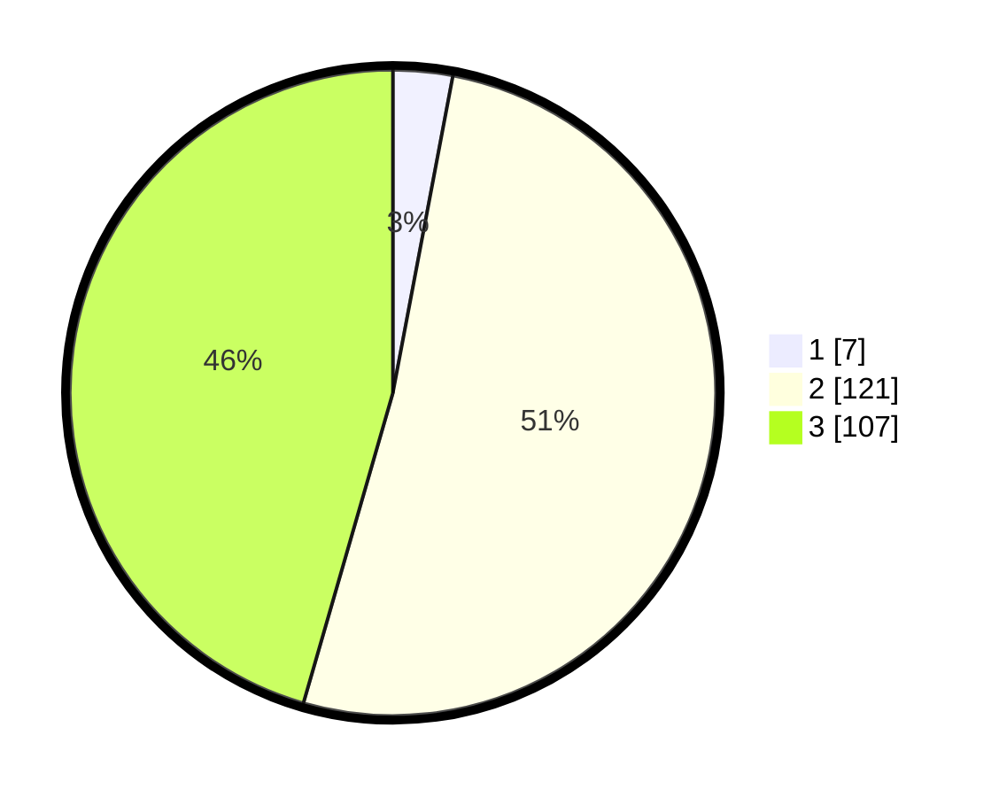

# Hasil

## Grafik

## Tabel

| No. | Nama Paslon    | Suara | Suara (raw) | Persentase |
|:--- |:-------------- | -----:| -----------:| ----------:|
| 1   | ANIES MUHAIMIN | 7     | [7][p-1]    | 2,98       |
| 2   | PRABOWO GIBRAN | 121   | [121][p-2]  | 51,49      |
| 3   | GANJAR MAHFUD  | 107   | [107][p-3]  | 45,53      |

[p-1]: https://github.com/gigit-pemilu/pemilu-2024-51-bali/blob/main/pilpres/hitung-suara/sub/51-bali/sub/06-bangli/sub/01-susut/sub/2004-susut/sub/020-tps/sub/paslon-1.txt
[p-2]: https://github.com/gigit-pemilu/pemilu-2024-51-bali/blob/main/pilpres/hitung-suara/sub/51-bali/sub/06-bangli/sub/01-susut/sub/2004-susut/sub/020-tps/sub/paslon-2.txt
[p-3]: https://github.com/gigit-pemilu/pemilu-2024-51-bali/blob/main/pilpres/hitung-suara/sub/51-bali/sub/06-bangli/sub/01-susut/sub/2004-susut/sub/020-tps/sub/paslon-3.txt

## Foto C Plano

https://sirekap-obj-formc.kpu.go.id/b3f9/pemilu/ppwp/51/06/01/20/04/5106012004020-20240318-092521--b9ca5ebc-de71-4f0a-9a18-147e34285aff.jpg

https://sirekap-obj-formc.kpu.go.id/b3f9/pemilu/ppwp/51/06/01/20/04/5106012004020-20240214-200921--29da9c82-f36f-4a0e-92f6-46a5b6c3afc2.jpg

https://sirekap-obj-formc.kpu.go.id/b3f9/pemilu/ppwp/51/06/01/20/04/5106012004020-20240214-201143--431e7994-5d60-40ca-a3d3-87567089fb25.jpg

## Metadata

| Key        | Value               |
| ---------- | ------------------- |
| Time Stamp | 2024-03-18 09:30:00 |

