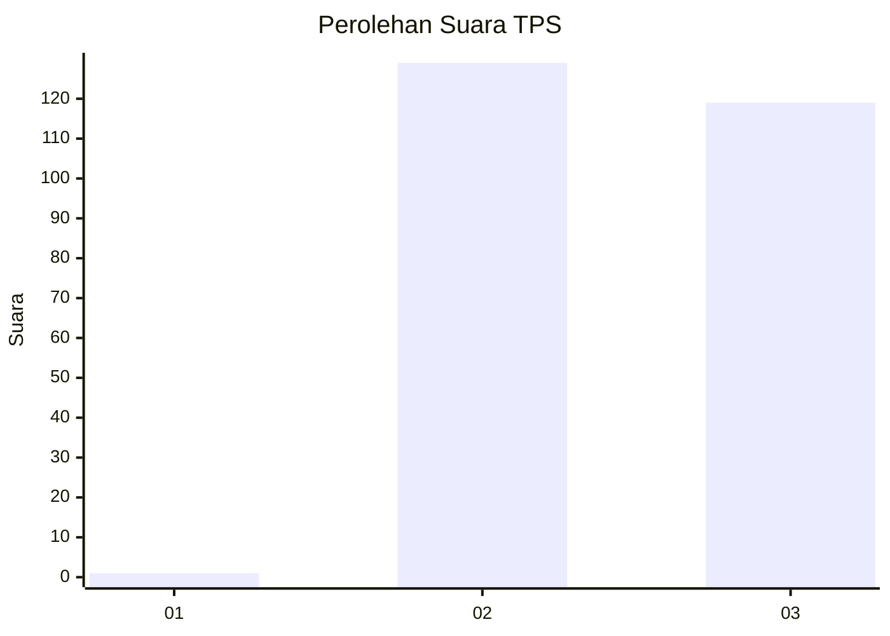
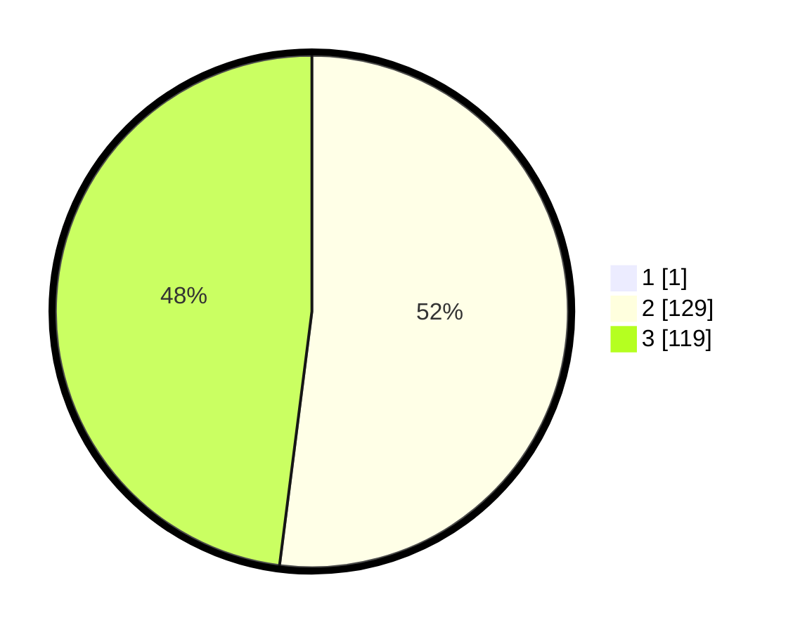

# Hasil

## Grafik

## Tabel

| No. | Nama Paslon    | Suara | Suara (raw) | Persentase |
|:--- |:-------------- | -----:| -----------:| ----------:|
| 1   | ANIES MUHAIMIN | 1     | [1][p-1]    | 0,40       |
| 2   | PRABOWO GIBRAN | 129   | [129][p-2]  | 51,81      |
| 3   | GANJAR MAHFUD  | 119   | [119][p-3]  | 47,79      |

[p-1]: https://github.com/gigit-pemilu/pemilu-2024-51-bali/blob/main/pilpres/hitung-suara/sub/51-bali/sub/06-bangli/sub/01-susut/sub/2005-sulahan/sub/002-tps/sub/paslon-1.txt
[p-2]: https://github.com/gigit-pemilu/pemilu-2024-51-bali/blob/main/pilpres/hitung-suara/sub/51-bali/sub/06-bangli/sub/01-susut/sub/2005-sulahan/sub/002-tps/sub/paslon-2.txt
[p-3]: https://github.com/gigit-pemilu/pemilu-2024-51-bali/blob/main/pilpres/hitung-suara/sub/51-bali/sub/06-bangli/sub/01-susut/sub/2005-sulahan/sub/002-tps/sub/paslon-3.txt

## Foto C Plano

https://sirekap-obj-formc.kpu.go.id/e262/pemilu/ppwp/51/06/01/20/05/5106012005002-20240215-001023--c04bc3b3-c8bb-4026-ac6d-9f0fdf21011a.jpg

https://sirekap-obj-formc.kpu.go.id/e262/pemilu/ppwp/51/06/01/20/05/5106012005002-20240215-001112--04f7ebb6-51f8-486f-929e-8073ee75ad31.jpg

https://sirekap-obj-formc.kpu.go.id/e262/pemilu/ppwp/51/06/01/20/05/5106012005002-20240215-001522--f33407f5-e949-4530-80a6-392cab4869cf.jpg

## Metadata

| Key        | Value               |
| ---------- | ------------------- |
| Time Stamp | 2024-02-24 22:31:28 |

