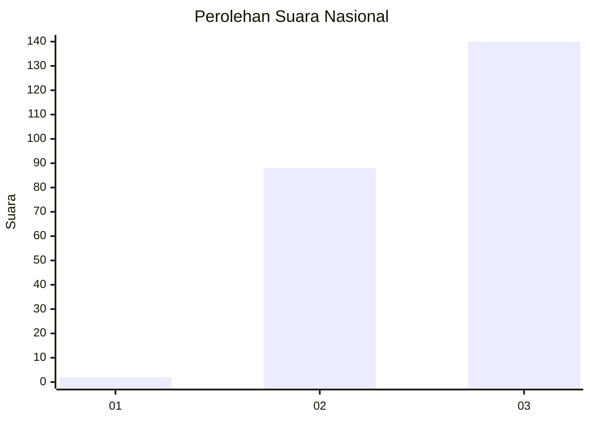
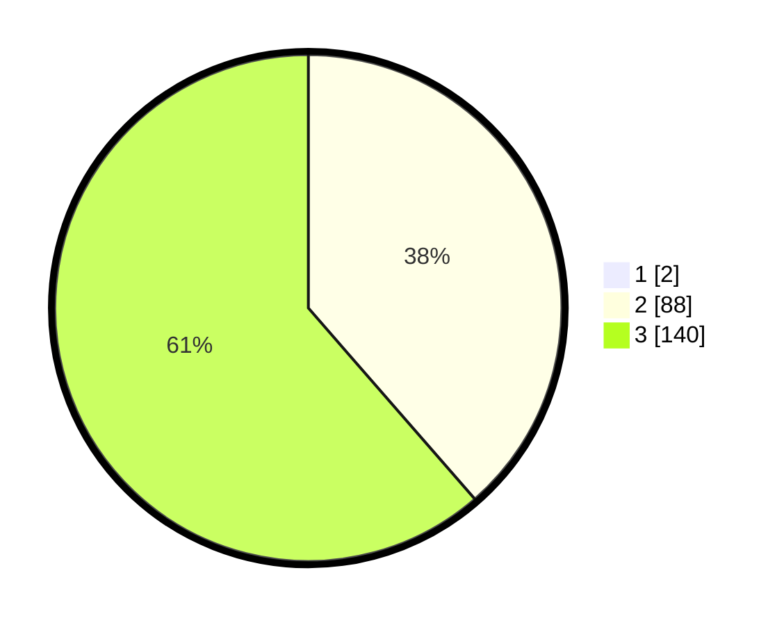

# Hasil

## Grafik

## Tabel

| No. | Nama Paslon    | Suara | Suara (raw) | Persentase |
|:--- |:-------------- | -----:| -----------:| ----------:|
| 1   | ANIES MUHAIMIN | 2     | [2][p-1]    | 0,87       |
| 2   | PRABOWO GIBRAN | 88    | [88][p-2]   | 38,26      |
| 3   | GANJAR MAHFUD  | 140   | [140][p-3]  | 60,87      |

[p-1]: https://github.com/gigit-pemilu/pemilu-2024/blob/main/pilpres/hitung-suara/sub/51-bali/sub/06-bangli/sub/01-susut/sub/2005-sulahan/sub/006-tps/sub/paslon-1.txt
[p-2]: https://github.com/gigit-pemilu/pemilu-2024/blob/main/pilpres/hitung-suara/sub/51-bali/sub/06-bangli/sub/01-susut/sub/2005-sulahan/sub/006-tps/sub/paslon-2.txt
[p-3]: https://github.com/gigit-pemilu/pemilu-2024/blob/main/pilpres/hitung-suara/sub/51-bali/sub/06-bangli/sub/01-susut/sub/2005-sulahan/sub/006-tps/sub/paslon-3.txt

## Foto C Plano

https://sirekap-obj-formc.kpu.go.id/71ec/pemilu/ppwp/51/06/01/20/05/5106012005006-20240215-023642--b97b4824-fe89-492d-b903-9a7478131ec8.jpg

https://sirekap-obj-formc.kpu.go.id/71ec/pemilu/ppwp/51/06/01/20/05/5106012005006-20240215-023727--d6937462-5485-452f-9389-934663a374ee.jpg

https://sirekap-obj-formc.kpu.go.id/71ec/pemilu/ppwp/51/06/01/20/05/5106012005006-20240215-023830--88565ec9-8f6d-4a0c-ac2f-91a91365a227.jpg

## Metadata

| Key        | Value               |
| ---------- | ------------------- |
| Time Stamp | 2024-02-24 22:31:28 |

