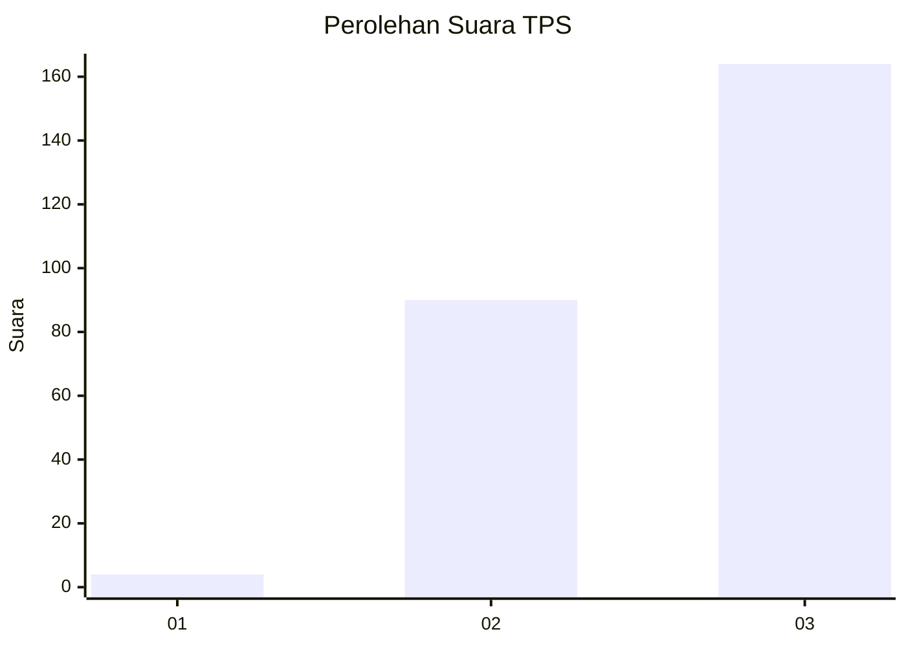
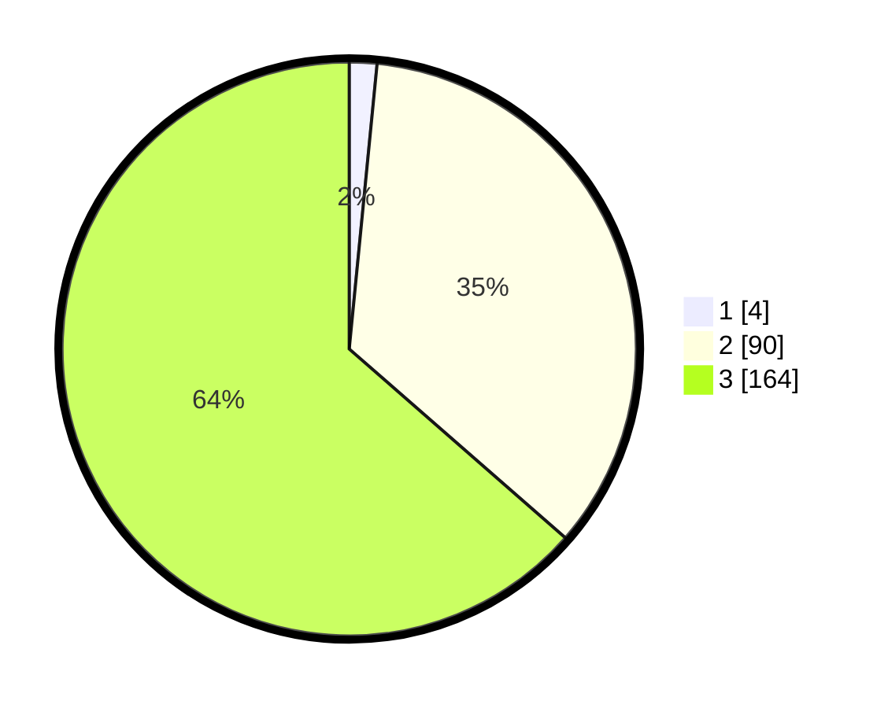

# Hasil

## Grafik

## Tabel

| No. | Nama Paslon    | Suara | Suara (raw) | Persentase |
|:--- |:-------------- | -----:| -----------:| ----------:|
| 1   | ANIES MUHAIMIN | 4     | [4][p-1]    | 1,55       |
| 2   | PRABOWO GIBRAN | 90    | [90][p-2]   | 34,88      |
| 3   | GANJAR MAHFUD  | 164   | [164][p-3]  | 63,57      |

[p-1]: https://github.com/gigit-pemilu/pemilu-2024-51-bali/blob/main/pilpres/hitung-suara/sub/51-bali/sub/06-bangli/sub/01-susut/sub/2005-sulahan/sub/018-tps/sub/paslon-1.txt
[p-2]: https://github.com/gigit-pemilu/pemilu-2024-51-bali/blob/main/pilpres/hitung-suara/sub/51-bali/sub/06-bangli/sub/01-susut/sub/2005-sulahan/sub/018-tps/sub/paslon-2.txt
[p-3]: https://github.com/gigit-pemilu/pemilu-2024-51-bali/blob/main/pilpres/hitung-suara/sub/51-bali/sub/06-bangli/sub/01-susut/sub/2005-sulahan/sub/018-tps/sub/paslon-3.txt

## Foto C Plano

https://sirekap-obj-formc.kpu.go.id/fe26/pemilu/ppwp/51/06/01/20/05/5106012005018-20240215-010759--3079c189-cfd4-4e0e-95c2-c756c68605ab.jpg

https://sirekap-obj-formc.kpu.go.id/fe26/pemilu/ppwp/51/06/01/20/05/5106012005018-20240215-010420--67547e9a-1418-41dc-be3f-32367d838657.jpg

https://sirekap-obj-formc.kpu.go.id/fe26/pemilu/ppwp/51/06/01/20/05/5106012005018-20240215-011125--a6b9633d-6242-4f20-97a8-b1d95588fe8f.jpg

## Metadata

| Key        | Value               |
| ---------- | ------------------- |
| Time Stamp | 2024-02-24 22:31:28 |

