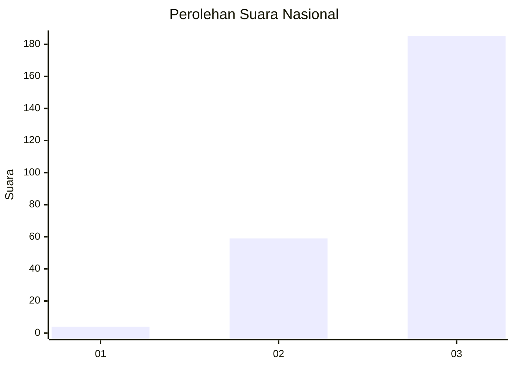
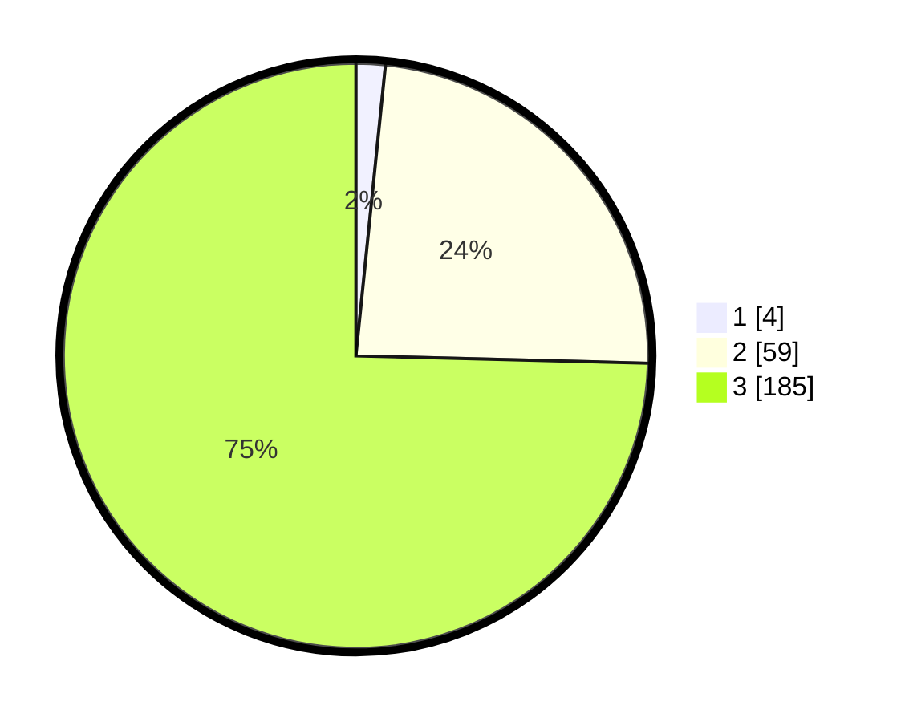

# Hasil

## Grafik

## Tabel

| No. | Nama Paslon    | Suara | Suara (raw) | Persentase |
|:--- |:-------------- | -----:| -----------:| ----------:|
| 1   | ANIES MUHAIMIN | 4     | [4][p-1]    | 1,61       |
| 2   | PRABOWO GIBRAN | 59    | [59][p-2]   | 23,79      |
| 3   | GANJAR MAHFUD  | 185   | [185][p-3]  | 74,60      |

[p-1]: https://github.com/gigit-pemilu/pemilu-2024/blob/main/pilpres/hitung-suara/sub/51-bali/sub/06-bangli/sub/01-susut/sub/2005-sulahan/sub/019-tps/sub/paslon-1.txt
[p-2]: https://github.com/gigit-pemilu/pemilu-2024/blob/main/pilpres/hitung-suara/sub/51-bali/sub/06-bangli/sub/01-susut/sub/2005-sulahan/sub/019-tps/sub/paslon-2.txt
[p-3]: https://github.com/gigit-pemilu/pemilu-2024/blob/main/pilpres/hitung-suara/sub/51-bali/sub/06-bangli/sub/01-susut/sub/2005-sulahan/sub/019-tps/sub/paslon-3.txt

## Foto C Plano

https://sirekap-obj-formc.kpu.go.id/a8e8/pemilu/ppwp/51/06/01/20/05/5106012005019-20240215-011450--8213b15b-5524-4228-a770-100b566e4b55.jpg

https://sirekap-obj-formc.kpu.go.id/a8e8/pemilu/ppwp/51/06/01/20/05/5106012005019-20240214-201923--10580489-07a8-4ff2-a15a-dcb5031462b9.jpg

https://sirekap-obj-formc.kpu.go.id/a8e8/pemilu/ppwp/51/06/01/20/05/5106012005019-20240214-235119--b3382329-cb90-4971-a71e-6bdf4c914b68.jpg

## Metadata

| Key        | Value               |
| ---------- | ------------------- |
| Time Stamp | 2024-02-24 22:31:28 |

