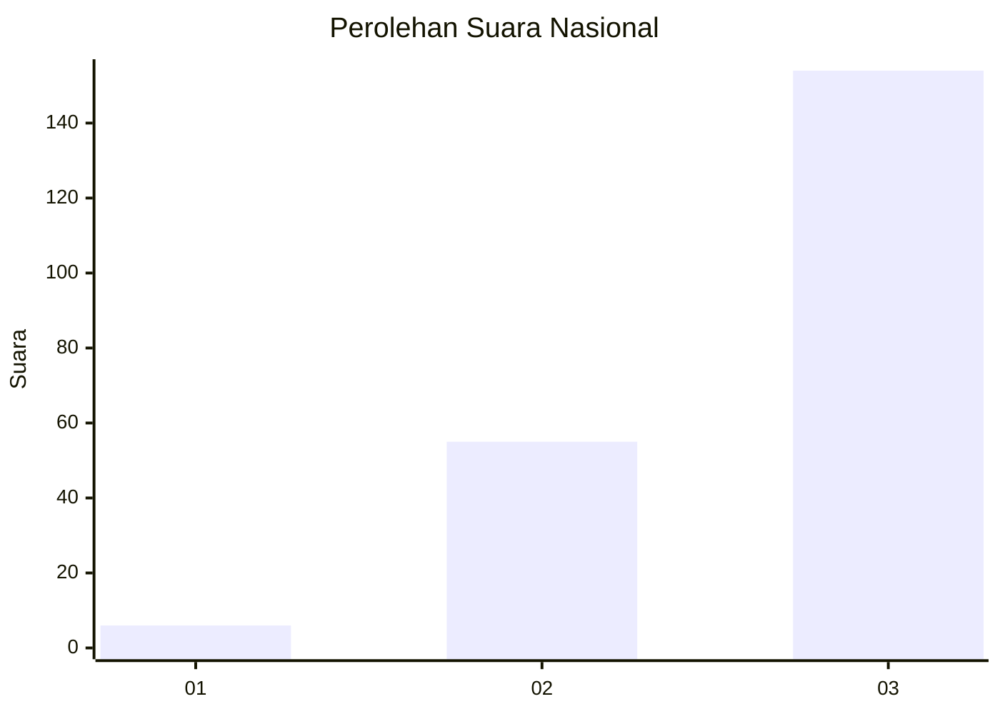
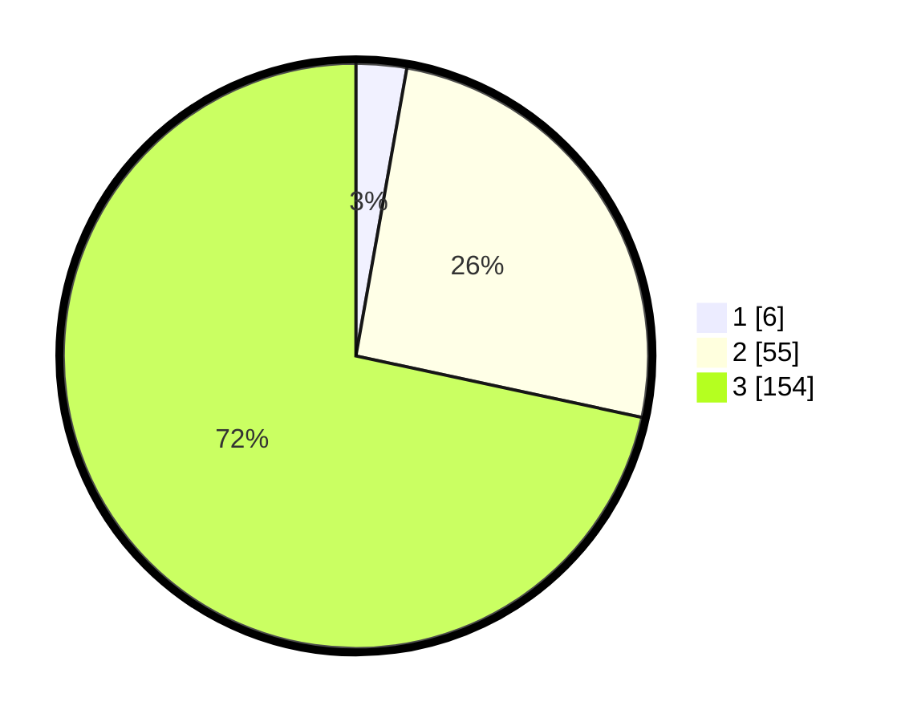

# Hasil

## Grafik

## Tabel

| No. | Nama Paslon    | Suara | Suara (raw) | Persentase |
|:--- |:-------------- | -----:| -----------:| ----------:|
| 1   | ANIES MUHAIMIN | 6     | [6][p-1]    | 2,79       |
| 2   | PRABOWO GIBRAN | 55    | [55][p-2]   | 25,58      |
| 3   | GANJAR MAHFUD  | 154   | [154][p-3]  | 71,63      |

[p-1]: https://github.com/gigit-pemilu/pemilu-2024/blob/main/pilpres/hitung-suara/sub/51-bali/sub/06-bangli/sub/01-susut/sub/2005-sulahan/sub/023-tps/sub/paslon-1.txt
[p-2]: https://github.com/gigit-pemilu/pemilu-2024/blob/main/pilpres/hitung-suara/sub/51-bali/sub/06-bangli/sub/01-susut/sub/2005-sulahan/sub/023-tps/sub/paslon-2.txt
[p-3]: https://github.com/gigit-pemilu/pemilu-2024/blob/main/pilpres/hitung-suara/sub/51-bali/sub/06-bangli/sub/01-susut/sub/2005-sulahan/sub/023-tps/sub/paslon-3.txt

## Foto C Plano

https://sirekap-obj-formc.kpu.go.id/fa0e/pemilu/ppwp/51/06/01/20/05/5106012005023-20240214-232128--07bc321d-a0f0-410b-aae5-d17ddc18af30.jpg

https://sirekap-obj-formc.kpu.go.id/fa0e/pemilu/ppwp/51/06/01/20/05/5106012005023-20240214-232055--c07bdf64-b815-42fc-bcea-ce853402d00e.jpg

https://sirekap-obj-formc.kpu.go.id/fa0e/pemilu/ppwp/51/06/01/20/05/5106012005023-20240214-232721--7f3d6d5c-e51d-4cd5-bde3-5ac9aa3e851b.jpg

## Metadata

| Key        | Value               |
| ---------- | ------------------- |
| Time Stamp | 2024-02-24 22:31:28 |

