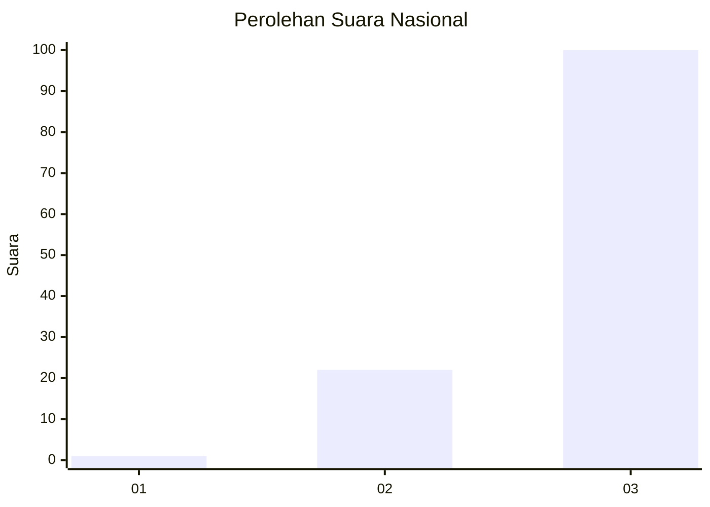
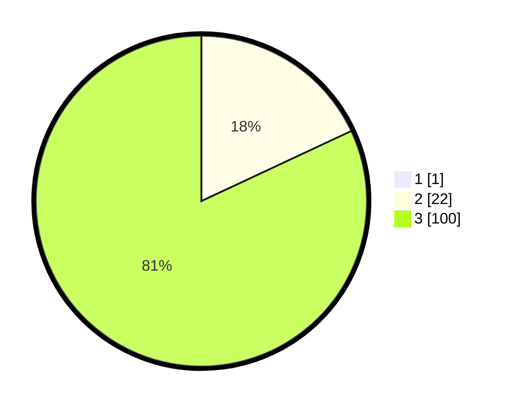

# Hasil

## Grafik

## Tabel

| No. | Nama Paslon    | Suara | Suara (raw) | Persentase |
|:--- |:-------------- | -----:| -----------:| ----------:|
| 1   | ANIES MUHAIMIN | 1     | [1][p-1]    | 0,81       |
| 2   | PRABOWO GIBRAN | 22    | [22][p-2]   | 17,89      |
| 3   | GANJAR MAHFUD  | 100   | [100][p-3]  | 81,30      |

[p-1]: https://github.com/gigit-pemilu/pemilu-2024/blob/main/pilpres/hitung-suara/sub/51-bali/sub/06-bangli/sub/01-susut/sub/2005-sulahan/sub/024-tps/sub/paslon-1.txt
[p-2]: https://github.com/gigit-pemilu/pemilu-2024/blob/main/pilpres/hitung-suara/sub/51-bali/sub/06-bangli/sub/01-susut/sub/2005-sulahan/sub/024-tps/sub/paslon-2.txt
[p-3]: https://github.com/gigit-pemilu/pemilu-2024/blob/main/pilpres/hitung-suara/sub/51-bali/sub/06-bangli/sub/01-susut/sub/2005-sulahan/sub/024-tps/sub/paslon-3.txt

## Foto C Plano

https://sirekap-obj-formc.kpu.go.id/d952/pemilu/ppwp/51/06/01/20/05/5106012005024-20240214-233153--9131dd68-235f-4821-a1da-945baa454a47.jpg

https://sirekap-obj-formc.kpu.go.id/d952/pemilu/ppwp/51/06/01/20/05/5106012005024-20240214-233342--0e6e7fab-3bf2-43f3-886b-9c4eb283bb5a.jpg

https://sirekap-obj-formc.kpu.go.id/d952/pemilu/ppwp/51/06/01/20/05/5106012005024-20240214-233648--a9d621b1-8aad-46f5-a3f7-c1b6362a6335.jpg

## Metadata

| Key        | Value               |
| ---------- | ------------------- |
| Time Stamp | 2024-02-15 19:30:26 |

## DATA PEMILIH TETAP

Jumlah pemilih dalam DPT: **168**.
 * L: **84**.
 * P: **84**.

## DATA PENGGUNA HAK PILIH

Jumlah pengguna hak pilih dalam DPT: **133**.
 * L: **67**.
 * P: **66**.

Jumlah pengguna hak pilih dalam DPTb: **1**.
 * L: **1**.
 * P: **0**.

Jumlah pengguna hak pilih dalam DPK: **0**.
 * L: **0**.
 * P: **0**.

Jumlah pengguna hak pilih: **134**.
 * L: **68**.
 * P: **66**.

## JUMLAH SUARA SAH DAN TIDAK SAH

JUMLAH SELURUH SUARA SAH: **123**.

JUMLAH SUARA TIDAK SAH: **11**.

JUMLAH SELURUH SUARA SAH DAN SUARA TIDAK SAH: **134**.

