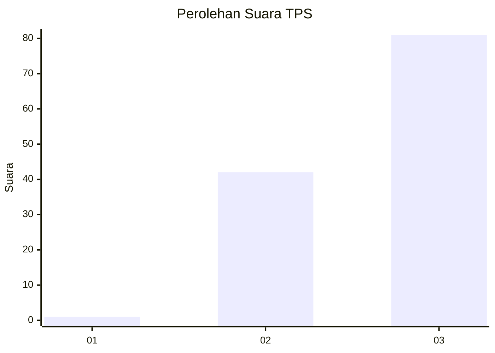
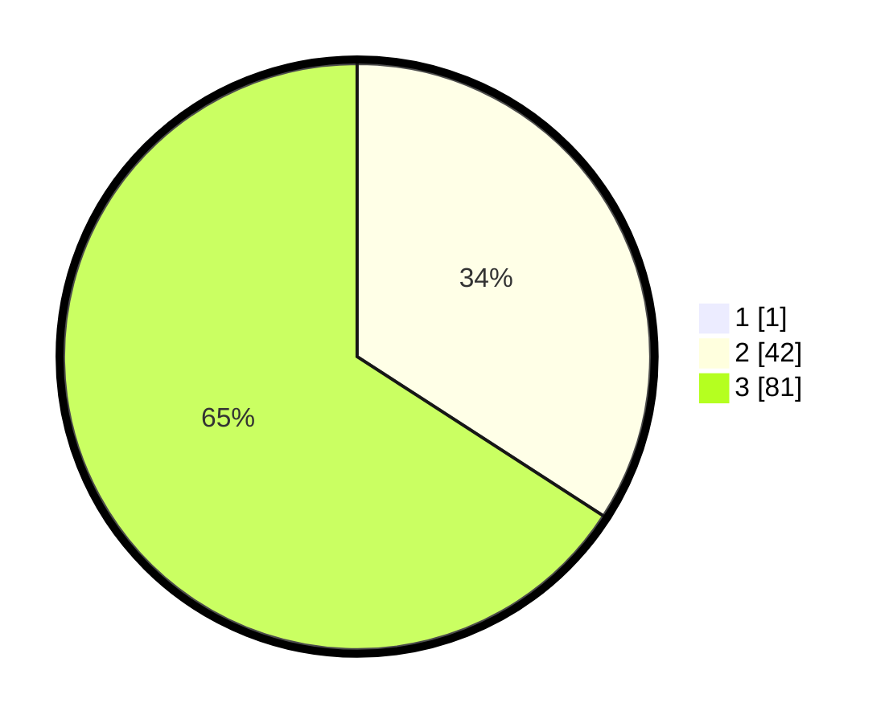

# Hasil

## Grafik

## Tabel

| No. | Nama Paslon    | Suara | Suara (raw) | Persentase |
|:--- |:-------------- | -----:| -----------:| ----------:|
| 1   | ANIES MUHAIMIN | 1     | [1][p-1]    | 0,81       |
| 2   | PRABOWO GIBRAN | 42    | [42][p-2]   | 33,87      |
| 3   | GANJAR MAHFUD  | 81    | [81][p-3]   | 65,32      |

[p-1]: https://github.com/gigit-pemilu/pemilu-2024-51-bali/blob/main/pilpres/hitung-suara/sub/51-bali/sub/06-bangli/sub/01-susut/sub/2006-penglumbaran/sub/002-tps/sub/paslon-1.txt
[p-2]: https://github.com/gigit-pemilu/pemilu-2024-51-bali/blob/main/pilpres/hitung-suara/sub/51-bali/sub/06-bangli/sub/01-susut/sub/2006-penglumbaran/sub/002-tps/sub/paslon-2.txt
[p-3]: https://github.com/gigit-pemilu/pemilu-2024-51-bali/blob/main/pilpres/hitung-suara/sub/51-bali/sub/06-bangli/sub/01-susut/sub/2006-penglumbaran/sub/002-tps/sub/paslon-3.txt

## Foto C Plano

https://sirekap-obj-formc.kpu.go.id/30fc/pemilu/ppwp/51/06/01/20/06/5106012006002-20240216-060548--df2cc472-51b6-48cb-88ab-0d1902f72beb.jpg

https://sirekap-obj-formc.kpu.go.id/30fc/pemilu/ppwp/51/06/01/20/06/5106012006002-20240216-060550--ac66488d-8186-48cd-88f4-923978a5d723.jpg

https://sirekap-obj-formc.kpu.go.id/30fc/pemilu/ppwp/51/06/01/20/06/5106012006002-20240216-060549--b1c9eb12-2949-4b8c-8c19-4bf4c938c964.jpg

## Metadata

| Key        | Value               |
| ---------- | ------------------- |
| Time Stamp | 2024-02-16 14:30:33 |

## DATA PEMILIH TETAP

Jumlah pemilih dalam DPT: **144**.
 * L: **79**.
 * P: **65**.

## DATA PENGGUNA HAK PILIH

Jumlah pengguna hak pilih dalam DPT: **129**.
 * L: **69**.
 * P: **60**.

Jumlah pengguna hak pilih dalam DPTb: **0**.
 * L: **0**.
 * P: **0**.

Jumlah pengguna hak pilih dalam DPK: **0**.
 * L: **0**.
 * P: **0**.

Jumlah pengguna hak pilih: **129**.
 * L: **69**.
 * P: **60**.

## JUMLAH SUARA SAH DAN TIDAK SAH

JUMLAH SELURUH SUARA SAH: **124**.

JUMLAH SUARA TIDAK SAH: **5**.

JUMLAH SELURUH SUARA SAH DAN SUARA TIDAK SAH: **129**.

